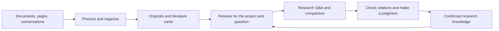

# Memorive

From reading materials to research records you can verify and reuse.

Memorive, or memo, is a Windows desktop workspace for personal learning and research. It connects papers, web pages, and research conversations in one workflow: retain the originals, organize information with its sources, ask questions and compare evidence, then keep the conclusions you have reviewed for future work.

[中文](README.md) · [English](README.en.md) · [日本語](README.ja.md)

[Downloads](https://github.com/KuchinashiYume/Memorive/releases) · [User guide](memorive_desktop/product/desktop/help/en-US/manual-text.md) · [Design](memorive_desktop/product/desktop/help/en-US/design.md) · [Issues](https://github.com/KuchinashiYume/Memorive/issues)

## What can you do?

### Read: bring documents, pages, and conversations into your research

Import materials through the Inbox, check their previews, and choose when to process them. Research Q&A also accepts PDF, images, Word, Markdown, and TXT directly; a document does not need a generated card before you can discuss it. Session Management brings together local Codex and Claude Code records, browser captures, and manual imports. Refinement turns a conversation into reviewable notes about ideas, decisions, assumptions, and next steps.

### Organize: turn materials into evidence you can revisit

Document processing preserves the original and produces a literature card (Card) and an analysis report (Analysis). Cards organize the research subject, methods, important numbers, findings, and limitations; analysis reports propose interpretations based on those materials. Read them beside the original in the Library. Current Tasks shows the model, inputs, outputs, and errors for each step, so you can retry from the relevant point.

### Verify: ask questions and check each citation

Select several papers in one conversation to compare methods, sample conditions, results, and limitations. Retrieval starts with the conversation's attachments; you can extend it to project materials and adjust retrieval weights for your purpose. Citations point back to sources and their saved versions. Open the passage, page, or line and check whether it supports a number, comparison, or causal claim. A fluent answer or a long reference list is not a substitute for this check.

### Retain: reuse knowledge you have reviewed

Before adding a suggested conclusion to your knowledge, review its claim, scope, limitations, and citations. Reviewing a document's outputs and confirming a derived conclusion are separate actions. Research records, previous versions, refined conversations, and daily, weekly, or monthly reports help you resume work. You choose whether confirmed research context is reused in later questions.

### Choose your models and working style

| Capability | How it helps |
| --- | --- |
| APIs, CLIs, and local models | Connect official APIs, compatible endpoints, or relay services; use a locally authenticated CLI or a local service such as Ollama. |
| Workflow model mapping | Assign models separately to embeddings, card generation, analysis, review, and periodic reports. New tasks record the configuration they use. |
| Web reading and browser companion | Save the current page or capture conversations within a source's supported scope; inspect completeness before refinement. |
| Model rankings | Compare public capability indicators, prices, sources, and update dates, then test candidates on your own materials. |
| Billing and usage | Filter requests, input/output tokens, and actual or estimated costs by time and model. Missing cost information remains unknown. |

## Install and get started

### Installation

1. Use **Windows 10 22H2 or later, or Windows 11, x64**. Obtain the installer and its matching `SHA256SUMS.txt` from this project's Releases.
2. To check the download, run `Get-FileHash -Algorithm SHA256 .\Memorive-Setup-1.01-x64.exe` in PowerShell and compare the result with the checksum file.
3. In the installer's System Check, prepare any missing components: .NET Framework 4.8, WebView2 Runtime, and Visual C++ v14 **x64** (14.51.36247 or later). Install only the components requested, then check again. Python is bundled.
4. Choose application and data directories and finish installation. The first launch has blank settings. In Settings → Documents and external viewing, check your workspace and generated-output locations.

### Configure one model connection

- **API:** in Settings → Model services and API, enter the provider's protocol, endpoint, and model ID, and save the key through the credential field. Verify the connection before assigning work.
- **CLI:** install and sign in through the tool's own terminal, confirm the model works, then select and verify the tool in Settings → CLI integration.
- **Local model:** start the local server and download the model first. In Settings → Local models, use detection or enter the local address, select the matching protocol, and load the model list.

Start with the connection you need. Chat, image reading, embeddings, and review have different requirements; appearing in a list does not establish every capability. Supply your own cloud access or CLI subscription. Memo does not include API credits.

### Complete your first research task

1. **Map the workflow:** choose models for the required steps in Workflow model mapping. Configure embeddings, generation, and review according to their roles.
2. **Try one familiar document:** add it to the Inbox, check its preview and automatic-execution setting, then follow it in Current Tasks.
3. **Review the outputs:** open the original, Card, and Analysis in the Library. Check methods, key numbers, and conclusions against the same source and version.
4. **Start a research conversation:** select a project, create a conversation, attach files or choose project materials, and check the model and retrieval scope.
5. **Ask a focused question:** for example, “Compare the methods, sample conditions, and limitations in these two papers. Cite each source and explain where direct comparison is inappropriate.”
6. **Check citations before retaining a conclusion:** open the references and surrounding text, then review the scope and limitations before confirming an addition to knowledge.

For ongoing work, sync new conversation records, refine notes, adjust project retrieval presets, and review reports and usage. Inspect the failed step before retrying a task. Changing embedding models may require rebuilding indexes; back up files before changing storage locations.

Illustrated guides in Chinese, English, and Japanese are available in Settings → About and version → User documentation. See also [installation and first setup](memorive_desktop/INSTALL.md) and the [text guide](memorive_desktop/product/desktop/help/en-US/manual-text.md).

## How it fits together

| Part | Responsibility |
| --- | --- |
| Originals and versions | Preserve files, conversation snapshots, and source locations so you can revisit the material used. |
| Processing and library | Convert and organize documents, extract information, and connect originals to cards and analyses. |
| Retrieval and research | Assemble evidence within the selected project scope for questions, comparisons, and citation checks. |
| Knowledge and records | Retain confirmed conclusions, refined conversations, and periodic reports for future research. |
| Shared services | Provide model connections, task state, usage records, and local storage. |

The desktop interface calls a Python application layer through an application service. Model connections are managed centrally, while originals and derived results remain separate. Search indexes help locate content; the original and its version remain the basis for verification. See the [design document](memorive_desktop/product/desktop/help/en-US/design.md) for details and [build instructions](memorive_desktop/BUILDING.md) for source builds.

## Data, costs, and current status

Materials and settings are stored locally. Cloud models, web reading, and external retrieval send relevant requests to the selected services; choose connections that fit your materials. Store keys through the credential interface and keep them out of issues, screenshots, and research exports.

Cost records distinguish actual, estimated, and unknown amounts. Public list prices and subscriptions are not the same as the amount charged for one task. Check model answers and citations yourself.

The current version is v1.01. Source and documentation are being refined; installers have not been made public again. The application and installer are unsigned. Releases is the authoritative place for downloadable versions.

## How this project is developed

Memorive is an AI-developed project. Its project-specific code was generated, modified, and iterated by **OpenAI Codex** and **Anthropic Claude Code**. The project initiator defined requirements and product design and carried out testing and acceptance; they did not write the code themselves. Third-party components retain their authors' attribution and licenses.

## License and character artwork

Project-specific code uses [AGPL-3.0-only](LICENSE); see the [licensing scope](memorive_desktop/LICENSING.md). The maintainer encourages personal learning, research, and non-commercial use. This preference adds no restrictions to the code license.

Some character images are AI-assisted fan creations inspired by Blue Archive. Memorive is an unofficial personal project, unaffiliated with Nexon, Nexon Games, or Yostar. Underlying characters, names, and marks belong to their respective rights holders. Desktop-pet images, expressions, and character icons are covered separately by the [asset notice](memorive_desktop/ASSET_NOTICE.md). Dependencies are listed in the [third-party notices](memorive_desktop/THIRD_PARTY_NOTICES.md).
