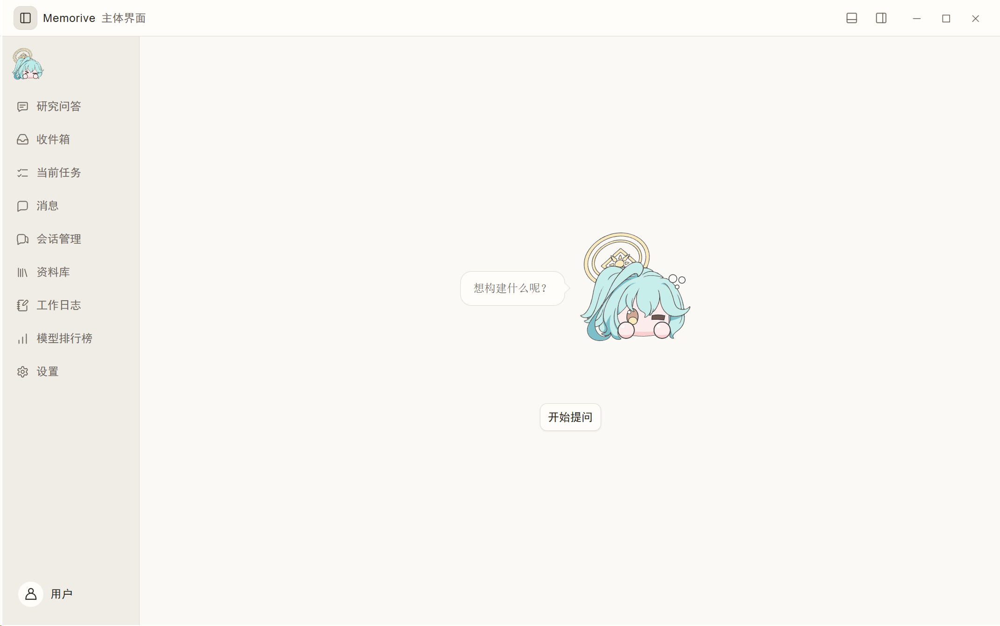
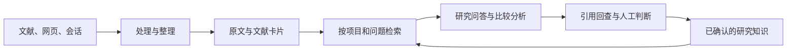

# Memorive

从阅读资料，到可查证、可复用的研究记录。

Memorive（简称 memo）是一款面向个人学习与研究的 Windows 桌面工作台。它把文献、网页和研究对话整理到同一条工作流程中：保留原始资料，提取有来源的信息，围绕证据提问与比较，再将人工确认的结论积累为可继续使用的知识。

[English](README.md) · [中文](README.zh-CN.md) · [日本語](README.ja.md)

### [⬇ 点击下载 Memorive Windows 版](https://github.com/KuchinashiYume/Memorive/releases/download/v1.03/Memorive-Setup-1.03-x64.exe)

**v1.03 · Windows 10 22H2 / Windows 11 · x64 · 约 205 MB（以下载资产为准）**

**第一次使用，下载上方的主程序安装包即可。** 它用于安装 Memorive；配套插件和测试控制台按需选择。

[我应该下载哪个文件？](#下载选择指南) · [下载与版本](https://github.com/KuchinashiYume/Memorive/releases) · [使用指南](memorive_desktop/product/desktop/help/zh-CN/manual-text.md) · [设计文档](memorive_desktop/product/desktop/help/zh-CN/design.md) · [问题反馈](https://github.com/KuchinashiYume/Memorive/issues)

## v1.03 的更新内容

### 功能更新：v1.02.01 → v1.03

研究问答现可复用 memo-research Skill 的原件与转换文本，围绕当前问题读取、比较和回查引用；经过来源与范围核对的回答可回到原对话继续追问。Skill 可独立处理单篇或由 Agent 组织多篇比较。测试控制台补齐三语界面、审核与结果页面及可分享摘要。

本版保留 1.02.01 的设置保存与三级版本识别修复。研究 Skill 是按问题阅读与来源复用的补充，尚无低延迟或取代全量流程的性能结论。来源级集成检查和两轮真实 Agent 回流已有记录；发布包检查另行记录，不代表科研质量、全量业务、干净机器或在线升级全链路已验收。

升级前请备份资料与设置，使用安装器或完整便携包；不要手动覆盖增量 ZIP。控制台独立安装或完整解压，首次连接仍需在 Memo 中授权；切换控制台语言不会改变 Memo 的语言，也不会恢复模型调用许可。

## 主页一览

Memorive v1.02 的中文主页，使用默认设置。

## 可以做什么

### 读：把文献、网页和对话带入研究

从收件箱导入资料，先检查文件、页数和预览，再安排处理。研究问答也支持直接添加 PDF、图片、Word、Markdown 或 TXT，不必先等文献卡片生成。会话管理可以整理本机 Codex、Claude Code 的记录以及浏览器采集、手动导入的内容；精炼后保留重点、决定、假设和待办，方便接着研究。

### 理：把材料整理成能回查的证据

资料处理保留原文，并生成文献卡片（Card）与分析报告（Analysis）。卡片用于整理研究对象、方法、关键数值、结果和局限；分析报告在这些材料上提出候选判断。你可以在资料库中对照原文阅读成品，也可以在当前任务中查看每一步使用的模型、输入输出及失败原因，从必要的步骤重试。

### 证：围绕资料提问，逐条查证引用

在同一对话中选入多篇文献，比较方法、样本条件、结果与限制。默认从当前对话附件检索，也可以主动扩大到项目资料，并按研究目的调整检索权重。回答中的引用连接到相应来源及保存版本；打开原文片段、页码或行号，检查数字、比较和因果判断是否真的得到支持。引用数量和回答流畅度都不能替代这一步。

### 存：让已确认的知识继续服务下一次研究

研究问答产生的“可保存的结论”需要人工检查主张、适用范围、限制和引用，再确认加入知识。单篇文献的“确认复核”与结论的“确认加入知识”是两个独立动作。研究记录、历史版本、会话精炼及日报／周报／月报帮助你回看进展；以后继续提问时，可以按自己的选择复用已确认的研究背景。

### 按自己的模型和工作方式使用

| 能力 | 你可以怎样使用 |
| --- | --- |
| API、CLI 与本地模型 | 连接官方接口、OpenAI 兼容接口或中转服务，也可接入本机已登录的 CLI、Ollama 等本地服务。 |
| 流程模型映射 | 为向量化、卡片生成、分析、审核及周期报告分别分配模型；新任务保存当时使用的配置。 |
| 网页读取与浏览器组件 | 保存当前页面，或按来源实际支持的范围采集会话；在会话管理中核对完整性后再精炼。 |
| 模型排行榜 | 对照公开能力指标、价格、来源和更新时间筛选候选模型，再用自己的任务验证。 |
| 计费与用量 | 按时间和模型查看请求、输入／输出 Tokens、实际或估算费用；缺失费用信息保持未知。 |

## 安装与开始使用

[完整便携包](https://github.com/KuchinashiYume/Memorive/releases/download/v1.03/Memorive-Portable-1.03-x64.zip) · [三语 PDF、Markdown 与本地网页文档](https://github.com/KuchinashiYume/Memorive/releases/download/v1.03/Memorive-1.03-Documentation.zip) · [v1.03 桌面对应源码](https://github.com/KuchinashiYume/Memorive/releases/download/v1.03/Memorive-1.03-desktop-source.zip)。便携版需要完整解压，不能只复制 EXE。当前源码包同时包含 1.03 控制台与研究 Skill；历史 v1.01 源码保留供查阅。

### 下载选择指南

| 你的用途 | 下载文件 | 什么时候需要 |
| --- | --- | --- |
| **Memorive 主程序 · 推荐** | [Memorive-Setup-1.03-x64.exe](https://github.com/KuchinashiYume/Memorive/releases/download/v1.03/Memorive-Setup-1.03-x64.exe) | 用于安装桌面应用。阅读文献、研究问答、管理会话，从这个文件开始。 |
| 校验下载文件 | [SHA256SUMS.txt](https://github.com/KuchinashiYume/Memorive/releases/download/v1.03/SHA256SUMS.txt) | 小型校验文本，用于核对下载文件是否完整。 |
| Obsidian 配套插件 · 可选 | [Memorive-Obsidian-Companion.zip](https://github.com/KuchinashiYume/Memorive/releases/download/v1.01/Memorive-Obsidian-Companion.zip) | 连接 Obsidian 笔记。需要同时安装 Obsidian 与 Memorive。 |
| Zotero 配套插件 · 可选 | [Memorive-Zotero-Companion.xpi](https://github.com/KuchinashiYume/Memorive/releases/download/v1.01/Memorive-Zotero-Companion.xpi) | 连接 Zotero 文献条目与批注。需要同时安装 Zotero 与 Memorive。 |
| 测试控制台安装版 · 可选 | [Memorive-Test-Console-Setup-1.03-x64.exe](https://github.com/KuchinashiYume/Memorive/releases/download/v1.03/Memorive-Test-Console-Setup-1.03-x64.exe) | 适合希望修改、测试或排查 Memorive 的用户，运行安装向导即可。 |
| 测试控制台便携版 · 另一种选择 | [Memorive-Test-Console-Portable-1.03-x64.zip](https://github.com/KuchinashiYume/Memorive/releases/download/v1.03/Memorive-Test-Console-Portable-1.03-x64.zip) | 同一个测试工具，无需安装；完整解压后使用，内含指南与声明。与控制台安装版二选一。 |
| 测试控制台单独 EXE | [Memorive-Test-Console.exe](https://github.com/KuchinashiYume/Memorive/releases/download/v1.03/Memorive-Test-Console.exe) | 适合已有指南和声明的进阶使用者；初次使用建议选安装版或便携版。 |
| 当前桌面源码 · v1.03 | [Memorive-1.03-desktop-source.zip](https://github.com/KuchinashiYume/Memorive/releases/download/v1.03/Memorive-1.03-desktop-source.zip) | 当前桌面程序的对应源码，用于阅读或自行构建，不是安装包。 |
| 历史项目源码 · v1.01 | [Memorive-1.01-source.zip](https://github.com/KuchinashiYume/Memorive/releases/download/v1.01/Memorive-1.01-source.zip) | 历史主程序、配套插件与独立控制台源码；当前桌面源码请选择上方 v1.03。 |
| 第三方对应源码 · 开发/再分发用途 | [Memorive-1.02-third-party-sources.zip](https://github.com/KuchinashiYume/Memorive/releases/download/v1.02/Memorive-1.02-third-party-sources.zip) | 打包依赖的对应源码与索引，约 592 MB。日常安装和使用 Memorive 无需下载。 |

GitHub 还会自动列出 **Source code (zip)** 和 **Source code (tar.gz)**，它们是源码快照。普通用户请选择 **Memorive-Setup-1.03-x64.exe** 安装程序。

### 安装

1. 系统需为 **Windows 10 22H2 或更新版本／Windows 11，x64**。从本项目的 Releases 获取安装包及同批 `SHA256SUMS.txt`。
2. 如需校验文件，在 PowerShell 中运行 `Get-FileHash -Algorithm SHA256 .\Memorive-Setup-1.03-x64.exe`，将结果与校验文件核对。
3. 打开安装向导，在“系统检查”准备缺少的组件：.NET Framework 4.8、WebView2 Runtime、Visual C++ v14 **x64**（14.51.36247 或更新版本）。只按界面提示安装缺失项，再返回重新检查。程序自带 Python，日常使用无需另装。
4. 分别选择程序目录和数据目录，完成安装。首次启动是空白配置；到“设置 → 文档与外部查看”核对工作区及生成产物的位置。

### 配置一条可用的模型通道

- **API**：进入“设置 → 模型服务与 API”，按服务商提供的信息填写协议、地址、模型 ID，并在凭据栏安全保存 Key。先验证连接，再分配任务用途。
- **CLI**：先在工具自己的终端完成安装、登录和模型确认，再到“设置 → CLI 接入”选择工具并验证。
- **本地模型**：先启动本机模型服务、下载模型，再到“设置 → 本地模型”自动检测或填写本机地址，选择正确协议并读取模型列表。

先配置你准备使用的一种方式即可。聊天、图像读取、向量化和审核的能力要求不同；模型出现在列表中，并不表示它适合所有步骤。云端服务或 CLI 订阅由你自行准备，memo 不附赠 API 额度。

### 完成第一次研究

1. **设置处理流程**：在“当前流程模型映射”为需要的步骤选择模型。向量模型负责检索表示，生成与审核分别配置。
2. **选一篇熟悉的资料试跑**：拖入收件箱，检查预览及自动执行开关；到当前任务查看处理进度。
3. **回到原文核对成品**：在资料库打开原文、文献卡片和分析报告，检查关键数值、方法与结论，确认阅读的是同一份资料和版本。
4. **开始研究问答**：选项目、新建对话，直接加附件或从本项目资料中选择，核对模型和检索范围后提问。
5. **把问题问具体**：例如“比较这两篇文献的方法、样本条件与主要限制；分别给出来源，不可直接比较的地方请说明。”
6. **查引用，再保存**：打开回答里的引用，核对原文及上下文；若准备保存结论，再检查适用范围和限制，完成独立的知识确认。

日常继续使用时，可以同步新增会话、精炼研究记录、调整项目检索预设、查看报告和用量。任务失败先查看具体步骤的错误；更换向量模型前留意旧索引，变更资料路径前备份并确认文件位置。

完整图文教程在“设置 → 关于与版本 → 使用文档”，提供中文、英文和日文。也可阅读[安装与首次配置](memorive_desktop/INSTALL.md)和[纯文字使用指南](memorive_desktop/product/desktop/help/zh-CN/manual-text.md)。

## 它怎样组织你的研究

| 组成 | 职责 |
| --- | --- |
| 原始资料与版本 | 保存文件、会话快照和来源位置，便于回到当时使用的材料。 |
| 处理与资料库 | 转换、整理、提取文献信息，并把原文、卡片和分析结果关联起来。 |
| 检索与研究 | 根据项目范围和检索设置组织证据，支持问答、跨篇比较及引用检查。 |
| 知识与研究记录 | 保存人工确认的结论、会话精炼和周期报告，供后续研究复用。 |
| 共用支撑 | 模型通道、任务状态、用量记录及本地存储为上述过程提供支持。 |

桌面界面通过应用服务调用 Python 业务层；模型连接集中管理，原始资料与派生结果分开保存。检索索引帮助找到内容，原文和对应版本仍是查证依据。更详细的数据关系与设计取舍见[设计文档](memorive_desktop/product/desktop/help/zh-CN/design.md)，源码构建见[构建说明](memorive_desktop/BUILDING.md)。

## 数据、费用与当前状态

资料和配置保存在本地。使用云端模型、网页读取或外部检索时，相关内容会发送到所选服务；请按资料性质选择通道。API Key 应通过专用凭据入口保存，不要放进 Issue、截图或导出的研究记录。

费用面板区分实际、估算与未知值；公开榜单价格和订阅费用不能直接当作一次任务的实扣。模型回答与引用需要使用者核对。

当前主程序版本为 v1.03。更新索引已使用生产密钥签名；程序和安装器仍没有 Windows Authenticode 证书，请核对发布校验值。本轮发布准备进行了代码、包身份与签名核对，没有重新执行全量回归。OCR、模型回答与引用支持程度仍需人工复核。

## 自己优化 Memorive，并验证修改

你可以根据自己的学习与研究需求修改、扩展 Memorive。仓库同时提供 **Memorive 测试控制台**：在临时数据空间启动你选择的 Memorive 程序，帮助复现问题、检查接口与功能行为，并查看测试事件、结果和清理回执。

- **修改代码**：使用你熟悉的编辑器或开发工具，再按构建说明生成程序；控制台负责连接和检查。
- **验证修改**：先运行参考端自检，再连接你构建的 Memorive，在程序内允许控制台访问后选择测试。涉及真实模型调用的操作需要单独确认，可能产生费用。
- **保留证据**：查看操作结果和诊断记录；结束会话会清理临时业务数据。部分本地设置可复制到临时空间，正式数据目录不会被覆盖。

测试结果只反映所选版本、配置和场景。参考端自检不能证明实际程序功能全部正常，单次通过也不代表完整质量或安全认证。

[控制台源码与中文使用说明](memorive_console/README.md) · [English](memorive_console/README.en.md) · [日本語](memorive_console/README.ja.md) · [安装包与便携包](https://github.com/KuchinashiYume/Memorive/releases)

控制台为可选开发工具，日常使用 Memorive 无需安装。代码沿用 AGPL-3.0-only；控制台图标另有原画作者署名与权利说明，见 [控制台声明](memorive_console/NOTICE.txt)。

## 开发方式

Memorive 是由 AI 编程工具开发的项目。项目自身的代码由 **OpenAI Codex** 与 **Anthropic Claude Code** 生成、修改和迭代；项目发起者负责需求、产品设计与测试验收，未亲自编写代码。第三方组件保留其各自作者的署名与许可。

## 设计参考与致谢

文献结构化解析参考了 Datalab 的 [Marker](https://github.com/datalab-to/marker) 项目，尤其是文档分块与表格、版面结构保留的思路。感谢项目作者及贡献者。Memorive 也提供可选的 Marker 本地解析接入；运行环境与模型权重需另行配置，并遵循各自许可。

## 许可与角色素材

项目自身代码采用 [AGPL-3.0-only](LICENSE)，适用范围见[许可说明](memorive_desktop/LICENSING.md)。作者鼓励个人学习、研究与非商业使用，这一倡议不增加代码许可证的限制。

部分角色图像是参考《Blue Archive》的 AI 辅助二次创作。Memorive 是非官方个人项目，与 Nexon、Nexon Games 或 Yostar 无关联；原角色、名称和标识的权利归各自权利人所有。桌宠、表情和角色图标单独适用[素材声明](memorive_desktop/ASSET_NOTICE.md)，第三方组件见[第三方说明](memorive_desktop/THIRD_PARTY_NOTICES.md)。

## 反馈与联系

使用问题、错误报告和功能建议，请提交至 [GitHub Issues](https://github.com/KuchinashiYume/Memorive/issues)。私密反馈、安全问题或素材权利相关事宜，可通过项目邮箱联系维护者：[kuchinashiyume01@Gmail.com](mailto:kuchinashiyume01@Gmail.com)。

反馈问题时请注明 Memorive 版本和复现步骤；截图与日志中请去除 API 密钥及私人研究内容。

## 配套插件

[memo-research Skill v0.2.0](https://github.com/KuchinashiYume/Memorive/releases/download/v1.03/Memorive-Research-Skill-0.2.0.zip) · [Test Console 1.03 source](https://github.com/KuchinashiYume/Memorive/releases/download/v1.03/Memorive-Test-Console-Source-1.03.zip)

Obsidian 笔记与 Zotero 文献可通过配套插件连接 Memorive，支持预览导入、证据检索、问答及结果回写。 [Installation / 安装 / インストール](memorive_desktop/integrations/README.md).

## 历史版本简述

**[v1.02.01](https://github.com/KuchinashiYume/Memorive/releases/tag/v1.02.01)** — 设置保存与版本识别修复。

**[v1.02](https://github.com/KuchinashiYume/Memorive/releases/tag/v1.02)** — 加入文献发现、AI近况、自定义CLI、多语言生成、问答归档及签名更新支持。

**[v1.01](https://github.com/KuchinashiYume/Memorive/releases/tag/v1.01)** — v1.01 建立了文献处理、研究问答、来源记录和模型连接的桌面研究流程，并提供配套插件与可选测试控制台。原版本保留供历史查阅；当前主程序请使用上方的 v1.03。
