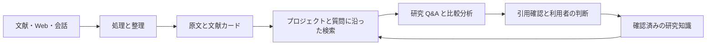

# Memorive v1.03

Current application, Test Console and research Skill information is in the repository project page and RELEASE_NOTES.md. Download the matching installer or complete portable package. The build and licensing context below is retained.

# Memorive

資料を読むところから、根拠を確かめ、次の研究に生かすところまで。

Memorive（略称 memo）は、個人の学習・研究向けの Windows デスクトップワークスペースです。文献、Web ページ、研究中の会話を一つの流れで扱います。原資料を残し、出典とともに情報を整理し、根拠に沿って質問・比較したうえで、自分で確認した結論を次の研究に活用できます。

[中文](../README.md) · [English](../README.en.md) · [日本語](../README.ja.md)

[ダウンロード](https://github.com/KuchinashiYume/Memorive/releases) · [利用ガイド](product/desktop/help/ja-JP/manual-text.md) · [設計文書](product/desktop/help/ja-JP/design.md) · [問題の報告](https://github.com/KuchinashiYume/Memorive/issues)

## できること

### 読む：文献・Web ページ・会話を研究に取り込む

受信箱に資料を追加し、プレビューを確認してから処理を進めます。研究 Q&A には PDF、画像、Word、Markdown、TXT を直接添付でき、文献カードの作成を待つ必要はありません。会話管理では、ローカルの Codex・Claude Code の記録、ブラウザーで取得した内容、手動で取り込んだ会話を整理できます。会話を精錬すると、考え、決定、仮定、次の作業を確認しやすくなります。

### 整理する：原文に戻れる形で根拠をまとめる

資料処理は原文を残し、文献カード（Card）と分析レポート（Analysis）を作成します。カードには研究対象、方法、重要な数値、結果、限界を整理し、分析レポートにはそれらに基づく判断の候補を示します。ライブラリで原文と照合して読めます。現在のタスクでは、各処理のモデル、入出力、エラーを確認し、必要な箇所から再試行できます。

### 確かめる：資料について質問し、引用を一つずつ確認する

一つの会話に複数の文献を選び、方法、標本条件、結果、限界を比較できます。検索対象は基本的に会話の添付資料です。必要に応じてプロジェクト内の資料へ広げ、目的に合わせて検索の重みを調整します。回答の引用から出典と保存された版に戻り、該当箇所、ページ、行を確認できます。数値や因果関係が原文に支えられているかは、文章の読みやすさや引用数とは別に確かめます。

### 残す：確認した知識を次の研究に生かす

保存候補の結論は、主張、適用範囲、限界、引用を確認してから知識に追加します。単独の文献の成果物を確認する操作と、派生した結論を知識に追加する操作は独立しています。過去の版、会話の整理結果、日次・週次・月次レポートを使って研究を再開し、確認済みの背景知識を後の質問で使うかどうかも選べます。

### 自分のモデルと作業方法に合わせる

| 機能 | 利用方法 |
| --- | --- |
| API・CLI・ローカルモデル | 公式 API、互換エンドポイント、中継サービスのほか、ログイン済みの CLI や Ollama などのローカルサービスを接続できます。 |
| 処理ごとのモデル設定 | ベクトル化、カード生成、分析、検証、定期レポートに別々のモデルを指定し、新しいタスクは実行時の設定を記録します。 |
| Web 取得・ブラウザー拡張 | 現在のページや対応範囲内の会話を取得し、内容の完全性を確認してから整理します。 |
| モデルランキング | 公開指標、価格、出典、更新日時で候補を絞り、自分の資料でも検証できます。 |
| 料金・使用量 | 期間とモデルを指定し、リクエスト数、入出力トークン、実額・推定費用を確認できます。不明な費用は不明のまま表示します。 |

## v1.02 で変わること

これまでの「読む・整える・確かめる・残す」という流れを引き継ぎ、研究問答の回答スタイル、再試行の分岐、過去の版を保持します。引用の確認では、出典が見つかることと、その出典が主張を支えることを分けます。長く開いていない会話はアーカイブでき、一覧は必要な情報を先に読み、本文は必要に応じて読み込みます。

文献探索では最新の進展と関連性の高い文献を分け、題録、DOI、出典リンク、取得できる抄録、推薦理由を保存し、重複を共通の仕組みで扱います。全文は引き続き利用者が追加します。ホームには研究への入口と AI 近況を用意します。自分で設定する CLI は入力・出力の仕様に沿って接続します。画面と今後生成する内容は中国語・英語・日本語に対応し、原文献と保存済みの版の言語は変えません。

解析では構造と引用位置をより詳しく保持し、進捗は実際の処理ノードに基づきます。インストールと保守には三言語の操作、更新確認、変更ファイルの取得を加えます。旧版からの初回更新には同じリリースの更新ヘルパーを使います。操作と制限はガイドを参照し、研究内容は利用者が確認してください。

## インストールと使い始め方

### インストール

1. **Windows 10 22H2 以降、または Windows 11（x64）**が対象です。本プロジェクトの Releases からインストーラーと同じ配布版の `SHA256SUMS.txt` を取得します。
2. ファイルを確認する場合は PowerShell で `Get-FileHash -Algorithm SHA256 .\Memorive-Setup-1.01-x64.exe` を実行し、チェックサムと照合します。
3. インストーラーのシステムチェックで、不足している .NET Framework 4.8、WebView2 Runtime、Visual C++ v14 **x64**（14.51.36247 以降）を準備し、再確認します。必要と表示された項目に従ってください。Python は同梱されています。
4. プログラムとデータの保存先を選んでインストールします。初回は空の設定で始まるので、「設定 → 文書と外部表示」で作業場所と生成物の保存先を確認します。

### まず一つのモデル接続を設定する

- **API**：「設定 → モデルサービスと API」で提供元のプロトコル、アドレス、モデル ID を設定し、認証情報欄からキーを保存します。接続を検証してから処理に割り当てます。
- **CLI**：そのツールのターミナルでインストール、ログイン、モデル確認を済ませ、「設定 → CLI 接続」で選択して検証します。
- **ローカルモデル**：先にローカルサーバーを起動し、モデルを用意します。「設定 → ローカルモデル」で自動検出するか本機のアドレスを入力し、対応するプロトコルでモデル一覧を取得します。

最初は使いたい接続方式だけで構いません。チャット、画像の読み取り、ベクトル化、検証では必要な能力が異なります。一覧に表示されるだけで、すべての処理に対応するとは限りません。クラウド利用枠や CLI の契約は各自で用意してください。memo に無料の API 利用枠は付属しません。

### 最初の研究を進める

1. **処理にモデルを割り当てる**：「現在の処理フローのモデル設定」で、必要な処理のモデルを選びます。検索用のベクトル化、生成、検証は役割ごとに設定します。
2. **よく知る資料を一つ試す**：受信箱に追加してプレビューと自動実行を確認し、現在のタスクで進捗を追います。
3. **原文と成果物を照合する**：ライブラリで原文、Card、Analysis を開き、同じ資料・版の方法、数値、結論を確認します。
4. **研究 Q&A を始める**：プロジェクトと会話を選び、ファイルを添付するか既存資料を選択し、モデルと検索範囲を確認します。
5. **具体的に質問する**：例えば「この二つの文献の方法、標本条件、主な限界を比較してください。それぞれの出典を示し、直接比較できない点を説明してください」と尋ねます。
6. **引用を確認してから保存する**：原文と前後の文脈に戻り、適用範囲と限界を確かめたうえで、知識への追加を個別に確認します。

日常の作業では、新しい会話の同期、記録の整理、検索プリセットの調整、レポートや使用量の確認を行えます。失敗時は該当処理のエラーを確認してください。ベクトルモデルの変更には索引の再構築が必要な場合があります。保存先を変える前にバックアップとファイルの位置を確認します。

中国語・英語・日本語の図解ガイドは「設定 → バージョン情報 → 利用文書」から開けます。[インストールと初期設定](INSTALL.md)、[テキスト版ガイド](product/desktop/help/ja-JP/manual-text.md)も参照できます。

## 研究を支える構成

| 構成 | 役割 |
| --- | --- |
| 原資料と版 | ファイル、会話のスナップショット、出典の位置を保存し、使用した時点の資料へ戻れるようにします。 |
| 処理とライブラリ | 資料の変換、整理、情報抽出を行い、原文とカード・分析を関連づけます。 |
| 検索と研究 | 選んだプロジェクトの範囲から根拠を組み立て、質問、比較、引用確認を支えます。 |
| 知識と研究記録 | 確認した結論、会話の整理結果、定期レポートを次の研究へ引き継ぎます。 |
| 共通サービス | モデル接続、タスクの状態、使用量記録、ローカル保存を提供します。 |

デスクトップ画面はアプリケーションサービスを介して Python の処理層を呼び出します。モデル接続はまとめて管理し、原資料と派生成果物は分けて保存します。索引は内容を探すためのもので、確認の根拠は原文とその版です。詳細は[設計文書](product/desktop/help/ja-JP/design.md)、ソースからの構築は[ビルド手順](BUILDING.md)をご覧ください。

## データ・費用・現在の状態

資料と設定はローカルに保存します。クラウドモデル、Web 取得、外部検索では、関連するリクエストを選択したサービスへ送信します。資料の性質に合う接続先を選び、キーは専用の認証情報欄で保存してください。Issue、画面画像、研究記録のエクスポートには含めないでください。

費用記録は実額・推定・不明を区別します。公開価格やサブスクリプション料金は、個々のタスクの請求額とは異なります。モデルの回答と引用は利用者自身で確認します。

本書は v1.02 の公開前改訂です。更新手順、インストーラー、アプリと対応ソースの検証・対応付けを終えてから公開します。公開済みファイルは Releases を参照してください。更新情報の署名と Windows Authenticode は別の確認であり、各ファイルの署名状態は最終配布時に示します。

## 開発について

Memorive は AI コーディングツールで開発されたプロジェクトです。独自のコードは **OpenAI Codex** と **Anthropic Claude Code** によって生成・修正され、改善が重ねられています。企画者は要件定義、製品設計、テストと受け入れ確認を担当しており、コードを直接書いてはいません。第三者のコンポーネントは、それぞれの作者の表記とライセンスを保持しています。

## ライセンスとキャラクター素材

プロジェクト独自のコードには [AGPL-3.0-only](../LICENSE) を適用します。[適用範囲](LICENSING.md)をご確認ください。個人の学習・研究と非商用利用を推奨しますが、この方針はコードのライセンスに制限を追加するものではありません。

一部のキャラクター画像は『ブルーアーカイブ』を参考に AI を用いて制作した二次創作です。Memorive は個人による非公式プロジェクトで、Nexon、Nexon Games、Yostar との関係はありません。原キャラクター、名称、標章などの権利は各権利者に帰属します。デスクトップペット、表情、キャラクターアイコンには[素材に関する声明](ASSET_NOTICE.md)を別途適用します。依存コンポーネントは[第三者に関する説明](THIRD_PARTY_NOTICES.md)をご覧ください。
