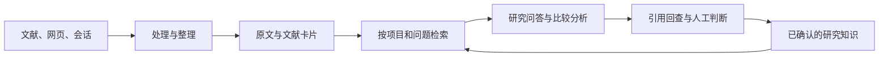

# Memorive v1.03

Current application, Test Console and research Skill information is in the repository project page and RELEASE_NOTES.md. Download the matching installer or complete portable package. The build and licensing context below is retained.

# Memorive

从阅读资料，到可查证、可复用的研究记录。

Memorive（简称 memo）是一款面向个人学习与研究的 Windows 桌面工作台。它把文献、网页和研究对话整理到同一条工作流程中：保留原始资料，提取有来源的信息，围绕证据提问与比较，再将人工确认的结论积累为可继续使用的知识。

[中文](../README.md) · [English](../README.en.md) · [日本語](../README.ja.md)

[下载与版本](https://github.com/KuchinashiYume/Memorive/releases) · [使用指南](product/desktop/help/zh-CN/manual-text.md) · [设计文档](product/desktop/help/zh-CN/design.md) · [问题反馈](https://github.com/KuchinashiYume/Memorive/issues)

## 可以做什么

### 读：把文献、网页和对话带入研究

从收件箱导入资料，先检查文件、页数和预览，再安排处理。研究问答也支持直接添加 PDF、图片、Word、Markdown 或 TXT，不必先等文献卡片生成。会话管理可以整理本机 Codex、Claude Code 的记录以及浏览器采集、手动导入的内容；精炼后保留重点、决定、假设和待办，方便接着研究。

### 理：把材料整理成能回查的证据

资料处理保留原文，并生成文献卡片（Card）与分析报告（Analysis）。卡片用于整理研究对象、方法、关键数值、结果和局限；分析报告在这些材料上提出候选判断。你可以在资料库中对照原文阅读成品，也可以在当前任务中查看每一步使用的模型、输入输出及失败原因，从必要的步骤重试。

### 证：围绕资料提问，逐条查证引用

在同一对话中选入多篇文献，比较方法、样本条件、结果与限制。默认从当前对话附件检索，也可以主动扩大到项目资料，并按研究目的调整检索权重。回答中的引用连接到相应来源及保存版本；打开原文片段、页码或行号，检查数字、比较和因果判断是否真的得到支持。引用数量和回答流畅度都不能替代这一步。

### 存：让已确认的知识继续服务下一次研究

研究问答产生的“可保存的结论”需要人工检查主张、适用范围、限制和引用，再确认加入知识。单篇文献的“确认复核”与结论的“确认加入知识”是两个独立动作。研究记录、历史版本、会话精炼及日报／周报／月报帮助你回看进展；以后继续提问时，可以按自己的选择复用已确认的研究背景。

### 按自己的模型和工作方式使用

| 能力 | 你可以怎样使用 |
| --- | --- |
| API、CLI 与本地模型 | 连接官方接口、OpenAI 兼容接口或中转服务，也可接入本机已登录的 CLI、Ollama 等本地服务。 |
| 流程模型映射 | 为向量化、卡片生成、分析、审核及周期报告分别分配模型；新任务保存当时使用的配置。 |
| 网页读取与浏览器组件 | 保存当前页面，或按来源实际支持的范围采集会话；在会话管理中核对完整性后再精炼。 |
| 模型排行榜 | 对照公开能力指标、价格、来源和更新时间筛选候选模型，再用自己的任务验证。 |
| 计费与用量 | 按时间和模型查看请求、输入／输出 Tokens、实际或估算费用；缺失费用信息保持未知。 |

## v1.02 的变化

本版围绕已有的阅读、整理、查证和保存流程继续改进。问答保留回答风格、重试分支与历史版本，引用检查区分找到来源与来源是否支持主张；长期未打开的对话可以归档，列表先加载必要信息，按需读取正文。

文献发现区分最新进展与高度相关内容，保存题录、DOI、来源链接、可取得的摘要和推荐理由，并统一处理重复记录。全文仍由你手动添加。首页提供研究入口和 AI 近况；自定义 CLI 可按其实际输入输出方式接入，界面与之后生成的内容支持中文、英文和日文，文献原始语言与历史版本保持不变。

解析与引用位置保留更多结构信息，任务进度来自实际节点。安装和更新维护增加三语入口、版本检查及变化文件下载，旧版本首次通过同批更新助手接入。功能边界和操作说明见使用指南；输出仍需要人工核对。

## 安装与开始使用

### 安装

1. 系统需为 **Windows 10 22H2 或更新版本／Windows 11，x64**。从本项目的 Releases 获取安装包及同批 `SHA256SUMS.txt`。
2. 如需校验文件，在 PowerShell 中运行 `Get-FileHash -Algorithm SHA256 .\Memorive-Setup-1.01-x64.exe`，将结果与校验文件核对。
3. 打开安装向导，在“系统检查”准备缺少的组件：.NET Framework 4.8、WebView2 Runtime、Visual C++ v14 **x64**（14.51.36247 或更新版本）。只按界面提示安装缺失项，再返回重新检查。程序自带 Python，日常使用无需另装。
4. 分别选择程序目录和数据目录，完成安装。首次启动是空白配置；到“设置 → 文档与外部查看”核对工作区及生成产物的位置。

### 配置一条可用的模型通道

- **API**：进入“设置 → 模型服务与 API”，按服务商提供的信息填写协议、地址、模型 ID，并在凭据栏安全保存 Key。先验证连接，再分配任务用途。
- **CLI**：先在工具自己的终端完成安装、登录和模型确认，再到“设置 → CLI 接入”选择工具并验证。
- **本地模型**：先启动本机模型服务、下载模型，再到“设置 → 本地模型”自动检测或填写本机地址，选择正确协议并读取模型列表。

先配置你准备使用的一种方式即可。聊天、图像读取、向量化和审核的能力要求不同；模型出现在列表中，并不表示它适合所有步骤。云端服务或 CLI 订阅由你自行准备，memo 不附赠 API 额度。

### 完成第一次研究

1. **设置处理流程**：在“当前流程模型映射”为需要的步骤选择模型。向量模型负责检索表示，生成与审核分别配置。
2. **选一篇熟悉的资料试跑**：拖入收件箱，检查预览及自动执行开关；到当前任务查看处理进度。
3. **回到原文核对成品**：在资料库打开原文、文献卡片和分析报告，检查关键数值、方法与结论，确认阅读的是同一份资料和版本。
4. **开始研究问答**：选项目、新建对话，直接加附件或从本项目资料中选择，核对模型和检索范围后提问。
5. **把问题问具体**：例如“比较这两篇文献的方法、样本条件与主要限制；分别给出来源，不可直接比较的地方请说明。”
6. **查引用，再保存**：打开回答里的引用，核对原文及上下文；若准备保存结论，再检查适用范围和限制，完成独立的知识确认。

日常继续使用时，可以同步新增会话、精炼研究记录、调整项目检索预设、查看报告和用量。任务失败先查看具体步骤的错误；更换向量模型前留意旧索引，变更资料路径前备份并确认文件位置。

完整图文教程在“设置 → 关于与版本 → 使用文档”，提供中文、英文和日文。也可阅读[安装与首次配置](INSTALL.md)和[纯文字使用指南](product/desktop/help/zh-CN/manual-text.md)。

## 它怎样组织你的研究

| 组成 | 职责 |
| --- | --- |
| 原始资料与版本 | 保存文件、会话快照和来源位置，便于回到当时使用的材料。 |
| 处理与资料库 | 转换、整理、提取文献信息，并把原文、卡片和分析结果关联起来。 |
| 检索与研究 | 根据项目范围和检索设置组织证据，支持问答、跨篇比较及引用检查。 |
| 知识与研究记录 | 保存人工确认的结论、会话精炼和周期报告，供后续研究复用。 |
| 共用支撑 | 模型通道、任务状态、用量记录及本地存储为上述过程提供支持。 |

桌面界面通过应用服务调用 Python 业务层；模型连接集中管理，原始资料与派生结果分开保存。检索索引帮助找到内容，原文和对应版本仍是查证依据。更详细的数据关系与设计取舍见[设计文档](product/desktop/help/zh-CN/design.md)，源码构建见[构建说明](BUILDING.md)。

## 数据、费用与当前状态

资料和配置保存在本地。使用云端模型、网页读取或外部检索时，相关内容会发送到所选服务；请按资料性质选择通道。API Key 应通过专用凭据入口保存，不要放进 Issue、截图或导出的研究记录。

费用面板区分实际、估算与未知值；公开榜单价格和订阅费用不能直接当作一次任务的实扣。模型回答与引用需要使用者核对。

本文为 v1.02 发布前修订。最终更新流程、安装器、程序与对应源码完成验收并绑定后再发布；公开可用文件以 Releases 为准。更新清单签名与 Windows Authenticode 是两种不同的校验，具体文件签名状态随最终交付说明。

## 开发方式

Memorive 是由 AI 编程工具开发的项目。项目自身的代码由 **OpenAI Codex** 与 **Anthropic Claude Code** 生成、修改和迭代；项目发起者负责需求、产品设计与测试验收，未亲自编写代码。第三方组件保留其各自作者的署名与许可。

## 许可与角色素材

项目自身代码采用 [AGPL-3.0-only](../LICENSE)，适用范围见[许可说明](LICENSING.md)。作者鼓励个人学习、研究与非商业使用，这一倡议不增加代码许可证的限制。

部分角色图像是参考《Blue Archive》的 AI 辅助二次创作。Memorive 是非官方个人项目，与 Nexon、Nexon Games 或 Yostar 无关联；原角色、名称和标识的权利归各自权利人所有。桌宠、表情和角色图标单独适用[素材声明](ASSET_NOTICE.md)，第三方组件见[第三方说明](THIRD_PARTY_NOTICES.md)。
