# Memorive システム設計

*利用者と開発協力者のための設計説明 · 2026 年 9 月 29 日*

v1.02 公開前の文書 · 2026-09-29。今回決定した機能範囲を説明します。インストールと更新の手順は、最終成果物と照合してから公開します。文書の版番号は公開済みを意味しません。従来の図は共通操作の説明用です。新機能は実際の画面で確認してください。

Memorive は資料処理、研究 Q&A、引用の確認、知識の再利用をつなぎます。本書では、出典をたどれる研究記録を支えるデータの流れ、各機能の責任、失敗時の扱いを説明します。研究上の判断と最終的な執筆は利用者が担当します。

実装済みの主な機能と、利用条件のある拡張設計を区別して読んでください。利用可否は現在の画面、設定、タスクの記録で確認できます。本書の改訂自体は公開を意味しません。

## 1. 位置づけと原則

Memoriveは個人の研究プロセスを支援するシステムであり、資料の取得、証拠の整理、検索・分析、研究記録、知識の再利用に対応し、特定の学問分野に限定しません。システムは追跡可能な資料と提案を提供し、研究者が判断、意思決定、最終的な執筆を担当します。

最終的な決定権は研究者にあります。AIは理解、整理、分析、推奨、検証、リマインダーを行うことができますが、インポート、承認、フィードバック、公開を単独で承認することはできません。また、生データを上書きしたり、研究者に代わって最終的な研究結論を形成したりすることもできません。システムは承認済みのタスクとルールを実行できますが、自動実行によって新たな承認が生じることはありません。

データはツールから独立しています。原本、Markdown、カード、ノート、意思決定記録は長期にわたり保持され、モデルやソフトウェアは交換可能です。検索インデックスとUIの投影はこれらの資産に奉仕し、別の事実源となることはありません。

段階的に構築します。まず最小限の研究の循環を完成させ、その後、品質ガバナンス、ライフサイクル、研究運用を追加します。高複雑度のモジュールのみを細分化し、新機能の追加には明確な責任、依存関係、終了条件が必要です。製品ポジショニングの拡大を理由に、すべての機能を同時に構築することはありません。

証拠に基づいて品質を判断します。形式の妥当性、内容の信頼性、抽出の完全性、系譜の有効性、公開の許可は異なる問題です。重要な数値、因果関係の判断、論文に使用予定の内容は優先的に検証します。一般的で分離可能なギャップは降格して保持でき、コア証拠が無効になった場合や、出力を継続すると誤解を招く場合にのみブロックします。

原文とバージョンを保持します。基礎データは出典の言語を維持し、翻訳はユーザーが選択した表示層でのみ行われ、データには書き戻されません。変更は新しいバージョンを生成し、旧コンテンツ、レビュー記録、失敗の証拠は保持されます。

### 本文の範囲

本文は、モジュールの責務、入出力、主要な依存関係、モジュール間の制約、失敗時の扱い、各フェーズの現状を扱います。全フィールド、Prompt、閾値、プロバイダー料金、個別のテスト記録、ファイルハッシュは、対応するモジュール契約と実行証拠で管理します。

## 2. システムアーキテクチャ

### 2.1 メインラインとバイパス

資料処理： ユーザーによる入力承認 → 資料処理 前処理 → 証拠抽出 カード生成 → 証拠レビュー 検証 → 知識登録 承認実行 → 通常の検索入口。

研究分析： 問題 → 証拠検索 検索およびコンテキストパックの組み立て → 研究分析 分析提案の生成 → 契約に基づき証拠レビューの独立したレビューをトリガー → ユーザーの判断。

知識の再利用： 承認済み資料 → 研究機会 機会分析；ユーザーが選択した再利用可能な結果 → 知識への反映 還流候補 → ユーザーが目的地と承認を確認 → 知識登録/バージョンと来歴 実行状態とバージョン処理。

外部探索：M16 が題録候補を集め、M17 が推薦を整理します。利用者が検索を実行するか、自動受け取りを有効にすると、題録と出典リンクをライブラリへ保存し通知できます。全文は利用者が追加します。題録の受け取りは全文処理や知識の承認とは別であり、それぞれの確認・承認規則を維持します。

原本と前処理の中間成果物は、Card が active であること前提とせずに先に保存可能；通常の分析に入る資料はその承認契約を満たす必要がある。研究レポート はマルチソースイベントから研究変更レポートを生成するものであり、上記のメインラインの必須工程ではない。

M18 は数値の関係と内部論理の有界な検査を既存フローに接続し、データノードや論理分岐の実行順を変更しません。M19 は研究処理の主線とは別にインストールと更新を調整します。下図は従来の研究経路を示します。追加する責務と依存関係はモジュール一覧と第 4 章に記載します。

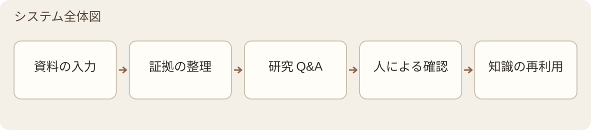

*図 1 · システム全体図*

### 2.2 モジュールの分担

M1–M17 の番号と基本的な責務を維持し、M18 データ・論理チェックと M19 アプリ更新・保守を追加します。M18 は検査サービス、M19 はデスクトップ保守層に属します。ホーム、言語、問答の操作は引き続きアプリ層で調整します。番号は責務を示すものであり、新しい画面や実装・受入の完了を意味しません。

| レイヤー | モジュール | 責任 |
| --- | --- | --- |
| 処理と分析 | 資料処理 前処理；証拠抽出 蒸留；証拠検索 検索；研究分析 分析 | 原始資料から引用可能な証拠と分析提案を形成 |
| 分析バイパス | 研究機会 機会分析 | 比較可能な条件における緊張関係と著者自身の陳述におけるギャップを識別 |
| 共有サービス | 証拠レビュー 検証；検索の重み付け 重み付け；知識登録 状態機械；モデルサービス モデルゲートウェイ | それぞれコンテンツ審査、ランキング、受入実行、モデル呼び出しを担当 |
| 記録とフィードバック | 知識への反映 還元；実行記録 ログ | 制御されたフィードバック候補を形成し、実行事実と最終状態を記録 |
| 長期ガバナンス | 判断記録 意思決定ログ；バージョンと来歴 ライフサイクル；品質評価 品質保証 | 意思決定の理由、不変のプロブナンス、継続的な品質証拠を保存 |
| 研究運用 | 研究レポート 変更ログ；文献探索 情報文献探索；研究資料の推薦 能動的取得 | 変化を報告し、候補を発見して推奨を組織化 |
| 検査サービス | M18 データ・論理チェック | 数値の関係と内部論理を確認し、条件・根拠・対象範囲を残す |
| デスクトップ保守 | M19 アプリ更新・保守 | 版の確認、取得、インストール、更新と復旧を調整する |
| アプリケーションと実行 | ApplicationFacade、Application Service、Control Store、ExecutionCore、JobRunner | デスクトップ、業務モジュール、永続実行状態、実行チャネルを接続；業務モジュール番号は追加しない |

| 番号 | モジュール |
| --- | --- |
| M1 | 前処理パイプライン |
| M2 | 蒸留 |
| M3 | 検索とコンテキストの重み付け |
| M4 | 分析 |
| M5 | 研究機会の分析 |
| M6 | 検証 |
| M7 | 重み付け |
| M8 | 状態機械 |
| M9 | モデルゲートウェイと実行経路 |
| M10 | 承認を伴う知識の還流 |
| M11 | ログと終端状態の台帳 |
| M12 | 設計判断の記録 |
| M13 | データのライフサイクル |
| M14 | 品質保証 |
| M15 | 研究変更ログ |
| M16 | 文献探索と研究情報レーダー |
| M17 | 能動的な知識獲得 |
| M18 | データ・論理チェック |
| M19 | アプリ更新・保守 |

### 2.3 責任境界

資料処理 は変換と OCR の品質を処理し、証拠抽出 は抽出とローカル構造検証を担当します。研究分析 は引用のアイデンティティおよびコンテキストメンバーシップを検証し、証拠レビュー は証拠が内容を支持しているかを判断します。知識登録 はリクエストと根拠に基づいてのみ状態遷移を実行し、品質判断を生成しません。

モデルサービス/provider adapter は呼び出し境界内の技術的リトライを処理し、JobRunner は実行、タイムアウト、キャンセル、復旧を管理します。証拠抽出/証拠レビュー はビジネスレベルの修正を管理し、実行記録 はイベントを記録します。判断記録 は決定理由を保存し、バージョンと来歴 はバージョンと系譜を保存し、品質評価 は品質を監視し、処置提案を行います。

各機能モジュール は本バージョンのモジュール集合です。今後の拡張には、ModuleManifest、依存関係、互換性、資格の個別承認が必要であり、デフォルトでは無効化されます。拡張プロトコル自体は新規モジュールの追加を承認しません。

## 3. データと比較の規約

### 3.1 二層構造ナレッジベース

ソース層では、原本とその追跡可能なテキスト（PDF または他の原始ファイル、RawMD、CleanMD、Chunks）を保存します。原本は最終的な証拠の根拠であり、変換結果にはソース位置と変換記録を保持します。

カード層では、単一記事の忠実な抽出である Card を保存し、検索、比較、照会に使用します。個人メモ、記事横断の要約、Analysis およびフィードバック対象は別の派生成果物として扱い、Card の原文忠実フィールドに混在させません。

ベクトル、フィールドベクトル、クエリ射影、デスクトップライブラリはいずれもアクセス層です。これらは具体的なソースと成果物バージョンを指す必要があり、契約に基づいて再構築可能ですが、原本、Card、Registry の権威を逆方向に代替することはできません。

### 3.2 アイデンティティ、ソース、言語

文献には安定した paper_id を使用します。永続化成果物には、artifact ID、コンテンツハッシュ、スキーマバージョン、ソース範囲、親バージョン、run、実行設定を保存します。複数の Context Pack、Analysis、リリースマニフェストには複数の親成果物を持たせることができ、単一の移動可能な latest パスにのみ紐付けすることはできません。

高リスクの Card 情報には、読み取り可能な抽出と source_anchor: {chunk_id, quote} を同時に保存します。quote は対応する同一記事の chunk で検証可能でなければなりません。原文引用が真実であることは、抽出が意味論的に必然的に成立することを意味せず、依然として審査が必要です。履歴でアイデンティティ、構造、系譜が欠落している場合は unknown / not_assessed とマークし、ファイル名、時間、類似テキストに基づいて推測補完しません。

RawMD、CleanMD、Card と文献処理は原文の言語を保持します。画面、システムメッセージ、新しく生成する問答・研究提案・報告は現在の生成言語設定に従い、原文、引用、題録、過去の版は書き換えません。生成時の言語とプロンプト版を固定し、キャッシュを言語ごとに区別します。表示用の訳文を新しい一次証拠として保存しません。

### 3.3 汎用比較コンテキスト

| フィールド | 表現すべき情報 |
| --- | --- |
| Research Object | 研究対象、材料、サンプル、テキストまたはシステム |
| Intervention / Factor | 検討対象となる要素または介入 |
| Comparator | 対照対象または比較基準 |
| Method | 方法、研究デザインまたは分析フレームワーク |
| Metric | 評価指標とその意味 |
| Boundary Condition | 結論が適用される条件と境界 |
| スケーリング / コンテキスト | スケーリング、シナリオ、および応用背景 |
| クレームタイプ | 因果関係、相関、メカニズム、パフォーマンス、手法検証などの結論タイプ |

各学科はエイリアスマッピングのみを置き換え、コアフィールドは変更しない。証拠抽出は比較コンテキストを抽出し、研究機会はそれを用いて比較可能性を判断する。比較結果はfact_id、または追跡可能なCardフィールドパスおよびバージョンを引用する。このビジネス表現は、Cardスキーマ、レビューサイドカー、カバレッジ、または系譜契約に代わるものではない。

## 4. モジュール設計

### M1 · 前処理パイプライン

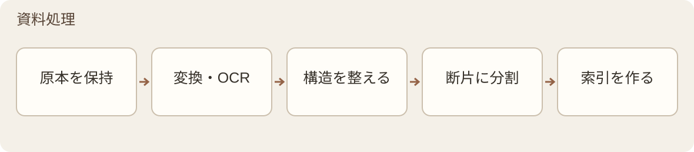

*図 2 · 資料処理 の内部フロー*

入力 → 出力： 原文書、画像、またはノート → 原本アーカイブ、RawMD、CleanMD、チャンク、ベクトルインデックス、および変換記録。

依存関係と成果物： 登録フローおよび承認された外部候補は資料処理を呼び出す。資料処理はモデルサービスの変換/OCR/埋め込みチャネル、検索の重み付けのエントリシグナル、バージョンと来歴のバージョン証跡、および実行記録のログを使用し、証拠抽出にテキストとソースを納品する。Cardが形成される前は知識登録を呼び出さず、変換品質は証拠レビューの汎用レビューに引き継がない。

| ステップ | 処理内容 |
| --- | --- |
| DocumentIngest インポート | 原本、ソース、アイデンティティ、時間、およびデータ処理権フラグの保存 |
| DocumentConvert 変換 | PDF/その他の入力をRawMDに変換；異常ページは必要に応じてOCRを実行し、変換レポートを出力 |
| DocumentClean クリーニング | ローカルの決定論的ルールを用いてヘッダー/フッター、改行、カラム混在などのフォーマットノイズを処理し、言語およびソースのマーカを保持 |
| DocumentChunk チャンク分割 | 章、段落、テーブル、図キャプションなどの構造に基づいて分割し、安定したchunk_idを生成 |
| DocumentEmbed 埋め込み | 承認済みプロファイルに基づいてベクトルを生成し、モデルと時刻を記録。既存の構造および所有権メタデータを透過的に伝達 |

ページレベルのOCR。 通常のデジタルPDFはローカル解析を優先し、デフォルトで全文OCRは行わない。スキャン、テキストがほぼ空、文字化け、または重要な構造が破損したページのみレスキュー処理に入る：ローカル診断 → 所有権チェック → 承認済みOCRロール → 元の解析結果との並列照合 → ページ統合。元の物理ページが最終的な根拠であり、二重パスの結果で多数決により真偽を決定しない。単一ページの失敗時は他のページを保持し、欠落ページおよび不完全な範囲を明確に示す。

ノート照合。 noteはM1b以降デフォルトで一時停止し、ユーザーが転写とフォーマットを確認する。ノート内容の価値判断は行わない。照合をスキップするには明示的な設定とログ記録が必要。再開時は検証済みのRawMDメタデータを使用し、前回のプロセスメモリに依存しない。重要なIDが欠落している場合は停止する。

ベクトルの一貫性と復旧。 同じモデル名でも同じベクトル空間であることを保証しない。インデックスの再利用には、次元、正規化、距離尺度、検索リグレッションの検証が必要。通常の実行および復旧エントリポイントには旧ベクトルの削除機能はない。明示的な再埋め込みでは、まず新しいテキスト成果物が生成可能であることを確認し、次に旧ベクトルのディスクスナップショットを保存し、クリーンアップと検証後に再構築する。中断時はスナップショットから旧ベクトルを復旧し、モデルを再呼び出して旧値を偽造しない。復旧に失敗した場合はスナップショットを保持し、手動処理を促す。同一文書の再埋め込みは単一ライター境界を遵守する。

本バージョンの範囲。 Capabilitiesでは14種類のcanonical形式を登録：11種類がsupported、JPEG/PNG/TIFFはdegradedであり、frame probeのみを意味し、画像OCRを意味しない。PDFは[PDF]を保持し、その他の元ファイルは元のバイトで[Original]として保持；typed anchorはchunk_schema_version=3に投影。Office legacy bridgeは凍結済みのOffice16範囲のみをカバーし、マクロおよびリンク更新は禁止。OCR、Marker、ローカルチェーンの実際の資格は第8章、第9章を参照。

### M2 · 蒸留

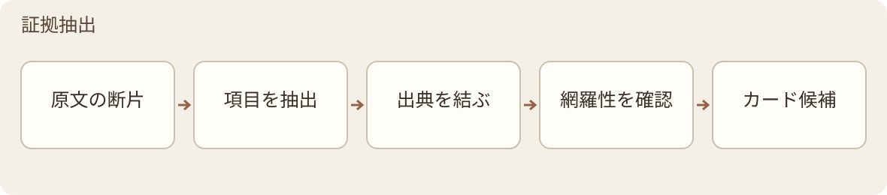

*図 3 · 証拠抽出 の内部フロー*

入力 → 出力： 単一のCleanMDと凍結済みChunksリスト → Card、補助抽出結果およびカバレッジ記録。

依存関係と成果物： モデルサービス経由でcard_distiller_primaryを要求；結果はまずローカルのハードゲートを通過し、次に証拠レビューのレビュー、知識登録の受入を経て、バージョンと来歴/実行記録がバージョンとログを保存。Cardフィールドの埋め込みは後続の承認済みフローによってトリガーされ、M1eの原文埋め込みと混同しない。

内容範囲。コアフィールドには、研究課題、対象、方法、主要な結果、著者の結論、境界条件、出典アンカーが含まれます。補助的な抽出には、重要なデータ、比較コンテキスト、著者が自己申告した限界・展望、および任意の用語と引用関係が含まれます。研究の限界と結論の適用範囲は分離します。個人のインスピレーション、批判、仮説、複数論文の統合、および執筆コーパスは忠実層には含めません。

| ルール | 抽出要件 |
| --- | --- |
| R1–R2 | 著者の主張の強度を保持する。多段階のプロセスや複数の比較群を完全に保持し、その一部で全体を代替してはならない。 |
| R3–R4 | 数値は統計タイプ、段階、サンプル、範囲とともに抽出する。指標にはスコープ、分母、対照を明記する。 |
| R5–R6 | 結論には実際の適用条件を付与する。研究対象と表現/テストサンプルを区別する。 |
| R7–R8 | 用語は著者の定義に従う。出典アンカーは実際の取材範囲をカバーし、「要約」として一律に略記しない。 |
| R9 | 原文に示されている情報は抽出する。確実に存在しない場合はその旨を明記し、捏造しない。明らかな誤字は文脈に基づいて処理する場合、原値、根拠、修正痕跡を保持する。 |

構造とカバレッジ。Card スキーマは v6 をベースとし、アンカーごとの引用、field_credibility、completion_status、omissions/tombstone を保持する。必須スロットは present、absent_in_source、not_applicable、extraction_gap、not_assessed に分類してラベル付けする。「見つからない」を直接「原文にない」と記録してはならない。レビュー完了や削除登録の欠如は、抽出が原文全体をカバーしていることの証明にはならない。

生成と復元。利用可能なCardを書き出す前に、スキーマ、型、列挙値、出典ID、アンカー、および決定論的なフィールド間制約を確認します。高リスクな引用については対応する原文との照合を行い、正規化はレイアウトノイズの処理に限定します。Fullの前に、独立した予算を使用してコアアンカーの復元を1回実行できます：正確な目標と候補出典を凍結し、無効なアンカーの置換または削除のみを許可します。フィールドがすべての実アンカーを失った場合は、リリースを許可できません。

Full後の修復は証拠レビューの契約に従って実行されます：1回のCardカスケードにつき、業務バッチ修正は最大1回までとし、カード全体の再生成や2回目のFullは行いません。体系的な失敗が発生した場合は、新しいCard、run、およびチェックリストを別途作成し、前回の失敗を保持します。技術的な切り詰め復元には、別の有界予算を使用します。

長文。Capabilities segmented_distillは、容量探査、分割、分割アンカーリング、階層別マージ、上限修正、および完全なファイルの原子的可见性メカニズムを確立しています。ファイルの完全な可见性と知識登録の受け入れ基準は別個の事項です。レビューが完了していない限り、状態はpendingのままです。このモジュールの契約およびサンプルの適格性は、デスクトップへの接続を保証するものとして直接使用できません。

### M3 · 検索とコンテキストの重み付け

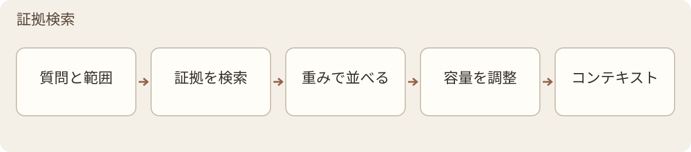

*図 4 · 証拠検索 の内部フロー*

入力 → 出力： 質問、承認済み出典、および重み設定 → 追跡可能かつ容量制約のあるContext Pack。

依存関係： 検索の重み付けがランキングスコアを提供し、モデルサービスが承認済み埋め込み/リランキングチャネルを提供し、実行記録が記録します。結果は研究分析、研究機会、および日常の検索で使用されます。

検索は、質問理解、候補リコール、およびコンテキストパッキングに分類されます。まずCardとフィールドシグナルを使用して位置を特定し、必要に応じて原文に降格します。Cardのアンカーはリコールの手がかりであり、実際に提供される証拠テキストはChunksから取得されます。パッキング時には、トークン上限、出典の多様性、質問のファセット、および質の高い反例を同時に制御し、固定ブロック数をカバレッジの証明として使用しません。

logical_spanは、実行時に明確な構造関係を持つ元のメンバーのみを組織化し、member_chunk_idsを保持します。現在の範囲は、同じ章の表と見出し/脚注、および厳密に隣接する連続段落に限定され、chunkを書き換えることも、任意の章間セマンティック融合を行うこともありません。

証拠検索はカバー済み/欠落している質問のファセットを記録し、研究分析はdirect-answer、subquestion coverage、source-dominanceなどの分析指標を別途生成します。不明な構造は推測で補完せず、参考文献は章とエントリの形態が両方とも明確な場合のみ、通常の検索ルールに従って除外します。書誌学に関する質問は保持できます。

Context Packは、実際に選択されたメンバーのdata_ownershipを集約し、effective_data_ownership、混合状態、貢献出典、サマリー、および解析受領証などの不変スナップショットを形成し、証拠検索→研究分析→証拠レビューに沿って伝達します。不明または競合する場合は、権限契約に従って外部送信を停止します。リランキングが有効な場合、承認済みモードのみを使用できます。結果のIDセットが不正な場合は、元の距離順序に戻ります。複雑な質問の検索サブダイアログの精錬は、まだ接続されていません。

### M4 · 分析

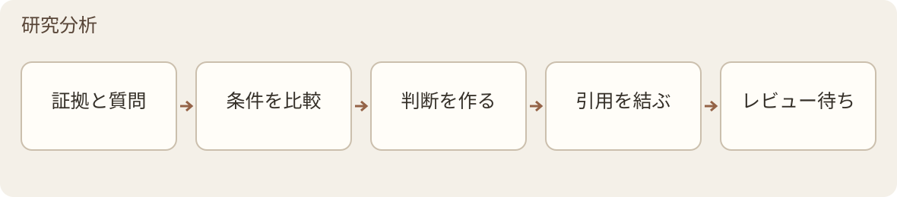

*図 5 · 研究分析 の内部フロー*

入力 → 出力： 質問とContext Pack → 引用、制限、および再確認位置を伴う分析提案。

依存関係： 証拠検索が証拠を提供し、モデルサービスがanalysis_primaryを呼び出し、証拠レビューがセマンティックサポートを検証し、実行記録が記録を残します。出力は、特定のCard/Pack親バージョン、所有権、モデル、および時間にバインドされます。

分析は固定して4つの部分を区別します：文献によるサポート内容及び引用、本ライブラリで検証されていないAIによる一般的な知識の補足、リスクと不確実性、および原文の再確認を推奨する位置。カバレッジが不足している場合は、AIによる一般的な知識の補完を抑制し、研究自体の限界、出典内部の不整合、および検索ギャップをそれぞれ説明します。

研究分析 は決定論的なソースチェックのみを実行します：source_id は存在し、かつ今回の Pack またはその展開メンバーに属している必要があります。不正な項目は文献サポート領域から除外し、理由を記録します。残りの合法な内容は保持されます。コアサポートがすべて無効になった場合、または出力を継続すると誤解を招く場合は処理をブロックします。証拠の十分性、主張の誇張または範囲逸脱は、証拠レビュー の独立した reviewer が判断します。

研究分析 は視点候補、証拠の並べ替え、分析構造を提供しますが、直接提出可能な最終論文結論は生成しません。レビューフィードバックはユーザーが処理し、Card の承認ステータスを逆方向に変更しません。

### M5 · 研究機会の分析

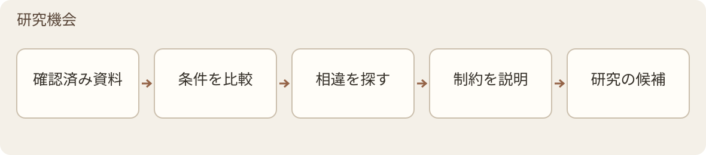

*図 6 · 研究機会 の内部フロー*

入力 → 出力： 承認済み Card、比較コンテキスト、著者の限界/展望 → 緊張関係候補と出典付きの研究ギャップ。

依存関係： 証拠検索/検索の重み付け がトピックとフィールドを特定し、モデルサービス が機会識別を実行し、証拠レビュー が帰納を検証し、知識登録 が機会対象の独立した契約に基づいて承認を管理し、実行記録 がトレースを記録し、品質評価 が品質シグナルを受信します。機会帰納のレビューは、該当する対象に適合した契約を通じて接続する必要があり、Card のスコープを直接適用してはいけません。

エンジン A は比較対象、条件、方法、指標、統計基準、時間範囲を比較し、コンテキストが比較可能だが結論が異なる箇所で緊張関係を提起します。エンジン B は著者が明示した限界、空白、将来の研究のみを帰納し、原文と出典を保持します。検索結果がないことは、ある方向性が誰も研究していないことを証明しません。ギャップはトピック別にクラスタリングし、言及回数を統計し、後続の文献が提供する補完証拠を注記できます。

出力は A：高比較可能性の緊張関係；B：条件または方法の違い；C：表現、指標、または結論タイプの違い；D：ユーザーが確認して無視。カバレッジが不十分な場合は not_comparable または coverage_limited を出力し、A レベルの緊張関係を捏造しません。これらのカテゴリは active な承認ステータスではありません。

研究機会 はトピックごとに増分処理を行い、スケジュール、ユーザー操作、または影響を受けたフィードバックによってトリガーされ、全ライブラリのペアワイズ比較は行いません。ユーザーが比較可能性と研究価値を決定します；無視率が異常な場合は 品質評価 に引き継ぎ、条件抽出と誤検出を確認させます。

### M6 · 検証

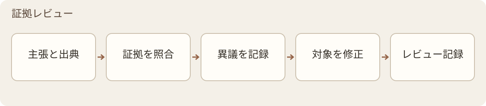

*図 7 · 証拠レビュー の内部フロー*

入力 → 出力： 決定論的な前ゲートを通過した Card または Analysis、対応する証拠とレビュー契約 → レビュー受領証、問題と処理記録。

依存関係： モデルサービス が reviewer をバインドし、実行記録 が記録し、品質評価 が品質を集約します；承認リクエストは 知識登録 に引き継ぎます。Card と Analysis はスコープを分け、それぞれ card_reviewer_primary、analysis_reviewer_primary を使用し、かつそれぞれのジェネレーターとは異なる model_family_id に属する必要があります。異なるベンダーであることは、モデルファミリーの独立性を自動的に意味しません。

Card フロー： 1 回の atomic Full → 問題がなければクローズ；修正可能な問題は 1 回の統合 Repair → 1 回の atomic Delta → クロスフィールドの残留スキャンと最終的な機械的ゲート。RepairPatch は承認されたパスのみを変更し、旧値の hash を検証し、対象外の变化はゼロです；Delta は修正項目および直接依存関係のみを証明し、全文の再通過を意味しません。

レビューは atomic claim と単一の保守的な事実アイデンティティに基づいて展開し、同一事実の確認済み occurrences をまとめて処理します。正確で一意かつ分離可能な対象のみ論理削除できます；曖昧な類似性は候補の提示のみで、曖昧さは人手に転送します。保持値には証拠またはダウングレードの説明が必要で、削除値は tombstone に入ります。完全なクローズは complete、分離可能な省略は passed_with_omissions、コア問題が未解決の場合は失敗または人手待ちのままにします。

Analysis フロー： リスク、MUST/EXEMPT、サンプリング契約に基づいてレビューを決定し、スキップする場合は理由または確認待ち項目を残す必要があります。reviewer は主張と引用証拠のみを受け取り、方向性のある反証を行い、ジェネレーターの推論過程は受け取りません。結果が不明な送信済みリクエストは、再起動や盲目的な再送信によって成功を偽造できません。デスクトップの有限修正および異議削除ルールは第 6 章を参照してください。

M18 は数値の関係と内部論理の指摘を提供し、M6 は引用された証拠が抽出・生成した主張を支えるか確認します。原文の矛盾を忠実に抽出した場合、抽出の忠実性と内容の整合性では異なる結果になり得ます。両者の結果は別々に保存します。

### M7 · 重み付け

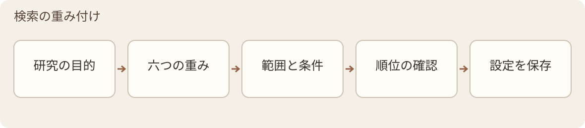

*図 8 · 検索の重み付け の内部フロー*

入力 → 出力： 資料メタデータと現在のクエリ → 検索ランキングスコア。

依存関係： モデルサービス がフィールド埋め込みなどの呼び出しを提供し、実行記録 が記録する。証拠検索 が結果を消費する。派生タイプは 知識への反映 に由来し、派生による減点を解除するには意思決定の根拠と状態イベントが必要である。

| グループ | プロバイダー | 意味 |
| --- | --- | --- |
| 関連性 | SimilarityWeight | 現在のクエリとのベクトル類似度 |
| 関連性 | SemanticWeight | クエリ次元に基づいて計算されるフィールドの関連性と相対的価値 |
| 権威性/個人価値 | ManualWeight | ユーザーが理由を付与して設定することの重要性 |
| 権威性/個人価値 | RuleWeight | 年号、ジャーナル、被引用数、タイプなどのルールシグナル。欠落は低品質を意味しない |
| 権威性/個人価値 | NoteWeight | ユーザーのノート、注釈などの研究痕跡 |
| 権威性/個人価値 | CitationWeight | ユーザーの研究において当該資料を引用した回数および用途 |

合成関係：FinalScore = 関連性グループ加重和 + DerivedPenalty × 権威性グループ加重和。

係数は調整可能な設定であり、全学科における最適定数ではない。SemanticWeight は検索時に現在のクエリに基づいて計算され、ソフトアロケーションにより他のフィールドを保持し、フィールド欠落による系統的な低評価を防ぐ。Card フィールドベクトルは DocumentEmbed 原文ベクトルと分離して生成される。通常のフィールドインデックスは、証拠レビュー で収口済みかつ 知識登録 で active 状態の Card のみを受け入れる。事前計算には独立した隔離インデックスを使用すること。

DerivedPenalty は派生エントリの権威性スコアのみを低下させ、実際の関連性を罰しない。複数論文の統合は最も重い減点、概念関係は中間、オリジナル注釈は最も軽い。解除には根拠の記録が必要であり、ManualWeight を引き上げることで信頼性をすり替えてはならない。品質評価 は、派生エントリが top-k 内でその元となる根拠を挤出する頻度でドリフトを監視し、比率と再確認日は補助指標としてのみ使用する。フィールドの信頼性とカバレッジ状態は依然として独立して表示され、自動的にグローバルウェイトに換算されない。

### M8 · 状態機械

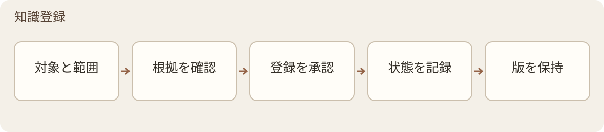

*図 9 · 知識登録 の内部フロー*

入力 → 出力: オブジェクト、明確なスコープを持つ変更リクエストとその根拠 → 検証済みの状態遷移およびイベント。

Card の review_status は pending、active、quarantined です。未承認のオブジェクトは審査に供されることはできますが、通常の検索、緊張分析、または自動フィードバックの消費には使用できません。機会と知識フィードバックはそれぞれ固有の契約を使用します。Analysis のリクエストコンストラクタは、まだ欠如している汎用的な本番状態契約を代替することはできません。

知識登録 は品質判断、技術的なリトライ、業務上の修正、または実行の復旧を担当しません。不変の state_transition_event を生成し、実行記録 が追記して永続化し、バージョンと来歴 がバージョンと系譜を関連付けます。ライフサイクルの熱度、バージョン状態、Card の完了度、リリース状態は Card の三態には書き込まれません。検証証拠は 証拠レビュー の受領証および今回の変換根拠に遡及する必要があり、active ラベルのみを根拠とすることはできません。

### M9 · モデルゲートウェイと実行経路

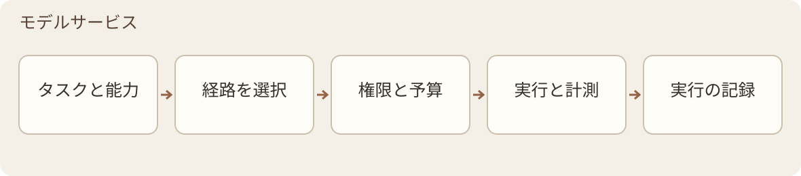

*図 10 · モデルサービス の内部フロー*

入力 → 出力: 論理ロール、タスク内容と制約 → 許可されたチャネルによるモデル結果、または明確な失敗/実行保留の結果。

業務モジュールは論理ロールにのみ依存します。モデルサービス は run の開始時にプロファイルとルートスナップショットを凍結し、ベンダー、モデルファミリー、プロンプト/スキーマ、パラメータ、実行場所、所有権、リージョン、品質証拠、予算、およびロールバック目標をバインドします。モデルの交換は設定の変更を優先し、業務職責を変更しません。

主要なロールには embedding_primary、card_distiller_primary、card_reviewer_primary、analysis_primary、analysis_reviewer_primary、opportunity_analysis_primary、change_digest_primary、ocr_page、reranker が含まれます。Card と Analysis のレビューアーは、意味が不明確な統一名称を共用しません。

実行チェーン: ロールリクエスト → ExecutionCore がワークパッケージをコンパイル → Adapter Registry がチャネルを選択 → 隔離された JobRunner → API、制御された CLI、またはローカルアダプタ → 結果と試行ごとの証拠。

JobRunner はプロセス、期限、ハートビート、キャンセル、復旧、およびワークパッケージの境界を管理します。ゲートウェイは呼び出しレベルの技術的復旧を処理し、業務上の修正は依然として 証拠抽出/証拠レビュー に帰属します。開発アシスタントセッションと実行セッションは隔離されます。Execution は7種類の制御された CLI アダプタを含んでいますが、コマンドが実行可能であることはチャネルの存在のみを示し、ロールごとの品質資格を代替することはできません。

設定ガバナンス。 実行可用性は UNKNOWN/AVAILABLE/DEGRADED/MISSING であり、ガバナンス状態 CANDIDATE/APPROVED/ACTIVE/DEPRECATED/QUARANTINED/RETIRED とは分離されます。品質評価 がロール評価を提供し、ユーザーまたは承認済みルールが決定を行い、モデルサービス が実行を登録し、判断記録 が理由を保存します。品質—コストルーティングは合格範囲から候補のみを提示します。利用可能な資格がない場合は abstain できます。

アイデンティティとフォールバック。 各保存時に requested と returned のプロバイダー/モデルを記録し、正式な審査でアイデンティティ不一致または検証不能な場合は契約に従ってブロックします。バッチ内で無痕にモデルを交換することは禁止されます。フォールバックはロールごとに定義され、審査ファミリーの独立性、所有権、リージョン制限を保持します。CLI コンポーネントの実際のパスとハッシュは事前チェックと起動前に照合します。Embedding の切り替えはデフォルトで新しいインデックスを使用し、互換性の証明が成立した後にのみ再利用します。

依存関係の障害。 一時的なネットワーク/レート制限の問題は予算内で復旧します。認証情報、クォータ、サービス終了、または設定の問題が発生した場合は、影響を受けた工程を一時停止し、モジュール、依存関係、原因、および対処方法を提示しますが、依存関係のない機能の停止は引き起こしません。自動タスクは API の使用を必須とせず、タイムアウト後に自動的に有料サービスへ切り替えることも許可されません。

地域ポリシー。設計要件では、各プロバイダーが有効なサポート地域ポリシーと同一ルーティング出口の証拠にバインドされることを求め、不明、期限切れ、または不一致の場合は本番リリースを許可しない。IntegrationではHTTPSプローブ、明示的なプロキシの同一ルーティング、送信前の再確認を強化したが、国別判定は依然としてCNをブロック/非CNを通過としており、プロバイダー固有のサポート国ホワイトリストは依然としてギャップである。

プロンプトバージョン、キャッシュ機能、ティア、Thinking、および料金ルールは管理された設定によって管理される。maximumティアは明示的な選択が必要であり、オプションのティアは対応するモデルが合格していることを証明しない。所有権、料金、およびキャッシュの共有制約については第5章を参照。

### M10 · 承認を伴う知識の還流

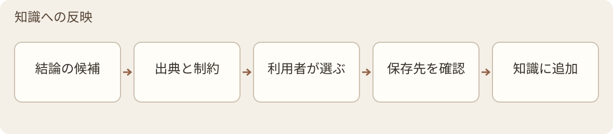

*図 11 · 知識への反映 の内部フロー*

入力 → 出力： ユーザーが選択した再利用可能な内容及び根拠 → is_derived、ソースバージョン、理由を付与されたpending候補。

依存関係： 知識登録が実行対象スコープの受け入れを、検索の重み付けが派生重みを、バージョンと来歴がバージョンと親チェーンを、判断記録が決定理由の関連付けを、モデルサービスが承認された整理タスクの実行を、実行記録が記録を残し、品質評価がヘルスシグナルを受信する。

フィードバック可能な対象には、注釈、判断、仮説、安定した概念関係、および文献横断的な統合が含まれる。ユーザーの元の記録は自動保存でき、候補として自動整理することもできるが、保存は正式なフィードバックを意味しない。すべてのタイプがactive、canonical、または通常のナレッジ消費に入る前にユーザーの確認が必要であり、一回限りのQ&Aや未確認のAIドラフトは直接プールに入れない。

フローは以下の通り：ユーザーが対象を選択 → 候補、ソース、理由を形成 → 許可された目的地と正確な変更を確認 → ユーザーが承認/修正/拒否/保留 → 必要な審査と受け入れ → バージョン保存と受領証。対象は入力アーティファクトID/ハッシュと実行設定にバインドされ、上流が変更された場合、互換性または陳腐化状態を再計算する。

フィードバックの受け入れと派生減点は、「使用可能か」と「ランキング重みはいくらか」をそれぞれ解決する。確認済みの要約は依然として二次的な産物であり、人手による確認によって自動的に一次文献の権威を獲得するわけではない。

### M11 · ログと終端状態の台帳

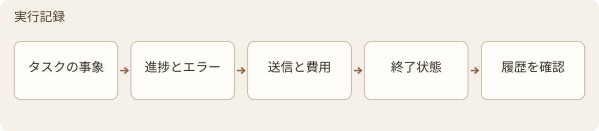

*図 12 · 実行記録 の内部フロー*

入力 → 出力： 各モジュール、ゲートウェイ、ランナーのイベント → コンテキスト付きの実行ログ、最終状態記録、およびクエリビュー。

実行記録は受動的な記録層であり、ウォッチドッグ、修正、または状態判定を実行しない。ユーザー向けには進捗とエラーを表示し、トラブルシューティング向けにはモジュール、対象、段階、依存関係、原因、証拠の場所、および処理を保存する。判断記録/品質評価/研究レポートは各自の目的に応じて読み取り、運用ログを文献ナレッジ検索に投入しない。

| 台帳 | 保存内容 |
| --- | --- |
| Attempt Ledger | 各試行における不変な終端記録、ルート、結果、および証拠 |
| Paper Outcome Ledger | 論文ごとの各ランの最終状態および最終成果物。再実行の場合は新しいランを作成する |
| Publication Ledger | 公開リクエスト、選択リスト、結果、および独立したレシート |

試行の成功、論文処理の合格、公開の成功は分離する。後続の成功は記録を追加し、以前の失敗を上書きしない。訂正には Amendment または明確な後継関係を使用する。実行ハートビートはイベントストリームまたは実行スナップショットに記録し、封鎖済みの試行へ書き戻さない。

外部呼び出しの時間分割記録：送信前にリクエストのアイデンティティ、ルート/リージョン、動作ハッシュ、権限、予算を凍結。送信後に実際の返答アイデンティティ、使用量、費用根拠、遅延、結果を補完する。復元できない旧データのフィールドは unknown と記録し、推測で埋め合わせず、証拠補完のために有料リクエストを自動再実行しない。復元と並行書き込みは、帳簿契約および実際のテスト範囲に基づいて宣言する。

### M12 · 設計判断の記録

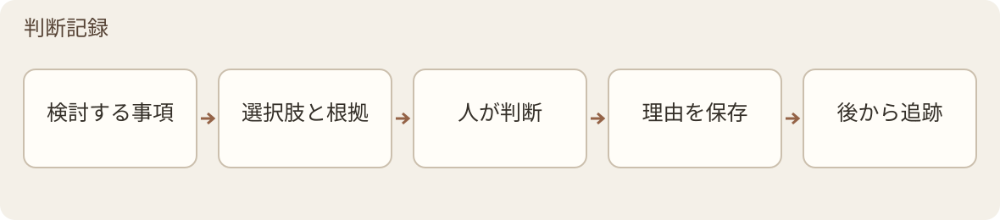

*図 13 · 判断記録 の内部フロー*

入力 → 出力： 重要な選択とその背景 → 検索可能、引用可能、バージョン管理可能な DDL。

背景、主要な代替案、最終選択、却下理由、影響を受けるモジュール、根拠/フィードバック、状態、再確認日付を記録する。実行記録 は何が起きたかを説明し、判断記録 はなぜその選択をしたかを説明する。すべての操作ログを意思決定ログに変換しない。

適用対象には、モデルの承認、分離、段階的展開、ロールバック、再埋め込み、OCR 準備、系譜の例外、フィードバック根拠、正規ポインタの移動、公開/撤回が含まれる。実際のイベントは 実行記録/バージョンと来歴 が記録し、判断記録 はイベントを参照して選択と放棄を説明する。意思決定の変更は後継者を作成し、元の決定とその時点の理由を保持する。

### M13 · データのライフサイクル

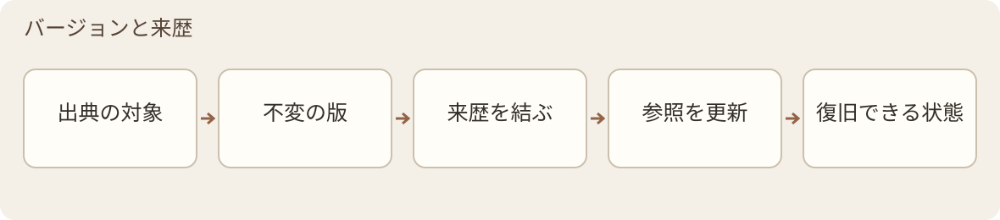

*図 14 · バージョンと来歴 の内部フロー*

入力 → 出力： データオブジェクトと承認された変更 → 新版本、系譜関係、ライフサイクル記録、旧証拠の保持。

依存関係： 各成果物の生成者がバージョンを提出。知識登録 が承認を所有・実行し、実行記録 がイベントを保存し、バージョンと来歴 が不変な成果物、親チェーン、状態イベント、互換性関係を関連付ける。Git とバックアップはストレージ復旧の基盤であり、ライフサイクルセマンティクスを代替しない。

Artifact Envelope は、不変 ID、コンテンツハッシュ、型/スキーマ、実行、ルートスナップショット、ソース範囲、作成日時、および複数の parent_artifacts を最低限サポートします。Registry はこれらのアイデンティティと関係を管理します。クエリプロジェクションは再構築可能ですが、本番環境の Registry/JSONL が権威あるソースです。

| ライフサイクル | 管理の意味 |
| --- | --- |
| Usage：Active / Cold / Archive | 使用頻度と検索優先度。削除を意味しません |
| Version：Current / Superseded / History | バージョンの置換と履歴の保存 |
| derived.version_status | 派生オブジェクトの draft / current / superseded / historical |

これらの軸は、知識登録 の pending/active/quarantined を置き換えません。業務上の修正は、元データ、テキスト、Card、フィードバック、または決定事項を直接上書きしません。削除は、第 7 章の承認済み処分プロセスに従って別途行います。

互換性と公開。 正確な親バージョン、スキーマ、ソース範囲に基づいて compatible/stale を判定します。親チェーンが欠落している場合は lineage_unknown を保持し、推測によるマッチングは行いません。新しい Card の作成により、古い Analysis が自動的に新しい組み合わせ資格を得ることはありません。公開前にマニフェストを凍結し、構造互換性、カバレッジ、ペーパーアウトカム、ユーザー選択、コスト決定を個別に確認します。正確なオブジェクトセットを確認し、承認を得た後に公開を実行し、独立した receipt と Publication Ledger で記録を残します。canonical の移動、撤回、置換は別途イベントとして記録します。

Quality の Registry、互換性エンジン、Analysis リクエスト構築、および公開ドライランは、それぞれ異なる構築範囲に属します。ドライランでは正式な公開は実行されていません。Capabilities では履歴移行と組み合わせクエリ機能が構築されましたが、実際の履歴一括移行、本番インデックスの切り替え、ポインターの移動は承認されていません。

プログラムのパッケージとインストール先の変更は M19 が調整します。研究データの版、来歴、互換性の規則は M13 が担当します。M19 は対応する移行機構を呼び出し保守記録を残しますが、更新を理由に知識の承認先や過去の審査結果を書き換えません。

### M14 · 品質保証

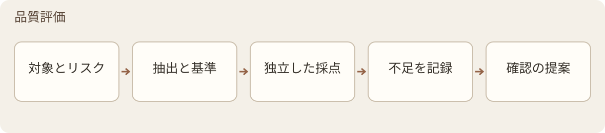

*図 15 · 品質評価 の内部フロー*

入力 → 出力： アクティブライブラリ、審査受領証、実行および系譜記録 → 品質レポート、劣化アラート、および処置提案。

依存関係：証拠レビュー が単一の内容検証を実行し、資料処理 が変換品質の根拠を提供し、モデルサービス が対応する役割を呼び出し、実行記録 が実行事実を提供し、判断記録 がゴールドスタンダードと設定変更の理由を記録する。研究機会/知識への反映 などの品質シグナルを受信する。

品質評価 はランダムサンプリング、リスクベースサンプリング、およびセンチネルリグレッションを採用する。高ウェイト、高引用、論文利用予定、または過去にレビューで意見が分かれた内容は優先対象とする。モデル、プロンプト、または関連ルールを変更した後は、対応するテストパッケージに基づいて再確認を行うが、すべての内容を毎回全文再レビューすることは要求しない。

| 品質軸 | チェック内容 |
| --- | --- |
| literal_fidelity | 文字、数値、単位、引用がソースに忠実であるか |
| evidence_scope_coverage | 証拠が主張の条件、範囲、および比較対象をカバーしているか |
| cross_artifact_consistency | Card、Context Pack、Analysis、レビュー、および公開物間で整合性が取れているか |
| scientific_plausibility | 統計基準、単位、サンプル、時間、および桁数が妥当であるか |
| lineage_freshness | 親アーティファクトの組み合わせが互換性があり、陳腐化していないか |

5つの軸で証拠と結果をそれぞれ記録し、総合的なPASSで未評価項目を隠蔽しません。通常の質問には制限事項と再確認のヒントを提供し、コア機能の非サポート、重要な系譜の無効化、または誤解を招く数値に対しては、機械可読のブロックまたは人間の提案を行います。品質評価は元ファイルを編集せず、知識登録の状態を変更せず、第2の生産パイプラインを構築しません。

数値とページ役割。 直接比較の前に、metric、unit、条件、統計タイプ、時間、サンプル、comparatorを揃えます。揃えられない場合はnot_directly_comparableとマークします。合理性チェックはヒントのみ提供し、生データを自動修正しません。OCRは本文、表紙、目次、ヘッダー/フッター、参考文献、不明な役割を区別し、任意のページの数値を本文の事実として扱いません。

センチネルとゴールドスタンダード。 役割ごとに抽出/蒸留、レビュアーの漏れと変異、検索/埋め込み、OCRテストを維持します。各revisionで完全なForm、Gold、scorer、manifestを凍結し、モデル間で再利用します。Goldはテスト対象モデルのリクエストに含まれません。修正は元の値、ソース、日付、新しいrevisionを保持し、判断記録で追跡します。公開されたcommitmentやlocatorは完全な試験パッケージの代替にはなりません。

参照パッケージは所有権に基づいてトラックを分けます：正確に降密されたREFERENCE_EXAM_PACKのみGitに含められます。PRIVATE_HOLDOUT_PACKはGitに含めません。FORMAL_LOCAL_REFERENCE_PACKは完全にローカルで使用可能ですが、パッケージ全体を隔離し、これに基づいてブラインドテストの資格を主張しません。

ナレッジベースの健全性は、未審査、失敗、期限切れ、リンク切れ、派生圧迫の指標を保持します。元のQUALITY-ASSURANCEの代替タスク完了ゲートは、元のB ERRORや12件の5軸not_assessedを品質合格に変更していません。

M18 が一回の範囲を限定したデータ・論理チェックを実行し、M14 はその記録から誤検出、見落とし、範囲と劣化を評価します。数値の品質軸のために重複した処理エンジンを設けず、実行成功を科学的な適格性へ読み替えません。

### M15 · 研究変更ログ

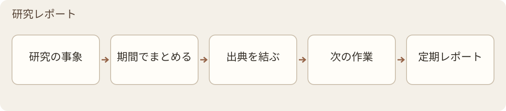

*図 16 · 研究レポート の内部フロー*

入力 → 出力： 一定期間の研究イベント → 日次、週次、月次の変更レポート。

実行記録/知識登録/バージョンと来歴などのソースから正規化、重複排除を行い、不変のResearchEventを生成し、change_digest_primaryなどの承認された方法で整理します。レポートはイベントのソースと集約系譜を保持し、試行結果、論文の最終状態、公開と設定変更をそれぞれ表現します。

日次レポートは新規追加、変更、審査待ち、失敗に注目します。週次レポートは重要な進捗、文献、未完了の審査、潜在的な緊張関係に注目します。月次レポートは構造変化と長期の未処理事項に注目します。研究レポートは変化、リスク、未処理事項のみを報告し、最終的な研究結論を形成せず、ナレッジの受け入れ状態を変更しません。

### M16 · 文献探索と研究情報レーダー

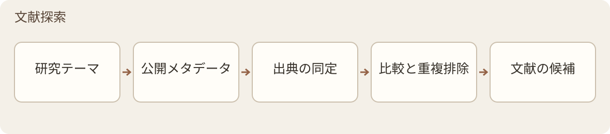

*図 17 · 文献探索 の内部フロー*

入力 → 出力： テーマ、キーワード、著者、ジャーナルまたは引用チェーン → ソースと推薦理由を持つ外部候補。

このバージョンの実際のソースはarXivとCrossrefです。他のソースは依然として独立して構築する必要があります。外部接続と応答は接続フレームワークによって管理され、モデルの判断が必要な場合のみモデルサービスを呼び出し、すべての書誌HTTPリクエストをモデル呼び出しとして扱いません。

アイデンティティクラスタリングは、競合のない正確なDOI/arXiv ID/PMIDのみ自動重複排除します。タイトル、著者などの弱い証拠や識別子の競合はOPENの人間による再確認に入れます。同じworkのプレプリント、会議版、AAM、VOR、arXivバージョンは異なるmanifestationとして保持されます。

新規性はpublication、first-seen、library、directionの4軸でTRUE/FALSE/UNKNOWNを記録します。要約レベルの方向推定は推定ラベルを保持し、UNKNOWNをTRUEに書き換えません。ソースcanary、Shadow、controlled activationは別々に検証と承認を行います。

二重的人工ゲート：初回の承認では、隔離された 資料処理→証拠抽出→証拠レビュー による pending CandidateCard の生成のみを許可し、Analysis は生成しません。二回目の承認で初めて、正確なセットに対する正式な昇格を許可します。昇格には、冪等性、WAL、二重ロック、補償、および receipt-last プロトコルを使用します。失敗時に成功レシートを残してはなりません。オフライン合成テストは、実際の昇格が発生したことを示すものではありません。

### M17 · 能動的な知識獲得

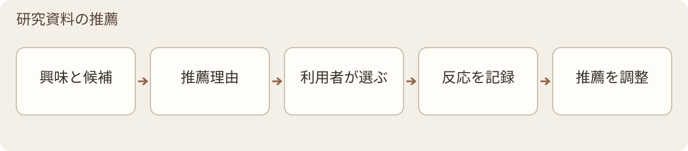

*図 18 · 研究資料の推薦 の内部フロー*

入力 → 出力： 研究方向、有限な候補、および承認済み行動シグナル → 根拠のある推奨と確認待ちの戦略提案。

研究資料の推薦 は 文献探索 を基盤とし、CORE、ADJACENT、BRIDGE、HORIZON、COVERAGE_REPAIR の5つのチャネルを使用して有限な Slate を組織化します。チャネル成分、空白、およびカバレッジ/極化情報を保持し、差異を隠す統一スコアを生成しません。

露出、抑制、および再出現は append-only ExposureLedger に書き込まれます。抑制は work_cluster_id、direction_id、direction_revision にバインドされ、類似テキスト、ベクトル近傍、または他の方向に伝播しません。再出現には新しい根拠が必要です。弱いシグナルが閾値に達しても、生成されるのは人手による確認待ちで、まだ適用されていない policy proposal のみです。

研究資料の推薦 は発見と推奨を行うだけで、自動インポート、高重み付け、戦略変更、またはリリースの許可は行いません。執筆、ファイル出力、または公開実行の責任も持ちません。v1.02 では利用者が設定した研究方向に基づく題録探索と関連推薦を提供します。一次証拠の自動承認や、長期的な推薦品質の保証を意味しません。

### M18 · データ・論理チェック

入力 → 出力： 読み込んだ文献の本文、表、出典位置、検査設定 → 原文位置、規則またはモデルの根拠、適用条件と対象範囲を持つデータ・論理チェックの報告。

依存関係： M1 が追跡可能な解析内容と変換品質を提供します。モデルによる判断は M9 を通じて選択した経路で実行します。M11 は実行と使用量を記録し、M13 は報告と入力版を関連付け、M14 は品質信号を受け取ります。M6 は引き続き、引用証拠が抽出・生成した主張を支えるかを確認します。Card の成功を検査の前提にせず、既存ノードの実行順や、すべての研究分析に必須の新たな関門を追加しません。

確定的な検査では原表現を保ち、百分率、比率、単位、統計量の意味を確認してから、明示された等式、範囲、数値の関係を調べます。換算の根拠を残し、空の条件から分母、群、重みを推測しません。途中で切れた複合等式を完全な式として扱わず、ゼロを取り得る非負の統計量を一律に誤りとしません。条件不足、解析の曖昧さ、比較不能な値は確認待ち、入力の問題、対象範囲の制限として残します。

モデルの論理チェックは原文に基づく疑点を提示し、確認した文脈、範囲、未解決の関係を記録します。規則の結果、モデルの疑点、人による判断は別々に保存します。モデルの疑いを確定した誤りへ直結させません。タスク完了、報告の疑点、科学的な妥当性は異なる状態であり、未実行や対象外を合格に含めません。

報告には入力、規則、Prompt、言語の版を結び付けます。説明はその生成で固定した内容言語に従い、原文の引用、数値、単位、過去の版は保持します。再実行は後継報告とし、以前の失敗と人による説明を残します。部分検査を全文検査と呼ばず、望ましい結論が得られるまで無制限に再生成しません。

M18 は原文の自動修正、著者の意図の判定、異常がないことによる研究の正当性の証明、M8 に代わる知識の承認を行いません。規則、資料量の上限、モデルの適格性は現行実装と検査契約に従います。番号の追加は対象範囲や呼び出し権限を広げません。

### M19 · アプリ更新・保守

入力 → 出力： 現在のインストール識別、対象版のマニフェスト、完全または差分パッケージ、利用者の操作 → 更新確認の結果、検証済みのインストール状態と追跡可能な保守記録。

依存関係： アプリ層が版の入口と利用者の操作を提供し、共通のインストールエンジンと独立アシスタントが保守を行います。M13 は研究データの互換性と移行規則、M11 は事実の記録、M14 は対応版の検証証拠を担当します。M19 はデスクトップ保守層であり、文献処理の主線には入らず、モデル呼び出しや研究資料のアップロードも行いません。

版の確認、取得、更新の適用は分けます。自動確認は正式リリースの情報だけを取得し、確認失敗を最新版と表示しません。利用者が版、説明、容量を確認してから取得します。差分は正確な旧パッケージに結び付け、組み立てた結果を対象の完全パッケージと一致させます。正当な基準版の不一致では確認後に完全パッケージを使えますが、署名、出所、識別の検証失敗では停止します。

取得と検証の後、「終了後に更新」を選んでネイティブのアシスタントを開き、現在のインスタンスを通常の操作で終了します。アシスタントはそのタスク、保存、終了を待ちます。アプリを強制終了せず、自動再起動も約束しません。完了後に開き直し、版、資料の場所、既存の設定を確認します。従来の v1.01 は対象版と一緒に配布されるアシスタントで最初の更新を行い、先にアンインストールする必要はありません。

プログラム、設定、研究資料は分けて扱います。切り替え前に復旧条件を保ち、失敗はトランザクションの状態に応じて処理します。新版が書き込みを受け付けた後は、古いバックアップで新しいデータを自動的に置き換えず、新しいデータベースを任意の旧版へ渡しません。中断、復旧、結果を追記し、過去の研究判断は書き換えません。

インストール、更新、依存関係の案内とエラー説明には共通の中文・English・日本語リソースを使います。新しい設定はインストール言語を継承できますが、既存設定は保ちます。更新アシスタントは正確なインスタンスの言語を引き継ぎ、一時的な表示変更で内容言語を上書きしません。新規導入、初回更新、差分更新、復旧は別々に検証します。導入やパッケージ検証の成功は全機能の合格を意味しません。ソース、文書、完全パッケージ、差分、署名を同じ成果物に結び付け、一般公開は別途公開の判断に従います。

## 5. 共通ルール

### 5.1 ステータスはオブジェクトとスコープを伴う必要があります

| ステータスオブジェクト | ステータスまたは証拠 | 所有者/解釈 |
| --- | --- | --- |
| 能力設計 | proposed / approved / superseded | 設計承認ステータス |
| 機能の実装 | not_started / partial / implemented | コードまたは契約が存在するか |
| 機能の検証 | untested / tested / qualified | 対応するエビデンス範囲でのみ成立する |
| 機能のデプロイ | disabled / pilot / active / retired | 許可された実際の使用範囲 |
| タスクの実行 | frozen / running / completed / aborted / invalidated | runner が実行ライフサイクルを管理する |
| タスクの受入 | PASS / FAIL / NOT_ASSESSED | 実行およびマシンの verification_result と分離する |
| Card の受入 | pending / active / quarantined | 知識登録 はスコープと根拠に基づいて実行する |
| Card の完成度 | pending_review / complete / passed_with_omissions | レビュー処理のクローズドセットであり、抽出カバレッジではない |
| Card の品質 | スキーマ、抽出カバレッジ、フィールドの信頼性、検証エビデンスをそれぞれ記録する | validation_evidence は 証拠レビュー/知識登録 の根拠から導出され、別途永続化された validation_status を作成しない |
| 公開 | not_requested / not_published / published / publication_failed | 実行記録/バージョンと来歴 が独立した公開事実を保存する |

モデルプロファイルの利用可能性/ガバナンス軸は モデルサービス を参照、データ使用/バージョン軸は バージョンと来歴 を参照。名称が類似していても同一の事実を意味しない。これらの状態を、無名の active や completed のいずれか一つだけで置き換えて表示や統計を行うことは禁止される。

### 5.2 データ処理権の全チェーン貫通

データ帰属と機密度は異なる属性です。現在の Card は self / entrusted を使用します。所有コンテンツは承認された設定に従って使用し、委託されたもの、処理権限のないもの、または帰属が不明なデータはデフォルトでローカル処理を行います。ローカル処理機能が不足している場合は、該当する呼び出しを停止します。追加の承認使用には監査可能な policy/decision レコードを記録し、独自に schema の列挙値を追加しません。

データをモデルに渡す場合、OCR、埋め込み、蒸留、分析、レビュー、キャッシュ、制御下 CLI を含め、まず帰属権限を確認します。OCR はエンコーディングおよびアップロード前に確認します。Context Pack の集約および下流への伝達において制約を失わないようにします。チャネルをローカルで起動し、ローカルポートを使用したり、別のプロバイダーに切り替えても、外部送信がないことの証明に代わるものではありません。

セッション収集、モデルによる精錬/外部送信、正式なプールへの投入はそれぞれ個別に承認されます。診断には承認された探査資料のみを使用し、委託データを外部機能のテストに使用してはいけません。認証情報は制御された認証情報ストアで管理し、設定には参照のみを保存します。ログおよびエクスポートには平文の key/token、cookie、または browser-storage の値を含めません。

### 5.3 部分出力と失敗

通常かつ分離可能な問題については、ダウングレード、省略、needs_review、または tombstone を許可し、利用可能な部分を保持し、ギャップを列挙します。コアエビデンスの失敗、コア処理の未クローズ、主要な系譜の非互換性、または出力が誤解を招く場合にのみブロックします。品質判断は対応する所有者が形成し、状態変更は実装済みの 知識登録 scope によって実行されます。技術的なリトライ、意味論的な修正、および新しい run の責任と予算は互いに代替できません。

### 5.4 実行分類とコストエビデンス

1回の呼び出しごとに process_transport、inference_location、access_mode、billing_mode を個別に記録します。CLI 経由で発行された API は依然として API です。ローカルプロセスはローカル推論を意味しません。subscription_session と subscription_entitlement の呼び出しごとの費用適用性が N/A であってもよく、ローカル計算は別途リソース消費を記録します。

費用適用性、金額の既知/未知、金額の出所は異なるフィールドです。サブスクリプション CLI の現在の通貨金額が取得できない場合は UNKNOWN であってもよく、適用性の N/A と矛盾しません。どちらも 0 または無料と記入できません。API は対応する有効日付の価格を使用し、actual_cost、推定値、価格欠損を区別し、失敗とリトライも計上されます。

デスクトップの現在の費用ビューは run/stage/physical attempt で重複排除し、現在の profile の接続済みレシートのみをカバーし、通貨別に ACTUAL、ESTIMATED、UNKNOWN、CONFLICT を区別しますが、完全なアカウント請求書ではありません。バックエンドで新しいフィールドを追加しても、フロントエンドで表示されていることを自動的に意味しません。

usage はキャッシュヒット/ミス入力、総出力、reasoning、可視出力、完全な遅延を保持します。reasoning は output の部分集合であり、再度加算できません。分割可能な場合、visible output = output − reasoning となり、欠損時は未知のままにします。セッション累積 usage は、同一の正確な session と前回の根拠に基づいてフィールドごとに差分計算し、累積の退行または不一致は検証済みの今回の用量として扱いません。

### 5.5 入力キャッシュとセッション継続

キャッシュはレビュー結論を再利用しません。安定したルールおよび同一記事の承認済みソースを前置し、動的タスクと正確な修正目標を後置し、プロバイダーが入力計算を再利用する機会を与えます。各タスクは依然として新しいリクエストを送信し、新しい出力を生成し、元の schema、ソース、レビューチェックを実行します。デスクトップのこの経路は Core の古い回答キャッシュを再利用するものではありません。

キャッシュ機能は API、モデル、実際のチャネルによって識別されます。未知の機能は UNKNOWN を維持し、サポートが確認されていないベンダーパラメータを送信しません。修正は本来承認された候補ソースのみを整理し、ヒットを強引に達成するために全文を短い修正に詰め込んだり、目標が参照を許可する範囲を拡大したりしてはいけません。

検証済み Codex ルートでは、exec を用いてセッションを作成し、resume には正確な UUID を指定し、--last は無効化されています。ロール、モデル/プロファイル、ソース、サービス、ワークスペース、トランスポートスキーマ、実装リビジョンがアイデンティティバインディングに関与します。各回ごとに、ビジネススキーマ、UUID、使用量、および受領確認を独立して検証します。アプリケーションのアイドル再利用期限は、サーバー側の TTL とは異なります。期限切れ、以前の失敗、未完了、またはアイデンティティ不明の場合、契約に従いコールドリクエスト、隔離スコープの新規作成、またはブロックを行います。並行ロック競合や破損レコードでは、旧セッションの混用はできません。

本ラウンドの実測は DeepSeek API と Codex CLI に限定されています。C59–C65 の共有コードと証拠は正式化されプッシュされましたが、これに基づいて再パッケージング、デプロイ、または Desktop の完了は行っていません。コスト比較では、元の費用、実時間、作業量、出力量を保持する必要があります。価格設定の反実仮想はコードによる因果的利益に等しくなく、全ヒットや普遍的な高速化を保証するものではありません。

## 6. デスクトップアプリケーションとインタラクション

### 6.1 アプリケーション層

Windows の主構成には pywebview + PyInstaller + Edge WebView2 を採用し、Python の ApplicationFacade を利用します。設計基準では pywebview 6.2.1 と PyInstaller 6.22.2 を記録していますが、個々のビルドでは凍結済みの依存関係一覧を優先します。Electron は、後続の証拠と設計決定記録によって必要と判断された場合のみ検討する代替案です。

呼び出し関係：HTML/CSS/JS → IPC コマンド/イベント → Application Service → ApplicationFacade → ビジネスモジュール。Control Store はジョブ、ビュー、復旧に必要な状態を保存し、切断または再起動後にプロジェクションを再構築します。UI はモジュール状態に直接書き込みません。ライブラリは正規ソース、成果物、系譜を読み取り、第二の知識権威として複製しません。

ページは採用済みの HTML を視覚的基準とし、移植マッピングを保持します。同じ WebView2、ビューポート、DPI、テーマ、フォント、フィクスチャの下で、スクリーンショット、スタイル、レイアウト、インタラクションを確認します。FakeFacade は視覚フローの検証のみに行い、実際の保存状態とバックエンド呼び出しは別途検証します。通常の起動では、サンプルデータをユーザー資料として偽装しません。

### 6.2 主要なインターフェース

| インターフェース | コア動作と境界 |
| --- | --- |
| 設定 | 3つのインターフェース言語、モデル段階、Thinking、認証情報参照、機能状態；まず検証してからアトミックに適用し、失敗時は旧値に復旧 |
| 受信トレイ/現在のタスク | intake、重複排除、競合、dispatch、ノードの管理；契約に従い一時停止、キャンセル、復旧、再試行、または設定の上書き |
| メッセージ/作業ログ | read と acknowledged を区別し、安定した locator を用いてタスク、ノード、成果物へジャンプする。レポートにはイベントの系譜を保持する |
| ライブラリ/会話ライブラリ | ソースと出力プロジェクションを読み取る。履歴収集とナレッジプールの投入は権限を分離し、ソースタイプを明確にする |
| モデル試験/費用 | 具体的な role、Form、バージョン、時刻の資格情報を表示する。費用は証拠タイプ別に表示し、完全な請求書と偽らない |
| 文献探索/研究レポート | 文献探索/研究資料の推薦 の二重ゲートと 研究レポート の変更のみ報告する境界を継承し、ページが存在するからといって機能が全開と推定しない |

UI は実行、論文結果、リリース、構造、審査根拠、フィールドの信頼性、カバレッジ、系譜を個別に表示する。passed_with_omissions では利用可能な成果物と具体的な削除理由を表示する。未審査、未知の系譜、古い組み合わせは明確に通知する。技術的なリトライと業務上の修正は別々にカウントする。

CapabilityState の availability は ready/disabled/not_configured/not_applicable/blocked、qualification は qualified/not_qualified/not_assessed、effective_enabled は独立したブール値である。required が利用不可の場合はブロックし、optional が利用不可の場合はダウングレードを列挙する。

標準、高度、開発者モードはデータや本番環境の権限を変更しない。Safe Mode では読み取り専用の official_core に戻り、カスタムコードを読み込まず、オーバーレイをマージしない。ユーザーデータは読み取り専用、本番環境の writer は無効化する。doctor/support は診断と公開された安全なエクスポートを提供し、修復や認可の有効化を暗黙に示さない。

### 6.3 デスクトップ 9 ノード実行図

| ノード | 責務 | 主要依存関係 |
| --- | --- | --- |
| 01 DOCUMENT_INGEST | ドキュメント処理 | 資料処理 変換、クリーニング、チャンク分割および出所 |
| 02 CHUNK_EMBEDDING | 原文のベクトル化 | 今回のベクトル空間を固定 |
| 03 CARD_DISTILL | カード生成 | 証拠抽出 およびローカルハードゲート |
| 04 CARD_CROSS_CHECK | カード照合 | 凍結済み審査契約に基づいてトリガー |
| 05 CARD_ADMISSION | カードの受け入れ | 知識登録 の根拠とスコープ |
| 06 CONTEXT_PACK | 分析資料の整理 | 検索空間は 02、容量予算は 07 から取得 |
| 07 ANALYSIS | 分析の生成 | 研究分析 と今回の Pack |
| 08 JUDGMENT_CROSS_CHECK | 分析の照合 | 独立した審査または明確なスキップ根拠 |
| 09 HUMAN_FINAL | 人間の判断 | 証拠、異議、および漏れの提示 |

06 は新たに追加された10番目の reranker ノードではありません。設定レイヤーで embedding/reranker を分離していることは、runtime で後者が有効化されていることを意味しません。現在のデスクトップ bridge.rerank は無効化され、距離順にフォールバックしています。また、OCR アダプターも他のモジュールの資格によって自動的に接続されることはありません。長時間タスクは機能に基づいて予算を設定し、spool/resume、ハートビート、ストリーミング IPC を使用しますが、キャンセル、コスト、リトライ上限は依然として保持されます。

### 6.4 デスクトップレビューが維持する限定フロー

Card：蒸留 → 一次レビュー → 問題項目の修正（1回） → 変更項目のみの Delta 再レビュー → 必要に応じて痕跡ロジックの削除 → 既存の根拠に基づく受入。passed_with_omissions は欠落を伴う利用可能な結果であり、カード全体の失敗と誤認すべきではありません。

Analysis：生成 → 代表的な独立レビュー → exact-target 修正（1回） → 独立 Delta → 合格または制限付きロジックの除外 → HumanReview。変更されていない claim hash は保持されます。実際の Delta 後に依然として異議がある独立した判断のみが除外資格を持ち、レビューの欠落、期限切れ、または deferred は該当しません。少なくとも1つの文献サポートを保持し、既存のファセットの最後のサポートを削除しない限り、ブロックされます。原文、修正、ソース、異議、系譜、tombstone はすべて保持されます。

### 6.5 セッション収集、精錬、組み込みドキュメント

セッションライブラリは PREFLIGHT でアイデンティティと権限を検証し、FULL で履歴を保存し、INCREMENTAL で成功カーソルから更新します。immutable snapshot、conversation graph、last-complete、lineage、ハートビートを保持します。継続的に進捗がある長時間タスクは、作成時間が早いという理由だけで失効と判定されるべきではありません。

ユーザーは Edge、Chrome、または Brave を明示的に選択し、ブラウザ、拡張機能のバージョン/ディレクトリ、セッションアイデンティティを記録します。読み取り専用収集は、承認された公式エクスポート/API、既存のログイン状態で表示可能な UI、または exact local CLI root に限定されます。cookie/storage の値を読み取らず、独立したログインや 2FA の処理を行わず、非公開インターフェースを呼び出しません。ブラウザがインストールされていない場合は、環境欠如として報告します。

収集後、同一ファイルの重複排除、全量または増分精錬を実行し、11種類の refinement 候補と5種類の制御された目的地選択を形成します。ユーザーは ACCEPT、EDIT、REJECT、DEFER を選択できます。収集の権限は、外部送信やプールへの投入を自動的に許可しません。対話内容は文献事実のソースではなく、ナレッジプールへの投入には依然として対応する目的地契約とレビューが必要です。

内蔵文書は中国語・英語・日本語のオフラインガイド、設計説明、声明を提供し、アプリは選択言語の資料を開きます。閲覧や本文の差し替えはデータ登録や公開の承認ではありません。

### 6.6 ネイティブインタラクション、ランキング、インストールエントリ

ネイティブウィンドウ、メニュー、2D デスクトップアシスタント、状態アニメーション、単一 EXE の個別検証。局所的なウィンドウ修正は、すべてのクロススクリーン、Snap、DPI、または終了動作が合格したと拡張できません。

コンソールはイベント処理を優先し、重量級のスナップショットにはスロットリングと有界バックオフを適用し、アクティブな業務期間中の再投影を低減します。シャットダウンは、UIリクエストの完了、IPC/コンソールからの応答、クリーンアップ、プロセス終了の順に待機します。接続ラベルや単一のHTTPタイムアウトは、実際の終了の証拠に代わるものではありません。

外部モデルランキングは参考情報であり、Memoriveのロール試験に代わるものではありません。データソースとバージョンは特定可能でなければならず、strict TLSを維持します。新しい隔離データディレクトリでキャッシュがなく、リフレッシュがオフの場合、NO_DATA_IN_ISOLATED_TESTを表示します。リクエスト失敗のみFETCH_FAILED、古い投影のみSTALE_PROJECTIONです。通常のオンラインソースチェーン、データの鮮度、コンソール接続はそれぞれ独立して検証します。

インストーラーのブラウザコールバックは、source/navigationを検証してからネイティブフォルダダイアログをスケジュールし、非安全なコールバックや誤ったスレッド内で直接操作してはいけません。開発者環境での対話テストは、ユーザーのノートPCやクリーンなWindows環境でのテストに代わるものではありません。

## 7. 保存、プライバシー、保守

### 原本、設定、インデックスを分けて保存する

プログラムのフォルダーにはアプリを、利用者が選んだデータフォルダーには資料、会話、状態、生成物を保存します。原本、読み取り可能な本文、Card、分析、出典のバージョンは保持すべき資産です。検索インデックスはそれらを検索するための派生データです。インデックスの編集や再構築で原本を黙って置き換えてはいけません。バックアップには内容とバージョンの関係を含め、復元が必要になる前に読み取れることを確認します。

### モデルへの送信と認証情報

API、CLI、ローカルサービスは利用者が設定します。外部リクエストには質問や選択した証拠の抜粋が含まれる場合があるため、送信先と資料の範囲を確認します。設定には認証情報への参照を保存し、秘密の値は端末の認証情報ストアで管理します。通常のログ、文書、エクスポートに Key、ログイントークン、ブラウザー Cookie を含めません。以前の設定を取り込む際も、有効なローカル参照を保持し、秘密の値を自動でコピーまたは書き出すことはありません。

### 更新とアンインストール

インストーラーのシステムチェックで不足するコンポーネントを案内し、プログラムとデータの保存先を別々に管理します。アプリのアンインストールでは、既定で利用者のデータを保持します。更新には復旧手段を用意し、実行済みタスクの出典バージョンやモデル設定を保持します。更新によって過去のレビュー結果を書き換えることはありません。

## 8. 利用できる範囲と拡張設計

資料処理、添付資料への直接質問、引用の確認、会話の精錬、モデル接続、モデルランキング、利用量の確認が主な入口です。v1.02 の題録探索と関連推薦は、有効にした研究方向と受け取り設定に従います。一次証拠の登録や、より広い能動的な方針には独立した条件が残ります。

OCR、再ランキング、レビューの実行経路は、アダプターとモデルの能力によって変わります。設定項目があることだけでは、すべてのファイルや実行経路への対応を保証できません。ブラウザーからの取得にも対象サービスと範囲があります。完全、一部、失敗を区別し、一度の成功を全会話履歴に広げて解釈しないようにします。

品質の抽出検査、実際の過去データの移行、長期的な推薦効果には、それぞれ検証範囲があります。実行記録、限定的な確認、インストール全体の受入れは分けて記録します。v1.01 の公開記録は別に保持します。本書は v1.02 の公開前改訂です。最終ソース、配布物、更新情報が同じ成果物を指すことを確認してから公開します。

## 9. v1.02 の研究フローと更新管理

### 主張、出典、回答の版 · M3・M4・M6・M10・M13

引用の位置を特定することと、主張を裏付けることは分けて記録します。支持の確認では支持・一部支持・不足・矛盾を区別し、証拠の網羅性では実際に調べた範囲を示します。どちらも知識を自動承認しません。問答、課題背景、知識の確認は、特定の回答版、出典、条件と結び付きます。後の提案は記録として追加し、以前の判断を上書きしません。

スタイルは生成設定のスナップショットです。通常の再試行は元のスタイルで分岐を作り、旧分岐の後続回答は保存しながら新しい文脈から除外します。コピー、版の選択、下書きの復元ではモデルを呼びません。30 日を超えて開いていない場合や保存メッセージが 100 件を超えた場合のアーカイブは、ライフサイクルの状態だけを変えます。固定、処理中、複数ウィンドウの保護を保ち、アクセス記録と復元猶予を使い捨てキャッシュにしません。一覧はメタデータをページ単位で読み、本文は必要なときに読みます。

### 文献探索、解析、実際の進捗 · M1・M11・M16・M17・M18

ホームの最新・関連の入口は、研究方向、識別確認、検索記録、通知を共用します。利用者の受け取り設定に従ってライブラリへ入るのは題録とリンクで、全文は利用者が追加します。本文の処理や証拠登録の承認とは分けて扱います。推薦理由は科学的品質の確認を代替しません。

解析は段落、表、上下付き文字、ページ・行のアンカーと版を保持します。決定論的な数値確認とモデルによる論理分析は、入力、条件、報告を分けて残し、主処理と分岐処理にも別の状態を持たせます。進捗はノードの出来事と測定できる作業量から得て、経過時間で割合を作りません。OCR、意味判断、複数文献の対象帰属には失敗が残り、追跡できることは正しさの保証ではありません。

### 実行経路と言語 · M9 とアプリ層

カスタム CLI は、実行ファイル、引数、入出力規則、モデルの対応を共通の利用側へ渡し、終了、取消し、費用不明の状態を保ちます。すべての対話型 CLI を自動対応させるものではありません。AI 近況と個人の研究報告は資料範囲と生成の入口を分けます。タスクごとに生成とキャッシュの言語を固定し、原文と過去の版を保持します。

### 研究データを保つ更新 · M19・M13 とアプリ層

v1.02 の範囲には更新確認と差分更新が含まれます。M19 が版の確認、取得、「終了後に更新」を調整し、一つの独立アシスタントが現在のインスタンスの正常終了を待って、既存のインストールエンジンで新しい版の領域を組み立てます。差分は正確な元パッケージに結び付け、結果を完全パッケージとファイル単位で一致させます。正当な元版の不一致では完全パッケージを案内できますが、署名や識別の検証失敗では停止します。更新は研究庫の再インポートではありません。

インストール、更新、保守、アンインストールは中英日の共通資源を使い、ネイティブの前提条件画面でも言語を選べます。新しい設定はインストール言語を継承でき、既存の設定は保ちます。ヘルパーは対象インスタンスの言語を使います。実行中の作業と書き込みを待ってからバックアップ、移行、検証を行います。有効化前の失敗は復元できますが、新版で書き込みを開始した後の内容を古いバックアップで自動上書きしません。正式公開ではソース、資源、完全・差分パッケージ、署名を一つの版に結び付けます。文書は公開の受入れに代わりません。

## 10. モデルランキングと公開データ

ランキングは外部情報を用いたモデル選定の参考です。モデル、提供者、評価指標、入力・出力価格、通貨、出典日、更新状態を示します。並べ替えや絞り込みの範囲を明示し、取得失敗をモデルが存在しないことと混同しません。公開スコアは特定の課題と時点に限られ、研究用途への適合を保証しません。[R1][R2]

LiveBench は公開ベンチマークの出典です。中核リポジトリは評価課題と結果を公開し、new-livebench は公開日別の表、細分課題、費用と品質の比較を示します。Memorive はデータと情報設計の参考として扱います。公開価格は個人の請求額ではありません。コードやアルゴリズムの複製を意味しません。[R1][R2]

| 項目 | Memorive の表示 | 確認上の境界 |
| --- | --- | --- |
| 能力 | 基準、スコア、日付 | 異なる基準を単純に混ぜない |
| 価格 | 百万 token 当たりの入出力価格と通貨 | 請求額ではない |
| 状態 | 更新時刻、取得失敗、欠損 | 不明値をゼロにしない |

## 11. 会話管理とウェブ情報源

会話管理では情報源による絞り込み、検索、表示件数、詳細閲覧、精練の入口をまとめます。Codex、Claude Code、ファイル取込、ブラウザー由来の会話には、情報源、同期時刻、最初と最後のメッセージ、読み取り専用の範囲を保持します。現在のページ、初回の全件取得、その後の差分取得は範囲と完了状態を区別します。精練は新しいタスクと確認可能な成果物を作り、元の会話を上書きしません。

情報構成と操作は CC Switch の Session Manager を参照しています。複数ツールの会話を一か所で閲覧、検索し、詳細を開く構成です。Memorive は研究資料の精練、資料庫の成果物、人による確認を加えます。既存の詳細設計にもこの参照先が明記されています。会話データの共有やコードの複製を意味しません。[R3][R4]

## 12. 利用量と費用の下部パネル

開閉可能な「利用量と費用」の下部パネルは集計表示です。すべての記録または帰属可能な現在のタスク、直近 7 日・30 日・今月、モデル、更新を選び、費用（推定を含む）、要求回数、token のグラフを切り替えます。タスクへの帰属が不完全ならその範囲は無効にし、全体の費用を一つの論文に割り当てません。費用は実額と推定額、要求回数は失敗と再試行、token は入力と出力を区別します。証拠の欠損は不明のまま保持します。

項目の整理は CC Switch の Usage Statistics を参照しています。同文書は API と CLI の記録を区別し、token、キャッシュ、推定費用、絞り込み、要求記録を提示します。Memorive の下部パネルは独自の絞り込みとグラフで、個別明細は別の請求一覧で確認します。研究問答の回答直下の一回分の記録も別の表示です。この引用はプロキシー機能や全統計機能の複製を主張しません。[R5]

| 項目 | 表示規則 | 推論できないこと |
| --- | --- | --- |
| 範囲 | 全記録と現在のタスクを分ける | 全体費用は一つのタスク費用ではない |
| 費用と利用量 | 実額と推定、失敗・再試行、入出力を区別 | 不明はゼロではなく、推定は確定額ではない |
| 経路 | API、CLI、ローカルを区別 | 接続成功は品質承認ではない |

## 13. 参照プロジェクトと適用範囲

以下の GitHub リンクは、具体的なデータの出典または設計上の比較対象を示します。コード再利用、ライセンス適合、過去の実装由来をそれだけで証明するものではありません。

| 記号 | プロジェクトと URL | 参照範囲 |
| --- | --- | --- |
| R1 | [LiveBench/LiveBench](https://github.com/LiveBench/LiveBench) | 公開評価課題と結果 |
| R2 | [LiveBench/new-livebench](https://github.com/LiveBench/new-livebench) | 公開日・細分課題・費用比較の表示 |
| R3 | [farion1231/cc-switch](https://github.com/farion1231/cc-switch) | ツール横断の会話構成 |
| R4 | [CC Switch Session Manager](https://github.com/farion1231/cc-switch/blob/main/session-manager.md) | 会話一覧と詳細の操作 |
| R5 | [CC Switch Usage Statistics](https://github.com/farion1231/cc-switch/blob/main/docs/user-manual/en/4-proxy/4.4-usage.md) | 利用量、キャッシュ、推定費用の表示 |
