# Memorive 使用ガイド

このガイドは、最初の資料を取り込むところから、原文に戻って確かめられる研究判断までを案内します。初期設定は順に読み、普段は必要な章から開いてください。画面は空の状態や合成例を使っており、回答やファイル名は操作説明用です。実際の一覧、価格、接続状態は自分の資料と設定によって変わります。

v1.02.01 文書 · 2026-09-30。更新識別番号は 1.02.01 で、機能範囲は v1.02 のままです。既存の図は共通操作の説明用です。この改訂は全体の受け入れテストの再実行を意味しません。

## 01 画面と研究資料の保存先を理解する

左のナビゲーションを見ると、資料の流れが分かります。受信箱からタスクへ進み、原文と成果物は資料ライブラリで開きます。その後、研究チャットで資料を横断して質問できます。設定はモデルと検索を管理し、メッセージと作業ログは経緯の確認に使います。上部のボタンでサイドバーと下部パネルを開閉できます。

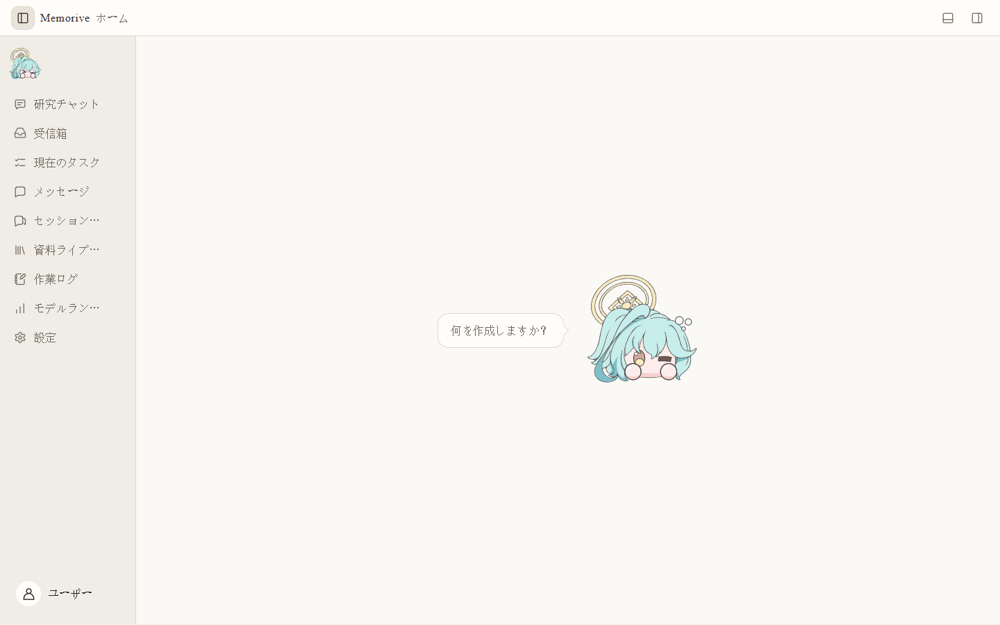

### 初回起動時

1. **設定 → 文書と外部表示**で既定のワークスペースと成果物の保存先を確認し、実際の場所を記録します。プログラム、研究資料、アプリの状態は別の役割を持ちます。
2. 使用する API、CLI、ローカルモデルだけを設定します。**現在のワークフローのモデル割当**で必要なノードにモデルを割り当てます。
3. 内容をよく知る論文を一つ試します。受信箱で取り込み、タスクのノードを見て、資料ライブラリの Card と Analysis を原文と比較します。
4. 研究チャットを始める前に、プロジェクト、会話、添付資料、検索範囲、モデルを確認します。送信できることと回答の根拠が確認済みであることは別です。

### 進捗の判断

画面が開くのは UI が起動した証拠です。接続検証はその経路を呼び出せるか、ノードの能力確認はその役割に適するかを調べます。タスク完了後も人による確認が必要です。一覧が空なら、まず対象の資料やタスクがその場所にあるか確認します。

### ホームから研究を続ける

ホームには最近の研究とよく使う入口がまとまっています。吹き出しや表情の周辺をクリックすると案内が切り替わり、表情をクリックすると動作も再生されます。位置は固定され、連打による切り替わりを抑える短い間隔があります。案内の下のボタンを押すと、対応する機能へ移動します。

最新の進展は研究方向に関する新しい文献を、関連資料は方向との関連性を重視して探します。この二つは別の検索です。関連資料の入口では最新の研究方向を使い、ホームでの再選択は不要です。方向がなければ、外部文献の受け取り設定で追加してください。AI 近況は独立した情報閲覧の入口で、研究の証拠ライブラリではありません。

## 02 モデルサービスと API：主な三つの設定方法

外部モデルは **設定 → モデルサービスと API** から接続します。公式 API、互換エンドポイント、中継サービスのいずれも、形式、接続先、モデル ID、認証情報を一つの利用可能な経路としてそろえます。表示名は自分用の目印で、実際に送られるのはモデル ID です。

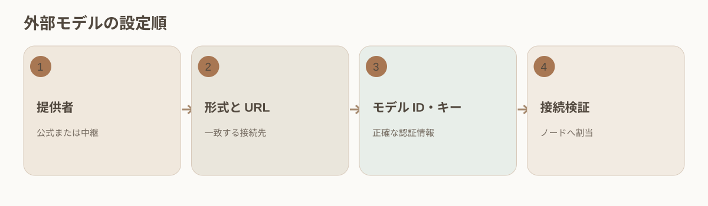

### 経路ごとの設定

1. **公式サービス**：実際の提供者を選び、公表されたモデル ID と専用欄の API キーを入力して安全に保存します。互換 URL を推測して加えません。
2. **OpenAI 互換**：互換形式を選び、そのサービスの HTTPS アドレス、モデル ID、キーを入力します。同一のサービスとアカウントに属する値を組み合わせます。
3. **中継サービス**：中継側が指定する形式、URL、キーを使います。表示価格が中継価格か上流の公開価格かを確認し、表示名だけで提供元を断定しません。
4. 普段は標準の品質段階から選びます。正確なモデル ID、形式、思考モードが必要なときに詳細設定を使います。段階名は能力保証ではありません。
5. 保存後、そのモデルの接続を検証し、ワークフローに割り当てます。小さなタスクでノードに記録された実際のモデルと経路を確認します。

### 保存後に利用できない場合

認証情報、URL と形式の組み合わせ、モデル ID、アカウント権限、ネットワークやプロキシーの順に確認します。保存成功、一覧への表示、接続検証成功は異なる状態です。無関係な経路を一度に変更しません。

### 各項目を確認する例

ある OpenAI 互換サービスでは、表示名は自分用の識別名、形式はサービスが宣言する互換形式、接続先は提供された HTTPS の基準 URL、モデル ID は一覧の正確な値、キーは認証欄に置きます。保存後にそのモデルを検証し、ノードに割り当てます。401/403 はキーや権限、404 は URL の経路やモデル ID、タイムアウトは通信やプロキシー、応答形式異常は形式を先に確認します。エラーコードは手掛かりで、最終的には実際の応答記録で判断します。

### 認証情報と費用

キーを文書、スクリーンショット、ウェブへの書出し、通常ログに載せません。同名モデルでも公式、互換、中継の経路を別々に識別します。費用は実際に呼んだ経路で決まります。検証も実要求になり得るため、経路とモデルを先に見ます。

## 03 CLI 接続：インストール済みのローカルツールを使う

本機に導入してログイン済みの CLI ツールは、Memo の実行経路として利用できます。導入、ログイン、更新、契約資格はそのツール側で管理します。Memo は経路を認識し、使えるモデルをタスクのノードへ割り当てます。サブスクリプションから一回分の価格を算出できない場合もあります。

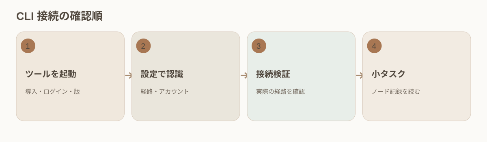

### 接続手順

1. ツール自身のターミナルで、コマンドが起動し、ログイン済みで、対象モデルが利用できることを確認します。版と実行パスを記録します。
2. **設定 → CLI 接続**でツールを選び、実行ファイル、アカウント状態、モデル設定、画面のエラーを確認します。
3. 保存後、その CLI 経路を検証します。API の成功は CLI の成功を示しません。CLI ごとに確認します。
4. 対応するノードに CLI モデルを割り当てます。生成と審査では役割、モデルの同一性、能力を別々に確かめます。
5. 小さなタスクを実行し、ノードの経路、開始時刻、エラー、再試行を見ます。接続は通るのにタスクが失敗する場合、再インストールの前にノードの記録を調べます。

### 費用と履歴

一回ごとの単価がない CLI 契約は費用をゼロではなく不明とします。アカウント、モデル、ツールの版が変われば再検証します。旧タスクには当時の経路と価格根拠を残します。

### 自分の CLI を追加する

既存のアダプターに加え、カスタム CLI サービスではローカルの実行ファイル、引数、入力方法、出力の読み取り規則とモデルを設定できます。まず接続を検証し、実際に利用するチャットや処理ノードでそのサービスを選んでください。表示名だけで判断せず、タスク記録に残るサービスとモデルを確認します。

設定した方法で要求を受け取り結果を返せる CLI が対象です。すべての対話型ツールがそのまま対応するわけではありません。タイムアウト、取消し、出力異常は元のエラーを残し、起動成功を回答成功と見なさないでください。CodeBuddy Code の名称はそのままです。WorkBuddy は別製品で、名前の変更だけでは対応できません。

## 04 ローカルモデル：サービス、通信形式、能力

まずローカルアプリでモデルのサービスを起動し、その後で Memo に検出させます。現在の接続先は `127.0.0.1` または `::1` です。一覧に表示されても、それは発見できたという意味にとどまります。会話、画像読取、埋め込み、根拠審査は用途ごとに確かめます。

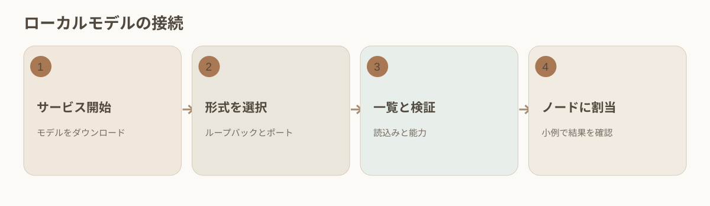

### 接続手順

1. Ollama などのソフトでサービスが動き、モデルが取得済みで、そのソフトから呼び出せることを確認します。
2. **設定 → ローカルモデル**で自動検出を試します。見つからなければ表示名、サービス種別、ループバックのアドレスを手動で入力します。
3. 実際のサービスに合わせて Ollama ネイティブか OpenAI 互換を選びます。llama.cpp は対応する互換プリセットを使います。
4. モデル一覧を読み込み、検証します。空ならプロセスとポートを確認します。表示されるのに失敗するなら形式、モデルの読込、能力を確認します。
5. 検証したモデルを研究チャットまたはワークフローに割り当てます。埋め込みモデルと会話モデルの用途は異なります。埋め込みモデルの変更には旧索引の再構築が必要な場合があります。

### 利用可能性の判断

機密を含まない小さな資料で対象の役割を確かめます。提供者の API 料金がなくても GPU、電力、時間を使います。接続検証だけで全ノードの適格性を主張しません。

## 05 ワークフローのモデル割当と検証

v1.02.01：独立した設定は個別に保存します。一部の保存に失敗すると対象を表示し、未保存の内容を保持します。保存済みの無効なディレクトリは無関係なモデル変更を妨げませんが、そのディレクトリを使用する前にパスを修正してください。取り込み時は設定の既定ディレクトリと存在しない過去の既定ディレクトリのみを調整し、カスタムパスは保持して問題を通知します。新しいショートカット名は Unicode 20文字までです。既存の長い名前は変更せずに保持でき、名前を編集すると新しい上限が適用されます。

ワークフローのモデル割当では、新しいタスクの各ノードが使うモデルと経路を決めます。埋め込み、Card 抽出、Analysis、審査には異なる能力が必要です。日報、週報、月報にも個別のモデル設定があります。変更は後続タスクに適用され、開始済みノードの設定と記録は残ります。

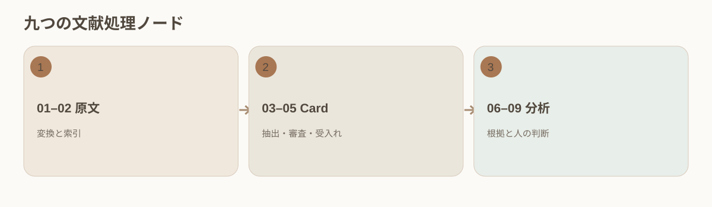

### 設定と確認

1. **設定 → 現在のワークフローのモデル割当**で文献処理または報告期間を選び、ノードを順に開きます。
2. 検索には埋め込みモデル、Card には忠実な抽出、Analysis には必要な根拠量を扱えるモデル、審査には根拠を独立に検査できるモデルを選びます。
3. 有効状態、再試行規則、利用可能表示を確認します。04 や 08 のような任意審査を無効にすると検査範囲が減ります。省略は合格ではありません。
4. 保存後に設定を開き直します。新しい小タスクで実際のモデル、経路、入出力、エラーを確認します。
5. 接続検証は「呼べるか」、ノード試験は「この役割に合うか」を調べます。公開ランキングは候補選びの参考です。この三つの証拠は交換できません。

### 一つのタスクだけ変更する場合

現在タスク内で許される置換はその実行だけに適用されます。将来の論文にはテンプレートを変更します。埋め込み空間が変わる場合は索引の再構築を検討します。

### 生成と審査の役割分担

確認可能な割当では、02 が検索表現を作り、03 が原文で位置を示せる Card 項目だけを抽出し、04 が原文に照らして漏れや誤読を探し、07 が管理された根拠から Analysis を作り、08 が引用と判断の関係を検査します。04 と 08 が同じモデル系列でも、独立した役割と実際の入力を見ます。生成器が似た答えを二回書くことは独立審査ではありません。ランキングが高いだけで不要な能力を有効にしません。

変更後は保存されたテンプレート、受信箱の実行可能表示、新タスクが記録したモデル ID と経路を比較します。不一致なら適用されなかった場所を調べ、旧タスクを書き換えません。

## 06 受信箱：取込、プレビュー、待機、自動実行

受信箱は新しい資料の最初の置き場所です。処理を始める前にファイルとプレビューを確認できます。待機中という表示は、本文変換や Card 生成の完了を意味しません。初回は内容を自分で確かめられる論文を選びます。

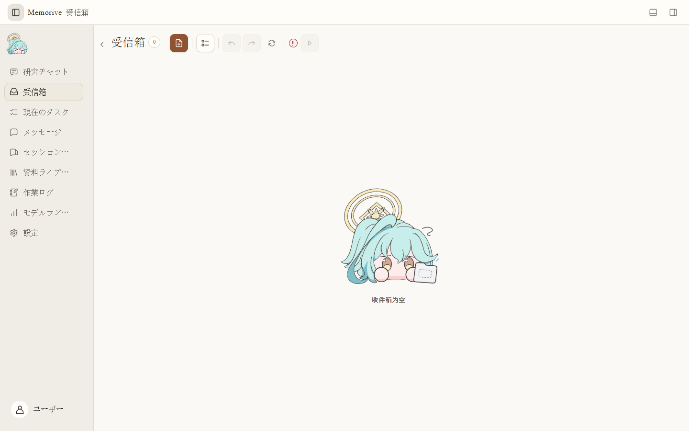

### 一つの資料を処理する

1. ファイルを追加するかドラッグします。名前、種類、ページ数、プレビューを確認します。PDF、Office、画像が受け付けられても完全な抽出を意味しません。
2. 重複や誤ったファイルを確認します。順序を変更し、まとめて削除する前には選択範囲を見直します。
3. 自動実行の状態と無効理由を読みます。オフなら待機できます。オンにする前に必要なモデル割当を保存します。
4. オンにしたら **現在のタスク**でタスクが作られたか確認します。受信箱からカードが消えただけでは成功と判断しません。
5. 異常なカードは詳細のエラーを読んでから取消、再試行、原本変更を決めます。元ファイルと失敗記録を残します。

### 始まらないとき

自動実行、モデル割当、画面の案内を確認します。タスクがあるのに進まない場合は具体的なノードを調べ、全件を再取込しません。

### 新しい文献と関連性の高い文献を受け取る

外部文献の受け取り設定で研究方向、検索間隔、各回の希望件数を設定します。自動受け取りは有効にした場合だけ動作し、ホームから一度の検索を明示的に開始することもできます。追加、重複、スキップ、失敗の内訳を確認してください。新規項目がないだけでは情報源の障害とは判断できません。

保存するのは題録と出典リンクです。題名、著者、年、DOI に加え、取得できる場合は抄録と推薦理由を含みます。理由は研究方向との関係を説明するもので、全文の確認に代わりません。新規資料はメッセージで通知し、抄録がなければ欠落として残します。全文は利用者が手動で追加します。ログインや著作権上の制限を回避せず、題録の保存を PDF の取得・処理完了と混同しません。

文献探索、受信箱、ライブラリでは共通の識別確認を使います。DOI などを優先し、識別子がない場合や競合する場合は題名、著者、出典を確認します。同じ研究のプレプリントと出版版は版の関係を保ち、題名が似ているだけで統合しません。同じ検索の再試行で資料や通知を重複させないことも確認してください。

## 07 現在のタスク：九つのノードと限定的な再試行

タスク一覧で進行状況を見て、ノードを開くと今回の入力やモデルが分かります。九つの段階は、01 文書処理、02 埋め込み、03 Card 生成、04 Card 審査、05 Card 受入れ、06 分析資料の準備、07 Analysis、08 Analysis 審査、09 人の判断です。

### ノードを順に確認する

1. **現在のタスク**で文献を選び、元ファイル、時刻、全体状態を確認して最初に異常が出たノードを探します。
2. ノードを開いて入力、出力、モデル、経路、再試行、エラーを見ます。緑はその工程の終了です。内容の承認ではありません。黄・赤は説明文と合わせて読みます。
3. 01 の本文や表が欠ければ原本を、02 が失敗すれば埋め込みと索引を、03/07 の内容が足りなければ入力と原文を調べます。
4. 04 と 08 は設定で省略されることがあります。省略されたノードには審査結論がありません。09 では研究者の判断が必要です。
5. 現在タスクのモデルや再試行を変更できる場合、影響範囲を確認します。必要な地点からだけ再処理し、旧実行との差を残します。
6. 過去を調べるときは履歴タスクに切り替え、実行時刻と成果物版を比較します。旧実行を現在の結果と取り違えません。

### 完了の意味

機械処理が終わっても、引用・再利用前に Card、Analysis、原文を開いて確かめます。

### 限定的な障害診断の例

07 Analysis が失敗したら、まず 01–06 に利用可能な出力があるか確認し、07 のエラーとモデルの記録を開きます。文脈容量不足なら組み立てた根拠の量とモデル上限を比較します。引用識別子の欠損なら 06 の資料準備を調べます。タイムアウトならその実行の経路と通信を見ます。原因が分かってから、許される最初の必要ノードだけを再試行します。全件の再実行は費用と版の比較を複雑にします。

再試行後、二つの入力版、モデル、時刻、結果を比較します。後の成功があっても旧失敗は履歴の証拠です。

### 円環は実際のノード進捗を表す

円環はノードの開始、処理、保存、終了に対応します。割合を測れないときは処理段階を示し、時間だけで進捗を装いません。完了した主処理と実行中の論理分析は分けて確認します。一時停止、再試行、並行タスクにもそれぞれ状態があります。ダウンロードや一つのノードが 100% でも、研究タスク全体の完了とは限りません。

## 08 資料ライブラリ：Card と Analysis を原文で確認する

処理後は資料ライブラリで原文、Card、Analysis を並べて読みます。Card は原文から抽出した情報をまとめ、Analysis はその根拠に基づく候補判断を示します。数値、条件、結論に疑問があれば原文に戻ります。

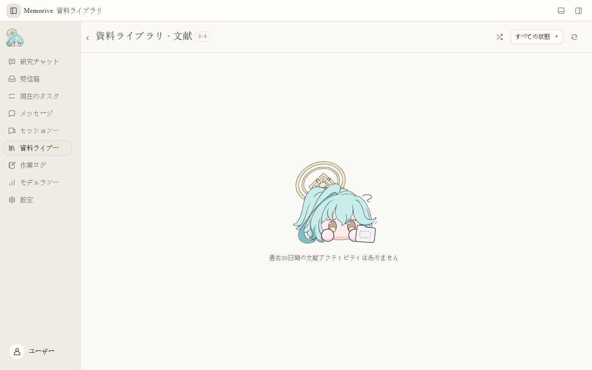

### 一篇の論文を確認する

1. 題名または状態から対象を探し、このタスクと現在の版に属するか確認します。
2. 原文や変換テキストを読み、図表、単位、標本、方法、著者が述べた限界を確かめます。
3. Card で対象、方法、数値、結果、出典位置を照合します。「原文にない」と抽出漏れを区別します。
4. Analysis で各判断の Card または原文上の根拠、推論の広さ、省略された条件を確かめます。
5. 異議を分けて記録します。転記間違いは Card の修正、根拠不足は判断の縮小または破棄、解釈の相違は双方の意見と理由を残します。
6. 現在版を読んだと確認してから **確認済みにする**操作を行い、状態と時刻を見ます。操作できないときは必要な二つの成果物を開いたか確認します。

### 確認後

単一文献の成果物を確認しても、自動で知識庫には入りません。研究チャットの派生結論には別の確認が必要です。

### Card と Analysis の確認表

Card：対象は正しいか。標本数、単位、区間、方法、比較対象、著者の表現、限界は完全か。重要な項目ごとに段落、ページ、図へ戻れるか。「未評価」「抽出の欠落」「原文にない」は区別します。

Analysis：判断ごとにどの Card 項目と原文が支えるか。相関を因果に変え、標本外へ一般化し、未検証の仮説を事実にしていないか。比較論文に可比性があるか。異論は理由と原文位置を残します。確認操作はこの版を読んだ記録であり、全主張への賛同ではありません。

### 表、数値、出典位置を確認する

資料処理は段落、表のセル、ページや行の位置を構造として残し、数値確認や引用から同じ資料へ戻れるようにします。上下付き文字、単位、見出し、ページをまたぐ表は元の PDF と照合してください。文字が空のページでは設定に応じて回数を限定した OCR 回復を試みますが、読めない内容をもっともらしい数値で埋めません。

保存した位置は確認の手掛かりで、OCR や解析の完全性を保証しません。再処理では新しい版を作り、過去の回答は当時参照した版との関係を保ちます。

## 09 研究チャット：プロジェクト、資料、モデルを決める

研究チャットでは、まずプロジェクトを選んで会話を開きます。既定の検索対象はその会話の添付資料です。プロジェクト内の別の資料も探したいときは、範囲を明示的に広げます。Card が未生成のファイルも添付できます。

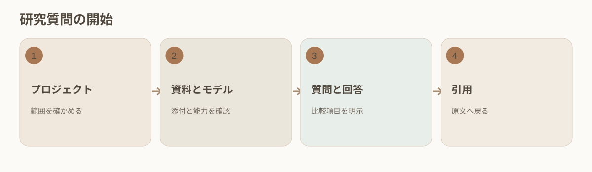

### 最初の質問

1. 研究チャットで目的のプロジェクトを選び、会話を作成または開きます。背景を混ぜないようプロジェクトを確かめます。
2. PDF、画像、Word、Markdown、TXT を入力欄へドラッグし、**＋**を使うか、同じプロジェクトの資料ライブラリから選びます。
3. 添付の表示と右の資料欄を比較します。チェック解除はこの会話から外すだけで、原本や過去の引用は残ります。
4. 入力欄下のモデル名から検証済みモデルを選びます。スキャン PDF や画像には視覚能力が必要です。読めなければモデルを変更して再試行します。
5. 方法、標本条件、結果、限界など比較項目を明示します。複数論文の比較には異なる論文を二つ以上選びます。
6. 送信前にモデル、資料数、検索範囲を再確認します。検索のみでは抜粋が返り、分析生成には利用可能なモデルが必要です。

### 範囲を広げた場合

プロジェクト資料の自動検索を有効にすると、手動で選んでいない資料も候補になります。会話名から推測せず、回答が実際に引用した資料を確認します。

### 添付、プロジェクト検索、記憶

入力欄の添付表示は今回明示した資料で、右の資料欄は会話との関連を示します。プロジェクトの自動検索は別の候補も加えます。確認済み記憶が有効なら保存された研究背景も参照され得ます。質問前に許す範囲を決め、回答後に各引用を開いて実際の資料を調べます。一篇だけを試す場合はその資料だけを残し、不要な範囲拡張を切って対照質問します。

論文を再処理した後も、旧会話は当時引用した保存版へ戻れる必要があります。資料庫の表示期限から過去の引用の消失を推測しません。

### 回答スタイル、再試行、分岐

全体設定には、専門性と信頼性、率直さ、効率と実用性、発想の展開を重視する四つの回答スタイルがあります。全体設定を継承する場合はその選択を使い、保存済みの回答には生成時のスタイルが残ります。コピーアイコンは回答をコピーし、一つの再試行アイコンは元の回答のスタイルで別の版を生成します。好みの変更は設定で行い、回答横に別のスタイルメニューは置きません。

途中の回答を再試行すると、新しい回答版ができます。以前の回答とその後のやり取りは元の分岐に残り、新しい分岐の文脈には混ざりません。以前の版に戻せば、その経路を確認できます。再試行の失敗で保存済みの回答を消してはいけません。コピーと版の切り替えではモデルを呼び出しません。

### 自動アーカイブと再表示

利用者が正常に開いてから 30 日を超えた場合、または保存された利用者・アシスタントのメッセージが 100 件を超えた場合、問答を自動アーカイブできます。ちょうど 30 日または 100 件では対象になりません。非表示の回答版も保存メッセージに数えるため、会話の往復数とは異なります。固定中、処理中、添付処理中、いずれかのウィンドウで開いている問答は、その間保護されます。

アーカイブしても本文、知識、引用、回答版は残ります。閲覧だけでは自動的に復元しません。手動で復元すると 30 日の猶予と現在の件数を記録し、同じ件数ですぐ再びアーカイブされることを防ぎます。一覧は要約と必要なメタデータから読み込み、会話を開いてから本文を読みます。保存内容は検索できます。

## 10 引用の検証と知識の承認

研究チャットの回答は、検証前の分析です。数値、比較、因果に関する主張を見つけたら、引用先を開き、保存された原文の前後も読みます。文章が自然でも、引用が多くても、「保存可能な結論」と表示されても、この確認は省けません。

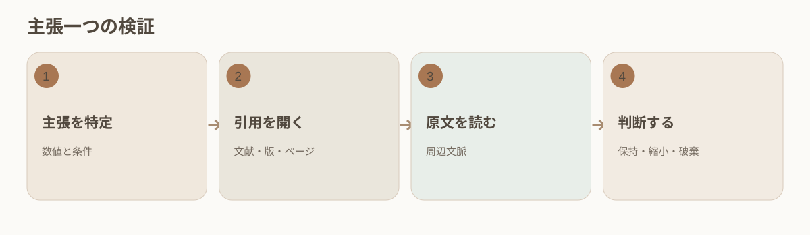

### 主張ごとに調べる

1. 数値、比較、因果関係、適用範囲、提案を印します。各主張と引用を対応させ、引用のない重要文は未検証とします。
2. 引用を開き、論文、保存版、ページまたは行を確認します。右の引用欄で出典一覧を照合します。
3. 該当箇所と前後を読みます。対象、標本数、方法、単位、時点、比較基準、統計上の制限、著者の表現を調べます。
4. 論文間比較では各論文を別々に確認します。指標や対象が異なる場合は違いを明記し、一つの結果にまとめません。
5. 各主張を「支持／部分的に支持／矛盾／位置を特定できない」に分けます。部分的なら表現を狭め、矛盾や特定不能は再調査または破棄します。
6. その後に **保存可能な結論**の主張、範囲、制限、全引用を確認し、知識へ追加します。訂正は新しい審査版を作り、旧版を保持します。

### 別々の二つの承認

資料ライブラリでの成果物確認は単一論文に対する操作です。知識への追加確認はチャットや Agent から生じた派生結論に対する操作です。出典が変更・撤回されたら依存する知識を再確認します。

### 検証例：差を因果にしない

回答が「方法 A は指標を 20% 改善した」と二篇を引用したとします。20% の出典、相対変化かパーセントポイントか、単位、測定時点を調べます。続いて対象、対照群、統計方法を比較します。一篇が関連性だけを報告し、もう一篇の対象が違えば「改善した」という因果表現は保持できません。「文献甲の特定標本で約 20% の差を観察した。文献乙は条件が異なり直接統合できない」のように狭め、別々の引用を残します。単位や条件が不明なら数値主張は未検証です。

知識項目には適用範囲、限界、再確認日も必要です。出典の訂正・撤回時には依存する項目をたどり、再確認します。

### 引用が見つかることと主張の裏付けを分ける

引用を開けることは、出典を特定できたことを示します。その箇所がこの主張をどこまで支えるかは、さらに確認が必要です。問答は支持、一部支持、根拠不足、矛盾を区別し、証拠の不足を示します。これらは確認の順序を考える手掛かりで、研究上の結論を代わりに承認するものではありません。

問答から知識を保存する前に、元の質問、選択した回答版、条件、出典を確認します。課題の背景、改善提案、その後の更新は関連を保ち、以前の記録を上書きしません。意味の診断には見落としや誤検出があり得ます。複数文献の対象の取り違えや推論は特に注意して確認してください。

## 11 検索と重み：順位の変わり方

検索結果にどの資料が先に出るかを調整するには、**設定 → 検索と重み** を開きます。全プロジェクトか一つのプロジェクトかを選び、プリセットまたは各項目の重みを調整します。順位の調整では原文の誤りは直せません。埋め込みモデルを変えたときは旧索引にも注意します。

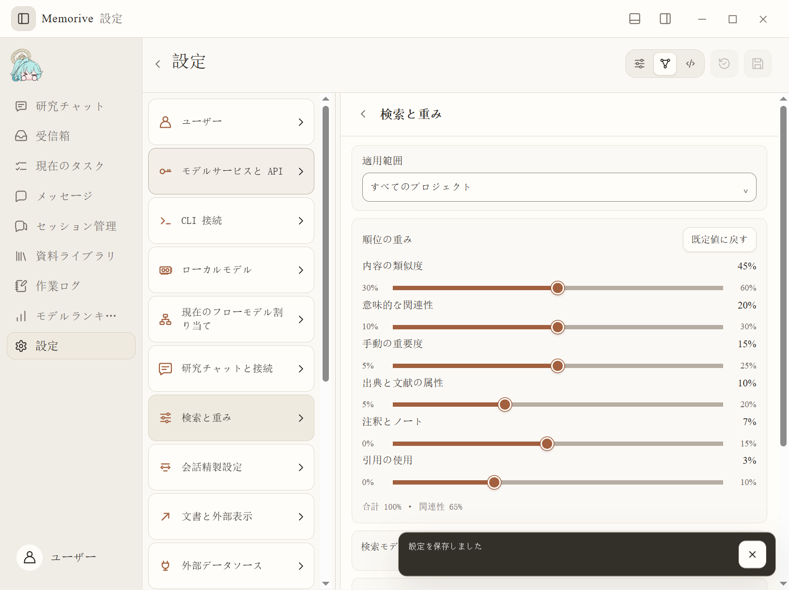

### モードを選ぶ

1. 通常モードでは、均衡研究、原文定位、複数論文比較、蓄積再利用から目的に近いものを選びます。
2. 詳細モードでは内容類似度、意味関連性、手動重要度、出典属性、注釈・ノート、引用利用の六項目を見ます。
3. 一つを動かしたら他項目の連動と合計 100% を確認します。関連性の許容範囲は画面の検証に従います。高い重みは信頼性の証拠ではありません。
4. 全プロジェクトか、継承をオフにした単一プロジェクトを選びます。保存前に適用範囲とプレビューを見ます。
5. 必要なら設定済みの埋め込み・意味モデルを選びます。未設定でも語句検索は使えます。モデル変更には索引再構築が必要な場合があります。
6. 開発者モードでは構造化設定の項目、上下限、合計を確認し、保存後に通常画面でも表示を確かめます。

### 既知の資料で調整する

必ず出るはずの論文でプレビューし、原本と派生知識の順位を観察します。異常なら重みを動かす前に出典の同一性と版を調べます。

## 12 セッション管理：同期、絞り込み、精練、削除

セッション管理には、本機の Codex と Claude Code の記録、ブラウザーからの取得分、手動取込をまとめて表示します。元のツールで会話を続けたら、追加分をもう一度同期してください。ここで整理するのは Memo が保存したコピーです。

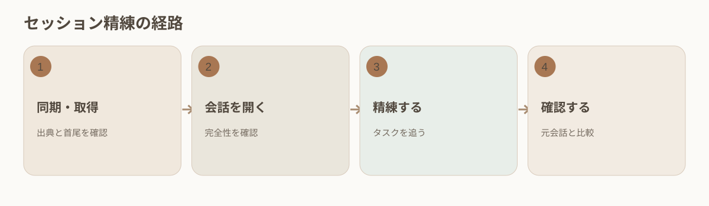

### 情報源から成果物まで

1. **セッション管理**で情報源、題名、表示件数を絞ります。本機の対応履歴には **Codex / Claude を同期**を使います。
2. 対象を開き、情報源、時刻、最初と最後の発言、本文の完全性を確認します。ブラウザー由来なら取得範囲と状態も見ます。
3. **設定 → 会話精練設定**で適切なモデルを保存し、会話詳細へ戻って **精練**を選びます。
4. 精練は受信箱とタスク待ち行列へ入ります。自動実行がオフなら待機します。現在のタスクを追い、完了後に資料ライブラリで成果物を開きます。
5. 要点、仮説、決定、次の行動を元の会話と比較してから確認します。新規発言には新しいスナップショットや精練版を作ります。
6. 一括削除の前に選択範囲を確認します。Memo のローカル記録を消しても Codex、Claude Code、サイト上の元会話は消えません。

### 見つからない場合

対応する情報源、同期完了、絞り込み条件、本機の対象アカウントに元会話があるかを確認します。「最近の会話」の表示場所が変わっただけでは削除された証拠になりません。

### 全件・差分・精練の版

初回同期または取得では基線を作り、最初と最後の発言、件数を抽出確認します。差分更新は最後の成功位置から続けます。部分的な失敗で完全な基線を上書きしません。精練前に会話スナップショットの時刻を記録し、結果がその末尾まで含むか確認します。元ツールで会話を続けたら再同期して新しい精練版を作ります。旧版は当時の決定の経緯として残します。

同じ題名でも情報源や会話が異なる場合があります。情報源、時刻、内容を合わせて識別します。一括削除はローカルコピーの管理です。必要な研究記録を保存・バックアップしてから範囲を確定します。

## 13 ウェブ読取とブラウザー拡張：現在ページと履歴

ウェブの内容を Memo に取り込むには、**設定 → 会話精練設定** でブラウザー補助機能を準備し、対象サイトには自分でログインします。取得できる履歴の範囲はサイトによって異なります。現在ページ、初回全件、後続差分を目的に合わせて選びます。

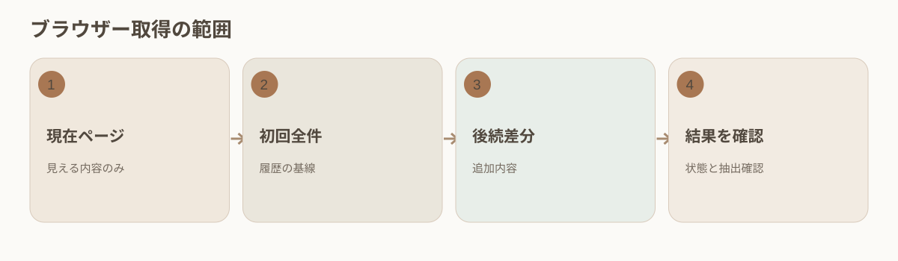

### 操作手順

1. 設定の入口からブラウザーの拡張管理画面で読み込みます。拡張ファイルを更新したら再読み込みします。
2. 対象サイトを開き、ログインや検証を自分で完了し、必要なページが読み込まれるまで待ちます。
3. 現在見えている内容だけならブラウザーのツールバーから **現在の画面を記録**します。一般的なウェブ情報源になり、アカウント全履歴にはなりません。
4. 対応サイトの履歴を初めて作るときは全件取得、後の更新は差分取得です。各情報源の最後の成功位置、件数、エラー、完了状態を見ます。
5. セッション管理を更新し、最初、最後、中間を抽出確認します。中断やログイン期限切れなら原因を直して続け、部分結果を完全履歴と呼びません。

### 失敗の境界

サイト構造の変更、通信中断、全履歴非対応は取得を制限します。URL を設定しただけでサイト全体が読めたとは言えません。

## 14 モデルランキング：公開指標による候補選び

モデルランキングは候補を絞るために使います。公開された能力と価格を比べ、試す価値のあるモデルを選びましょう。更新日、指標の定義、提供者、通貨、単位を一緒に読みます。順位だけでは接続や自分の資料での品質は分かりません。

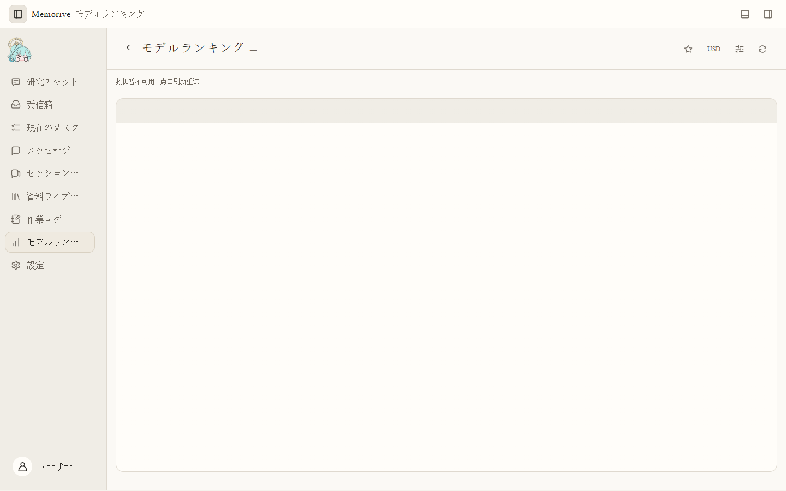

### 比較する手順

1. 出典と更新日を見てから、モデル、提供者、お気に入りで絞ります。取得失敗時は更新または後で再試行します。
2. 能力スコアの基準と課題分類を確認します。異なる基準の数値を同じ尺度として差し引きません。
3. 入出力価格の通貨、百万 token 当たりの単位、キャッシュや複合計算の口径を確認します。公開価格は変化します。
4. 候補を API、CLI、ローカルモデル設定で確認し、実際の経路とモデル ID、接続、役割別の能力を検証します。

### 境界

空の一覧はモデル不存在を意味しません。高順位でも利用権限、文献抽出・引用審査への適合、本機での動作は証明されません。

## 15 利用量と費用の下部パネル：範囲と不明値

下部の **利用量と費用** では、集計範囲と期間を先に決め、それからモデルや指標を選びます。ここでの合計、ランキングの公開価格、研究チャット一回分の記録は対象が異なります。費用を比べる前に範囲をそろえてください。

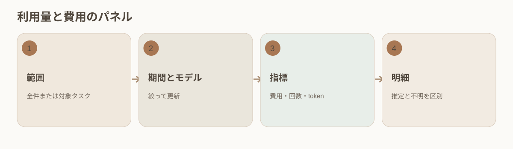

### グラフと明細

1. 上部の下部パネル操作または **Ctrl+J**で開きます。全記録を選べます。「現在のタスク」が帰属不完全と表示されれば無効のままです。
2. 直近 7 日、30 日、今月と、単一モデルまたは全モデルを選びます。新しい記録が必要なら更新し、同期状態を見ます。
3. 費用（推定を含む）、要求回数、token を切り替えます。実額と推定、失敗と再試行を含む回数、入力と出力を分けます。
4. 一件ごとにはモデル・費用の請求一覧で、タスクへの帰属、経路、時刻、モデル、計算根拠を確認します。
5. 一回の単価がない CLI 契約は不明です。ローカルモデルには提供者 API 料金がなくても資源費用があります。証拠が欠ける値をゼロにしません。

### 請求との照合

推定費用は記録された利用量と価格から求め、提供者の確定請求とは異なります。通貨切替は表示上の換算です。元の価格情報と提供者の請求を残し、全記録を一篇の論文費用に割り当てません。

### 三種類の費用が違う理由

ランキングの百万 token 当たり価格は公開参考、下部パネルは絞り込んだ実額・推定記録の集計、回答直下の記録は一回分です。時刻、経路、キャッシュ価格、通貨、失敗要求の扱いが異なります。失敗して再試行した場合、要求回数は二つでも最終回答は一つです。token の一部だけが報告されれば費用は推定または不明になります。比較には日付、モデル、経路をそろえ、入力・出力・キャッシュを見てから提供者の請求と照合します。

現在タスクへの帰属が利用できないとき、全体費用をタスク数で割りません。不明と未帰属の記録を保ち、証拠がそろってから照合します。

## 16 報告、メッセージ、作業ログ、バックアップ

日報、週報、月報は一定期間の研究を振り返る助けになります。メッセージは対応が必要なことを示し、作業ログは実行の経緯を残します。判断の理由を確かめるときは、そこからタスク、Card、Analysis、原文へ戻ります。

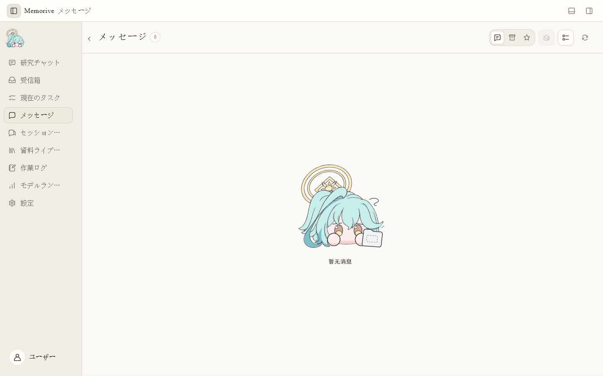

### 報告と異常

1. 日報、週報、月報の生成モデルをそれぞれ割り当てます。一つの期間の設定は他の期間へ自動適用されません。
2. **設定 → 通知とリマインダー**で生成時刻を設定します。新しい成果や利用可能モデルがない場合、空の報告を作る必要はありません。
3. 資料ライブラリで報告の対象期間、関連資料、版を見ます。必要なら関連タスクから再生成し、旧版を残します。
4. メッセージを開き **移動**で対象へ行きます。既読にしても審査承認や文献確認にはなりません。
5. 作業ログを時刻と種類で絞り、一つのタスクのエラーと再試行をたどります。新記録には更新を使い、最後の成功通知だけを全工程の証拠としません。

### 保守

原本、生成物、注釈、研究上の結論、設定、必要な記録をバックアップします。保存先の項目を変える前に旧ファイルを確認します。項目の変更は移動ではありません。バックアップ後、原文、Card、Analysis、精練結果を開いて抽出確認します。公開版や正式受入れの資格は版ごとの別記録で判断します。

### AI 近況と生成内容の言語

AI 近況は選択期間の公開資料から変化と出典リンクを整理します。研究チャットと接続の設定で利用可能なモデルを選ぶか、設定に従ってチャット用モデルを継承し、生成を明示的に開始します。自分の研究記録を対象とする日報・週報・月報とは別の機能です。メッセージは出来事の通知であり、報告本文の代わりではありません。

中国語、English、日本語を切り替えると、画面、システムメッセージ、その後に生成する問答と memo の報告は現在の言語設定に従います。保存済みの回答と報告は元の言語と版を保ちます。文献処理は原文の言語に従い、題名、DOI、引用、原文の抜粋を画面切り替えで書き換えません。言語ごとにキャッシュを区別し、以前の言語の結果を新しい生成と混同しません。

## 17 文献のデータ・論理分析

memo はローカルの数値確認と、文献ごとに選択するクラウドの論理分析を提供します。報告は確認範囲を限定した意見です。色だけで論文全体の真正性や著者の意図を判断できません。

### 確認を始める

1. 設定の「現在のフローモデル」を開きます。データ分析は既定で有効で、モデルを使用せず RawMD の生成後に実行します。主処理の下にある論理分析には、検証済みのクラウド API またはサブスクリプション CLI を指定します。この項目はローカルモデルや自動切替に対応しません。
2. 受信箱の詳細で、ファイルの場所を開く操作の下にある脳アイコン横の「論理分析」を選択します。既定では未選択です。自動実行が有効な場合は、先に無効にしてから待機中の文献の設定を変更してください。実行開始時に資料の識別情報、ルールとモデル設定が固定されます。
3. 「数値確認ルール」で割合、合計、SD/SE、同じ量の照合、離散値の平均、統計量と p 値、または生データの要約を選びます。原表記の数値、一意に特定できる原文引用、適用条件と根拠を入力します。重み、独立性、分母、裾や補正が不明な場合は情報不足として残します。
4. 数値条件が不足し、実際の Card 削除記録が同じ明示的な原文関係を指す場合、削除記録・原文引用・現在の chunk のページ位置を自動で関連付けます。RawMD を先に確認し、必要時だけ範囲を限定して PDF を参照します。削除された Card 値は再利用・復元しません。一意に関連付けられない場合は不足として残します。詳細な Card 位置指定は任意の補足です。

### 進行と再試行

データ分析は主処理の一部ですが、Card の成功を前提にしません。開始前にはスキップできます。選択済みの論理分析は主処理完了後も待機・実行でき、報告の保存と登録が完了して初めてタスク全体が完了します。独立項目には状態に応じて一時停止、再開、取消、スキップ、再試行が表示されます。論理分析の再試行で成功済みの主処理は繰り返しません。

一時停止や取消によって送信済みの要求を取り消すことはできません。使用量と返された結果は保持します。送信後の結果が不明な場合は自動再送せず、再試行時に追加呼び出しと費用の可能性を確認します。登録失敗時は保存済み結果の登録を優先します。報告の版を残し、入力変更や後継結果による旧版を履歴として表示します。

### 報告と人による判断

資料庫の文献詳細からデータ分析・論理分析の報告を開き、確認範囲、対象外、出典、式、条件と結果を読みます。数値一覧は追加表示できます。条件不足、OCR の曖昧さや出典を特定できない値は、制限や入力問題として記録します。

緑は確認範囲に重要な疑問点がないこと、黄は説明が必要なこと、赤は根拠のある重要な疑問点を優先確認すべきことを示します。範囲が限定される場合には色の結論を出しません。疑問点の数、数字の反復や小標本だけで高リスクとはしません。詳細な計算記録は展開して確認できます。

項目ごとに説明済み、報告の問題を確認、資料待ち、保留、再検討を記録し、理由と、説明する場合には根拠を添えます。人の判断は追記として保持し、機械報告と色は変更しません。確認報告を論文原文の証拠候補に自動追加しません。

### モデル試験・費用・制限

試験は現在のフローモデル設定の論理分析項目にあります。異常データの検出と偽陽性の抑制を扱う独立カテゴリで、LIGHT、HALF、FULL は入れ子の 6、10、20 件の合成事例を使います。各段階で二回の指定修正が可能で、カテゴリ固有の暫定非線形減点を適用します。部分試験は FULL 成績を上書きしません。参考試験であり、盲検試験、正式資格やカテゴリ間比較を保証しません。引用と項目の採点だけでは説明内容の正しさを証明できません。

データ分析とローカル PDF 補助はモデルを呼び出しません。選択した論理分析と試験は指定クラウド経路と既存の承認・容量・費用記録を使います。API 試験計画は費用上限を表示し、費用情報が不足する場合は自動的な有料修正を続けません。CLI の一回あたりの料金が不明な場合はゼロとせず不明のままにします。論理分析では読込済みテキストを分割して送信するため、選択前に送信可能な資料であることを確認してください。

確定的な数値確認は RawMD と明示した条件に限ります。PDF 補助は最大二ページ、64 MB、五秒です。主数値処理の上限は RawMD 4 MB、数値 20,000 件、ルール 200 件で、超過時は理由を残して停止します。分布の裾確率は数値近似です。未読込の補足資料、画像鑑定と著者の意図は対象外です。

### 既定の処理と全文の関係確認

ルールを入力しなくても、数値・表記精度・反復・表の数値列・原表記のプラスマイナス対を要約します。明示的な算術式、一つのセル内の n/N (%)、p-value/SD/SE と明示された数値領域、原文にある SE = SD / sqrt(n) の関係に対応します。列を一つの研究標本とみなしたり、プラスマイナス対から SD/SE を推定したりしません。一般的な count/percent 列から分母・重み・群を補いません。計算結果は記載した条件の下でのみ成立し、真正性の判断ではありません。

容量内なら全文を同時に確認します。長文では出典付きの方法・結果・結論・制約の一覧を作り、原文抜粋を使って別の段階で分割間の関係を確認します。報告には全体確認の状態と引用を表示します。局所的な確認の完了だけ、全体資料の容量超過、一覧不足、未解決の関係から完了の緑色にはしません。呼び出しは文献ごとの手動選択に従い、既存の並行制御・一時停止・費用記録・不確定な要求の復旧を共有します。

自動ルールは詳細指定も含めて最大 200 件です。超過による未確認範囲を記録します。未読込資料、未対応形式、根拠のない Card 関連付けは確認済みとしません。

現在のタスクでは実行状態だけを表示します。疑点や確認範囲の制限が報告にあっても、論理分析の完了ノードは緑色です。ノードをクリックすると既存の右サイドバーで進捗や操作を確認でき、閉じた後も同じノードで再展開できます。保存済みの展開欄や報告ポップアップはありません。データ・論理分析の報告は資料庫の文献詳細内で表示し、報告の色は確認範囲内の所見を別に示します。資料庫の状態ラベルは文字幅に合わせ、狭い一覧では次の行に配置します。

指摘は報告に示された条件と範囲に限って読みます。百分率と比率は原文の意味に沿って換算し、欠けた条件を推測しません。途中で切れた式、曖昧な OCR、妥当なゼロ値は区別します。検査は文献を書き換えず、疑点や人の説明も研究上の判断に代わるものではありません。

## 18 インストール、更新確認、差分更新

v1.02.01 は v1.02 の修正版です。v1.01 または v1.02 から初めて更新する際は、データをバックアップし、本版のインストーラーまたは完全なポータブル版を使用してください。旧アップデーターは3段の版番号を認識しません。差分 ZIP を手動で上書きしないでください。本版は今後のアプリ内更新に向けて3段の版番号に対応します。

新規インストールでは、ようこそ画面の地球アイコンで中文、English、日本語を選び、ランタイム、プログラムとデータの保存先を確認します。WebView2 が未導入でも、ネイティブの前提条件ウィザードで言語を選べます。設定のない新規利用では初回のアプリ言語になりますが、既存データの再利用や更新では以前の設定を保ちます。

自動確認は正式リリースを対象に初期状態で有効であり、設定で無効にできます。アプリの準備後に少し待って確認し、自動確認には 24 時間の間隔を設けます。自動でダウンロードやインストールはしません。手動確認に失敗した場合も、最新版と判断せず原因を確認してください。

### v1.01 から更新を始める

従来の v1.01 には、アプリ内で完結する差分更新の入口がありません。最初は対象リリースと一緒に配布される Memorive.Update.exe を使い、既存のプログラムとデータの場所を確認します。実行中の作業を終え、重要なデータをバックアップしてください。先にアンインストールしたり、データフォルダーを上書きしたりしないでください。新しい空の設定を、元のデータが消えたことと混同しません。ポータブル版も主 EXE だけでなくフォルダー全体を保ちます。

### 以後の更新手順

1. 設定のバージョン情報から更新を確認します。自動確認は新しい版の確認を制御し、自動インストールを許可するものではありません。
2. 版、変更内容、容量を確認してダウンロードします。対応する差分は変更ファイルだけを転送し、合わない場合は理由と容量を示して完全パッケージを案内します。確認失敗は最新版であることを意味しません。
3. ダウンロードの検証後に「終了後に更新」を選び、更新アシスタントを開きます。タスクと保存が終わったら、現在のインスタンスを通常の操作で終了します。アシスタントが更新を続け、アプリの強制終了や自動再起動は行いません。
4. アシスタントの完了後に memo を開き直し、版、データの場所、モデル設定、最近の問答を確認します。アシスタントはアプリの言語を継承し、一時的な表示変更は既存の内容言語設定を上書きしません。

### 失敗したときは状態を残す

署名、整合性、互換性の検証に失敗した場合は適用を止め、以前のプログラムと診断情報を保ちます。プログラムと研究データは分けて扱い、更新後の新しい回答を古いバックアップで自動的に上書きしません。その更新に対応した復旧手順を使い、新しいデータベースを任意の旧版へ渡さないでください。問い合わせ前に診断情報から私的な資料やパスを除いてください。
