# Memorive System Design

*Design notes for users and contributors · 29 September 2026*

v1.02 pre-release documentation · 2026-09-29. This edition covers the agreed scope; installation and update instructions must be checked against the final delivery before release. A documentation version is not a release announcement. Existing illustrations explain common controls; use the actual page for new features.

Memorive connects document processing, research Q&A, citation checking and knowledge reuse. These notes explain the data flow, module responsibilities and failure handling behind research records that can be traced to their sources. Researchers remain responsible for judgment and final writing.

The document covers both the implemented core and constrained extension designs. Availability depends on the current interface, configuration and task receipts; revising this document does not authorize a release.

## 1. Positioning and Principles

Memorive is an auxiliary system for personal research workflows, supporting material acquisition, evidence organization, retrieval and analysis, research logging, and knowledge reuse. It is not bound to a single discipline. The system provides traceable materials and recommendations; researchers are responsible for judgment, decision-making, and final writing.

Researchers retain final decision authority. AI can understand, organize, analyze, recommend, verify, and remind, but it cannot independently approve import, acceptance, feedback, or publication, nor can it overwrite raw data or replace the researcher in forming final scientific conclusions. The system can execute authorized tasks and rules; automatic execution does not generate new authorization.

Data is independent of tools. Originals, Markdown, Cards, notes, and decision records are retained long-term; models and software can be replaced. Evidence retrieval indexes and interface projections serve these assets and do not become a separate source of truth.

Build by phase. Complete the minimal research loop first, then add quality governance, lifecycle management, and research operations. Subdivide only high-complexity modules; new capabilities must have clear responsibilities, dependencies, and exit conditions. Do not build all features simultaneously just because the product positioning expands.

Judge quality by evidence. Format validity, content credibility, extraction completeness, provenance validity, and publication permission are distinct issues. Prioritize verification for critical values, causal judgments, and content intended for papers. Ordinary, separable gaps can be retained with reduced status; block output only when core evidence is invalid or continued output would be misleading.

Preserve original text and versions. The data backbone retains the source language; translation occurs only at the user-selected display layer and is not written back to the data. Modifications create new versions; old content, review records, and failure evidence are retained.

### Scope of This Document

The main text covers module responsibilities, inputs and outputs, key dependencies, cross-module constraints, failure handling, and phase status. Complete field sets, prompts, thresholds, provider prices, individual test records, and file hashes are maintained in the relevant module contracts and runtime evidence.

## 2. System Architecture

### 2.1 Main Line and Side Paths

Material Processing: User-authorized input → Document processing Preprocessing → Evidence extraction Card Generation → Evidence review Verification → Knowledge admission Acceptance Execution → Normal Evidence retrieval Entry.

Research Analysis: Question → Evidence retrieval Evidence retrieval and Context Pack Assembly → Research analysis Analysis Recommendation Generation → Evidence review Independent Review triggered per contract → User Judgment.

Knowledge Reuse: Accepted materials → Research opportunities Opportunity Analysis; user-selected reusable results → Knowledge feedback knowledge-feedback candidate → user confirms destination and acceptance → Knowledge admission/Version and provenance execution status and version handling.

External discovery: M16 obtains metadata candidates and M17 organizes recommendations. An explicit search or enabled automatic receipt may save metadata and source links to the library and notify the user; the user adds full text. Metadata receipt is separate from full-text processing and knowledge admission, which retain their respective review and approval rules.

Originals and preprocessed intermediate artifacts may be saved first, without requiring the Card to be active; materials entering normal analysis must satisfy their acceptance contract. Research reports generates research change reports from multi-source events and is not a mandatory step in the main workflow described above.

M18 connects bounded numeric and internal-logic checks to the existing workflow without changing the scheduling of its data node and logic branch. M19 coordinates desktop installation and updates outside the research pipeline. The diagram retains the original research paths; the added responsibilities and dependencies are described in the module catalogue and Chapter 4.

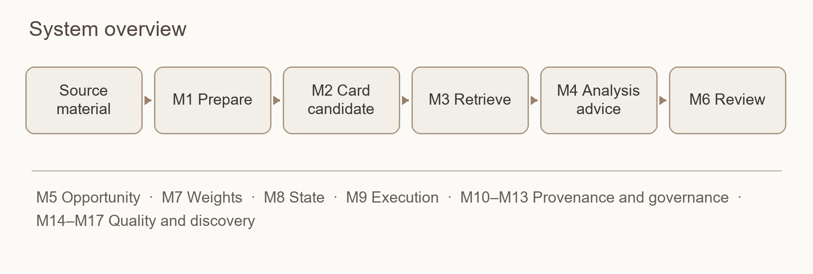

*Figure 1 · System overview*

### 2.2 Module Responsibilities

The design preserves the M1–M17 identifiers and their core responsibilities, and adds M18 Data and Logic Checking and M19 Application Updates and Maintenance. M18 is a checking service; M19 belongs to desktop maintenance. Home, language and conversation controls remain coordinated by the application layer. These identifiers describe responsibilities, not new screens or evidence of implementation and acceptance.

| Layer | Module | Responsibility |
| --- | --- | --- |
| Processing and Analysis | Document processing Preprocessing; Evidence extraction Distillation; Evidence retrieval Evidence retrieval; Research analysis Analysis | Form citable evidence and analytical recommendations from raw materials |
| Analysis Bypass | Research opportunities Opportunity Analysis | Identify tensions and author-stated gaps under comparable conditions |
| Shared Services | Evidence review Verification; Evidence retrieval weighting Weighting; Knowledge admission State Machine; Model services Model Gateway | Responsible for content review, ranking, acceptance execution, and model invocation, respectively |
| Logging and Feedback | Knowledge feedback Feedback Loop; Runtime records Logging | Form controlled feedback candidates and record operational facts and final states |
| Long-term Governance | Decision records Decision Log; Version and provenance Lifecycle; Quality evaluation Quality Assurance | Preserve decision rationale, immutable provenance, and continuous quality evidence |
| Research Operations | Research reports Change Log; Literature discovery Intelligence discovery; Research recommendations Active Acquisition | Report changes, discover candidates, and organize recommendations |
| Checking Services | M18 Data and Logic Checking | Check numeric relationships and internal logic, retaining conditions, grounds and coverage |
| Desktop Maintenance | M19 Application Updates and Maintenance | Coordinate version checks, downloads, installation, updates and recovery |
| Application and Execution | ApplicationFacade, Application Service, Control Store, ExecutionCore, JobRunner | Connect desktop, business modules, persistent runtime state, and execution channels; do not add new business module numbers |

| ID | Module |
| --- | --- |
| M1 | Preprocessing Pipeline |
| M2 | Distillation |
| M3 | Retrieval and Context Weighting |
| M4 | Analysis |
| M5 | Opportunity Analysis |
| M6 | Verification |
| M7 | Weights |
| M8 | State Machine |
| M9 | Model Gateway and Execution Channels |
| M10 | Controlled Knowledge Feedback |
| M11 | Logs and Terminal State Ledger |
| M12 | Design Decision Log |
| M13 | Data Lifecycle |
| M14 | Quality Assurance |
| M15 | Research Change Log |
| M16 | Literature Discovery and Research Radar |
| M17 | Proactive Knowledge Acquisition |
| M18 | Data and Logic Checking |
| M19 | Application Updates and Maintenance |

### 2.3 Responsibility Boundaries

Document processing handles conversion and OCR quality; Evidence extraction is responsible for extraction and local structural validation; Research analysis validates citation identity and context membership; Evidence review determines whether evidence supports the content. Knowledge admission executes state transitions solely based on requests and grounds, without generating quality judgments.

Model services/provider adapter handles technical retries within the call boundary; JobRunner manages execution, timeouts, cancellation, and recovery; Evidence extraction/Evidence review manage business-level rework; Runtime records records events. Decision records stores decision rationale; Version and provenance stores versions and lineage; Quality evaluation monitors quality and provides disposition recommendations.

the functional modules constitute the module set for this version. Subsequent extensions require independent approval of the ModuleManifest, dependencies, compatibility, and eligibility, and are disabled by default; the extension protocol itself does not authorize the addition of new modules.

## III. Data and Comparison Conventions

### 3.1 Two-Tier Knowledge Base

The source layer stores originals and their traceable text: PDFs or other raw files, RawMD, CleanMD, and Chunks. Originals serve as the ultimate evidentiary basis; conversion results retain source locations and conversion records.

The card layer stores Cards that faithfully distill individual documents, intended for retrieval, comparison, and review. Personal annotations, cross-document summaries, Analysis, and feedback objects are treated as separate derived artifacts and must not be mixed into the original-faithful fields of a Card.

Vectors, field vectors, query projections, and the desktop library are all access layers. They must point to specific sources and artifact versions, can be rebuilt according to contract, but cannot reverse-substitute for the authority of originals, Cards, or the Registry.

### 3.2 Identity, Provenance, and Language

Literature uses a stable paper_id; persisted artifacts store artifact ID, content hash, schema version, source scope, parent version, run, and execution configuration. Multiple Context Packs, Analysis, and release manifests may have multiple parent artifacts; they cannot rely solely on a single mutable latest path.

High-risk Card information stores both a readable distillation and a source_anchor: {chunk_id, quote}. The quote must be verifiable within the corresponding chunk of the same document; the authenticity of the original quote does not imply that the distillation is semantically valid, and review is still required. Historical missing identity, structure, or lineage is marked as unknown / not_assessed, and must not be guessed or filled in based on file names, timestamps, or similar text.

RawMD, CleanMD, Card and document processing retain source language. Interface text, system messages and newly generated chat answers, research suggestions and reports follow the current content-language setting; original text, citations, metadata and historical versions are not rewritten. A generation fixes its language and prompt version, with language-separated caches. A displayed translation does not become new primary evidence.

### 3.3 General Comparison Context

| Field | Information to Express |
| --- | --- |
| Research Object | Research subject, material, sample, text, or system |
| Intervention / Factor | Factor or intervention under examination |
| Comparator | Control subject or comparison baseline |
| Method | Method, research design, or analytical framework |
| Metric | Evaluation metric and its meaning |
| Boundary Condition | Conditions and boundaries for the applicability of conclusions |
| Scale / Context | Scale, scenario, and application context |
| Claim Type | Conclusion types such as causal, correlational, mechanistic, performance, and method validation |

Disciplines only replace alias mappings; core fields remain unchanged. Evidence extraction extracts comparison context, and Research opportunities uses it to determine comparability. Comparison results cite fact_id or traceable Card field paths and versions; this business expression does not replace the Card Schema, audit sidecar, coverage, or provenance contract.

## 4. Module Design

### M1 · Preprocessing Pipeline

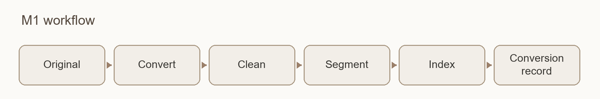

*Figure 2 · Document processing workflow*

Input → Output: Raw documents, images, or notes → Original archive, RawMD, CleanMD, Chunks, vector index, and conversion records.

Dependencies and Deliverables: Ingestion workflows and approved external candidate calls invoke Document processing; Document processing uses Model services conversion/OCR/embedding channels, Evidence retrieval weighting entry signals, Version and provenance version evidence, and Runtime records logs to deliver text and provenance to Evidence extraction. Knowledge admission is not invoked before a Card is formed, and conversion quality is not delegated to Evidence review general review.

| Step | Processing Content |
| --- | --- |
| DocumentIngest Import | Preserve original, provenance, identity, timestamp, and data disposition rights markers |
| DocumentConvert Conversion | Convert PDF/other inputs to RawMD; perform on-demand OCR for anomalous pages and output a conversion report |
| DocumentClean Cleaning | Process format noise such as headers, footers, line breaks, and column runs using local deterministic rules, while preserving language and source markers |
| DocumentChunk Chunking | Split content by structure (sections, paragraphs, tables, figure captions, etc.) and generate stable chunk_id values |
| DocumentEmbed Embedding | Generate vectors according to the approved profile, record the model and timestamp, and pass through existing structure and provenance metadata |

Page-level OCR. For standard digital PDFs, prioritize local parsing and do not default to full-text OCR. Only pages with scans, near-empty text, garbled characters, or critical structural damage enter the rescue workflow: local diagnosis → provenance check → approved OCR role → parallel verification against original parsing → page merging. The original physical page is the final authority; dual-path results do not determine truth via majority voting. If a single page fails, retain other pages and explicitly mark missing pages and incomplete ranges.

Note verification. Notes are paused by default after DocumentConvert for user inspection of transcription and formatting, without judging the value of the note content. Skipping verification requires explicit configuration and logging. Resumption uses validated RawMD metadata and does not rely on previous process memory; stop immediately if critical identity information is missing.

Vector consistency and recovery. The same model name does not guarantee the same vector space; reusing an index requires verifying dimensions, normalization, distance metrics, and retrieval regression. Standard execution and recovery entry points do not have the capability to clear old vectors. Explicit re-embedding first confirms that new text artifacts can be generated, then saves an on-disk snapshot of old vectors, cleans and verifies before rebuilding. If aborted, restore old vectors from the snapshot without re-invoking the model to fake old values; if recovery fails, retain the snapshot and prompt for manual handling. Re-embedding the same document must respect single-writer boundaries.

Scope of this version. Capabilities registers 14 canonical formats: 11 are supported, while JPEG/PNG/TIFF are degraded and used only for frame probing, not representing image OCR. PDFs retain the [PDF] marker, while other originals are preserved as original bytes with the [Original] marker; typed anchors are projected to chunk_schema_version=3. The Office legacy bridge covers only the frozen Office16 scope, prohibiting macros and link updates. See Chapters 8 and 9 for the actual eligibility of OCR, Marker, and local chains.

### M2 · Distillation

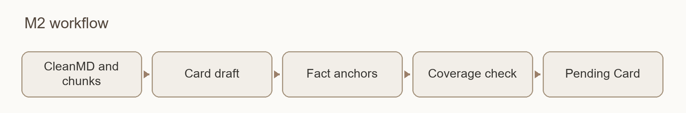

*Figure 3 · Evidence extraction workflow*

Input → Output: A single CleanMD document and a frozen Chunks list → Card, auxiliary extraction results, and coverage records.

Dependencies and delivery: Request card_distiller_primary via Model services; results first pass local hard gates, then proceed to Evidence review review and Knowledge admission acceptance, with Version and provenance/Runtime records saving versions and logs. Card field embedding is triggered by subsequent approved workflows and is not mixed with DocumentEmbed source text embedding as a single step.

Content scope. Core fields include the research question, subject, methods, key results, author conclusions, boundary conditions, and source anchors. Auxiliary extraction includes key data, comparative context, author-stated limitations/future work, and optional terminology and citation relationships. Research limitations are separated from the applicability boundaries of conclusions. Personal insights, critiques, hypotheses, cross-paper synthesis, and writing corpora do not enter the fidelity layer.

| Rule | Extraction Requirement |
| --- | --- |
| R1–R2 | Preserve the strength of author claims; fully retain multi-step processes and multiple comparison groups; do not substitute a single item for the whole. |
| R3–R4 | Extract numerical values along with statistical type, stage, sample, and scope; specify the scope, denominator, and control for metrics. |
| R5–R6 | Attach actual applicability conditions to conclusions; distinguish between the research subject and the characterization/test sample. |
| R7–R8 | Define terms according to the author's definitions; source anchors must cover the actual material scope and must not be uniformly abbreviated as 'abstract'. |
| R9 | Extract information already provided in the source; if truly absent, mark it as such without fabrication. When handling obvious typos based on context, retain the original value, the basis, and the revision trace. |

Structure and coverage. The Card Schema uses v6 as the baseline, retaining per-anchor citations, field_credibility, completion_status, and omissions/tombstone. Required slots are marked as present, absent_in_source, not_applicable, extraction_gap, or not_assessed; 'not found' cannot be directly recorded as 'not in source'. Completion of review and absence of registered deletions do not prove that extraction has covered the entire source text.

Generation and Recovery. Before writing a usable Card, validate the schema, types, enums, source IDs, anchors, and deterministic cross-field constraints. For high-risk quotes, perform exact matching against the original text; normalization addresses only typographical noise. Before Full, a dedicated budget allows one core anchor recovery pass: freeze the precise targets and candidate sources, permitting only the replacement or deletion of invalid anchors. If a field loses all valid anchors, it must not be released.

Post-Full repairs follow the Evidence review contract: a single Card cascade allows at most one business batch rework; do not regenerate the entire Card or perform a second Full. Systemic failures require creating a new Card, run, and manifest, preserving the previous failure. Technical truncation recovery uses a separate bounded budget.

Long-form Content. Capabilities segmented_distill has established mechanisms for capacity probing, segmentation, segment anchoring, hierarchical merging, capped revision, and atomic visibility of complete files. Complete file visibility and Knowledge admission acceptance are distinct; if review is incomplete, the status remains pending. The module contract and sample eligibility do not guarantee desktop integration.

### M3 · Retrieval and Context Weighting

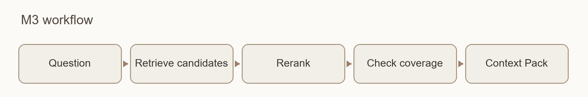

*Figure 4 · Evidence retrieval workflow*

Input → Output: Question, authorized sources, and weighting configuration → a traceable, capacity-constrained Context Pack.

Dependencies: Evidence retrieval weighting provides ranking scores, Model services provides authorized embedding/reranking channels, and Runtime records records logs. Results are used by Research analysis, Research opportunities, and daily retrieval.

Evidence retrieval comprises question understanding, candidate recall, and context packaging. First locate using Card and field signals; drill down to original text if necessary. Card anchors serve as recall clues, while the actual evidence text delivered comes from Chunks. Packaging simultaneously controls token limits, source diversity, question facets, and high-quality counter-examples, without treating a fixed block count as proof of coverage.

logical_span organizes raw members with explicit structural relationships only at runtime, preserving member_chunk_ids. The current scope covers tables and headings/footnotes within the same chapter, as well as strictly adjacent continuous paragraphs. It does not rewrite chunks nor perform arbitrary cross-chapter semantic fusion.

Evidence retrieval records covered/missing question facets; Research analysis generates additional analysis metrics such as direct-answer, subquestion coverage, and source-dominance. Do not guess or fill in unknown structures. References are excluded under standard retrieval rules only when both the chapter and entry format are explicit; bibliographic questions may be retained.

The Context Pack aggregates the data_ownership of actually selected members to form an immutable snapshot including effective_data_ownership, mixed status, contributing sources, summaries, and parsing receipts, which is passed along Evidence retrieval→Research analysis→Evidence review. Unknown or conflicting permissions halt external transmission per the permission contract. If reranking is enabled, only authorized modes may be used; if the resulting identity set is invalid, revert to the original distance order. Evidence retrieval sub-dialog refinement for complex questions is not yet integrated.

### M4 · Analysis

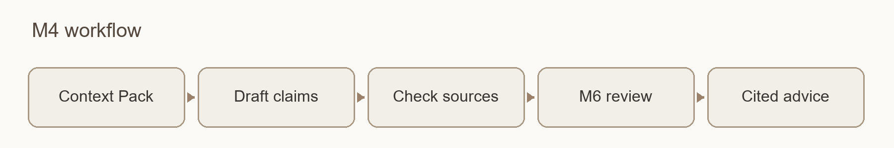

*Figure 5 · Research analysis workflow*

Input → Output: Question and Context Pack → analytical recommendations with citations, limitations, and locations for re-verification.

Dependencies: Evidence retrieval provides evidence, Model services invokes analysis_primary, Evidence review verifies semantic support, and Runtime records logs traces. Output is bound to specific Card/Pack parent versions, ownership, model, and timestamp.

Analysis strictly distinguishes four parts: literature-supported content with citations, AI-supplemented general knowledge not verified by this library, risks and uncertainties, and locations for re-verifying original text. When coverage is insufficient, suppress AI general knowledge completion, separately explaining the study's inherent limitations, internal source inconsistencies, and retrieval gaps.

Research analysis performs deterministic source checks only: source_id must exist and belong to the current Pack or its expanded members. Invalid items are removed from the literature support area with the reason recorded; remaining valid content is retained. Blocking occurs if all core support is invalid or if continued output would be misleading. Whether evidence is sufficient, or whether claims are exaggerated or out of scope, is judged by the independent reviewer in Evidence review.

Research analysis provides opinion candidates, evidence arrangements, and analysis structure; it does not produce final paper conclusions ready for direct submission. Review comments are handled by the user and do not retroactively change the Card's acceptance status.

### M5 · Opportunity Analysis

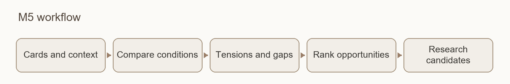

*Figure 6 · Research opportunities workflow*

Input → Output: Accepted Cards, comparison context, and author-stated limitations/future work → Tension candidates and sourced research gaps.

Dependencies: Evidence retrieval/Evidence retrieval weighting identify topics and fields, Model services executes opportunity identification, Evidence review verifies induction, Knowledge admission manages acceptance according to the independent contract of the opportunity object, Runtime records logs traces, and Quality evaluation receives quality signals. Opportunity induction review must be connected via the corresponding object-adapted contract and must not directly apply the Card scope.

Engine A compares objects, conditions, methods, metrics, statistical standards, and time ranges, proposing tensions where context is comparable but conclusions differ. Engine B only induces explicitly stated limitations, gaps, and future work by authors, preserving original sentences and sources; the absence of search results cannot prove that no one has researched a direction. Gaps can be clustered by topic, counted by mention frequency, and annotated with filling evidence provided by later literature.

Output is categorized as A: High-comparability tensions; B: Condition or method differences; C: Expression, metric, or conclusion type differences; D: User-confirmed ignore. When coverage is insufficient, output not_comparable or coverage_limited; do not fabricate A-level tensions. These categories are not active acceptance statuses.

Research opportunities processes incrementally by topic, triggered by schedules, user actions, or affected feedback, rather than performing pairwise comparisons across the entire library. The user determines comparability and research value; if the ignore rate is abnormal, Quality evaluation checks condition extraction and false positives.

### M6 · Verification

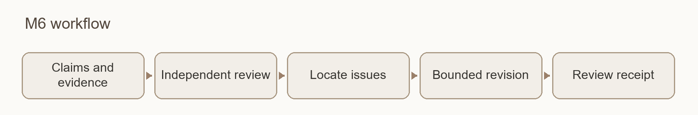

*Figure 7 · Evidence review workflow*

Input → Output: Cards or Analyses that have passed the deterministic pre-gate, corresponding evidence, and review contracts → Review receipts, issues, and disposition records.

Dependencies: Model services binds the reviewer, Runtime records records, and Quality evaluation aggregates quality; acceptance requests are sent to Knowledge admission. Card and Analysis have separate scopes, using card_reviewer_primary and analysis_reviewer_primary respectively, and must belong to different model_family_id than their respective generators. Different vendors do not automatically imply model family independence.

Card workflow: One atomic Full → closure if no issues; one consolidated Repair for fixable issues → one atomic Delta → cross-field residual scan and final mechanical gate. RepairPatch only modifies authorized paths, verifies old value hashes, and ensures zero non-target changes; Delta only proves modified items and direct dependencies, not a full-text re-pass.

Review expands by atomic claim and conservative single-document fact identity; confirmed occurrences of the same fact are handled together. Only precise, unique, and separable targets can be logically deleted; vague similarities only suggest candidates, with ambiguity escalated to manual review. Retained values require evidence or a downgrade explanation; deleted values enter the tombstone. Complete closure is complete, separable omissions are passed_with_omissions, and unresolved core issues remain failed or pending manual decision.

Analysis workflow: Review is determined by risk, MUST/EXEMPT, and sampling contracts; skipping requires a reason or pending verification item. The reviewer only receives claims and cited evidence for targeted falsification, not the generator's reasoning process. Sent requests with unknown results cannot be faked as successful via restart or blind resending. See Chapter 6 for desktop limited revision and objection deletion rules.

M18 supplies numeric and internal-logic findings; M6 continues to assess whether cited evidence supports an extracted or generated claim. A contradiction may be faithfully extracted from the source, so extraction fidelity and internal consistency can have different outcomes. The two results are retained separately.

### M7 · Weights

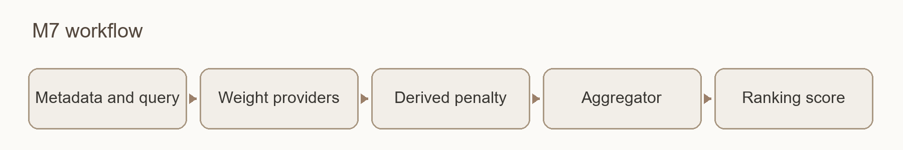

*Figure 8 · Evidence retrieval weighting workflow*

Input → Output: Document metadata and current query → Evidence retrieval ranking score.

Dependencies: Model services provides field embedding calls; Runtime records records logs; Evidence retrieval consumes results. Derived types originate from Knowledge feedback; lifting derived downweights requires decision rationale and status events.

| Group | Provider | Meaning |
| --- | --- | --- |
| Relevance | SimilarityWeight | Vector similarity to the current query |
| Relevance | SemanticWeight | Field relevance and relative value calculated per query dimension |
| Authority/Personal Value | ManualWeight | Importance of user-provided rationale |
| Authority/Personal Value | RuleWeight | Rule signals such as year, journal, citation count, and type; missing data does not imply low quality |
| Authority/Personal Value | NoteWeight | User notes, annotations, and other research traces |
| Authority/Personal Value | CitationWeight | Frequency and purpose of citing this material in user research |

Composite relationship: FinalScore = weighted sum of relevance group + DerivedPenalty × weighted sum of authority group.

Coefficients are adjustable configurations, not optimal constants for all disciplines. SemanticWeight is calculated at retrieval time based on the current query, using soft assignment to preserve other fields; missing fields do not cause systematic low scores. Card field vectors are generated separately from DocumentEmbed source text vectors. The standard field index only accepts Cards that have passed Evidence review convergence and are active in Knowledge admission; pre-computation must use an isolated index.

DerivedPenalty only reduces the authority score of derived entries; it does not penalize true relevance. Cross-document synthesis carries the heaviest penalty, conceptual relationships are moderate, and original annotations are the lightest. Reversal requires documented rationale and cannot be achieved by increasing ManualWeight to substitute credibility. Quality evaluation monitors drift by tracking the frequency with which derived entries displace their original sources in the top-k results; ratios and review dates serve only as auxiliary metrics. Field credibility and coverage status remain independently displayed and are not automatically converted into global weights.

### M8 · State Machine

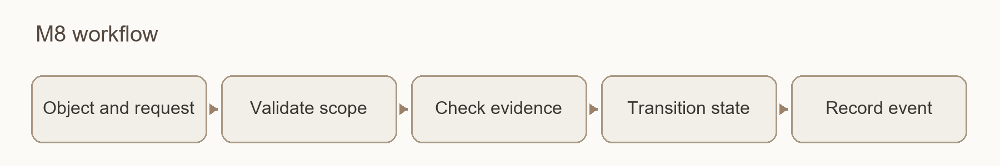

*Figure 9 · Knowledge admission workflow*

Input → Output: Objects, change requests with explicit scope and rationale → Validated state transitions and events.

The review_status of a Card is pending, active, or quarantined. Objects that have not been accepted are available for review but must not enter normal retrieval, tension analysis, or automatic feedback consumption. Opportunities and knowledge feedback use their respective contracts; the request constructor for Analysis cannot substitute for the missing general production state contract.

Knowledge admission is not responsible for quality judgment, technical retries, business rework, or operational recovery. It generates immutable state_transition_event, which Runtime records appends and persists, and Version and provenance associates with version and lineage. Lifecycle heat, version status, Card completion, and release status are not written into the Card's three states. Validation evidence must reference the Evidence review receipt and the basis for the current transition; it cannot rely solely on the active label.

### M9 · Model Gateway and Execution Channels

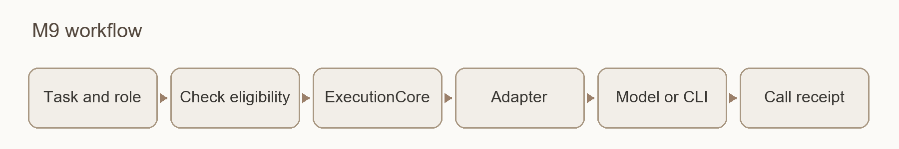

*Figure 10 · Model services workflow*

Input → Output: Logical roles, task content, and constraints → Model results from authorized channels, or explicit failure/deferred execution results.

Business modules depend only on logical roles. Model services freezes the profile and route snapshot at the start of a run, binding the provider, model family, Prompt/schema, parameters, execution location, ownership, region, quality evidence, budget, and rollback target. Model changes prioritize configuration updates over modifying business responsibilities.

Key roles include embedding_primary, card_distiller_primary, card_reviewer_primary, analysis_primary, analysis_reviewer_primary, opportunity_analysis_primary, change_digest_primary, ocr_page, and reranker. Reviewers for Card and Analysis do not share an ambiguous unified name.

Execution chain: Role request → ExecutionCore compiles work package → Adapter Registry selects channel → Isolated JobRunner → API, controlled CLI, or local adapter → Results and per-attempt evidence.

JobRunner manages processes, deadlines, heartbeats, cancellation, recovery, and work package boundaries. The gateway handles call-level technical recovery; business rework remains the responsibility of Evidence extraction/Evidence review. Development assistant sessions are isolated from runtime sessions. Execution has incorporated seven types of controlled CLI adapters, but the ability to execute commands only indicates channel existence and does not substitute for per-role quality qualification.

Configuration governance. Runtime availability is UNKNOWN/AVAILABLE/DEGRADED/MISSING, distinct from governance status CANDIDATE/APPROVED/ACTIVE/DEPRECATED/QUARANTINED/RETIRED. Quality evaluation provides role evaluation; users or approved rules make decisions; Model services registers execution; Decision records stores the rationale. Quality-cost routing proposes candidates only from the qualified scope; it may abstain if no available qualification exists.

Identity and fallback. Each save records the requested and returned provider/model. Formal reviews block execution per contract if identity mismatch or unverifiability is detected. Silent model swapping within a batch is prohibited; fallback is defined per role and preserves review family independence, ownership, and regional restrictions. Actual paths and hashes of CLI components are verified during pre-checks and before startup. Embedding switches default to a new index; reuse is allowed only after compatibility proof is established.

Dependency failures. Transient network/rate-limiting issues are recovered within budget. Credential, quota, service shutdown, or configuration issues pause affected stages, prompting the module, dependency, reason, and handling method, without stalling independent features. Automatic tasks do not imply mandatory API usage, nor do they allow automatic conversion to paid services after timeout.

Regional policy. The design requires each provider to bind a valid supported-region policy with same-route egress evidence; unknown, expired, or mismatched states must not be released to production. Integration has strengthened HTTPS probes, explicit proxy same-routing, and pre-send verification, but country determination remains CN block/non-CN pass; a provider-specific supported-country whitelist remains a gap.

Prompt versions, caching capabilities, tiers, Thinking, and billing rules are managed by controlled configuration. The maximum tier must be explicitly selected; optional tiers do not prove that the corresponding model has passed qualification. Shared constraints on ownership, billing, and caching are detailed in Chapter 5.

### M10 · Controlled Knowledge Feedback

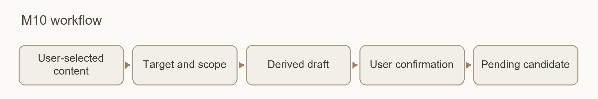

*Figure 11 · Knowledge feedback workflow*

Input → Output: User-selected reusable content and rationale → pending candidates with is_derived, source version, and reasoning.

Dependencies: Knowledge admission enforces admission for the target scope, Evidence retrieval weighting applies derived weighting, Version and provenance stores versions and parent chains, Decision records associates decision rationale, Model services executes approved curation tasks, Runtime records records audit trails, and Quality evaluation receives health signals.

Objects eligible for knowledge feedback include annotations, judgments, hypotheses, stable conceptual relationships, and cross-document synthesis. User raw records can be automatically saved or automatically curated into candidates; saving does not equal formal feedback. All types require user confirmation before entering active, canonical, or normal knowledge consumption; one-off Q&A and unconfirmed AI drafts cannot enter the pool directly.

The workflow is: user selects object → forms candidate, source, and rationale → checks allowed destinations and precise changes → user accepts/modifies/rejects/defers → necessary review and admission → version storage and receipt. Objects are bound to input artifact IDs/hashes and execution configuration; upstream changes trigger recalculation of compatibility or staleness status.

Knowledge feedback admission and derived down-weighting separately address "whether it can be used" and "what the ranking weight is." A confirmed summary remains a secondary artifact and does not automatically acquire the authority of original literature due to human confirmation.

### M11 · Logs and Terminal State Ledger

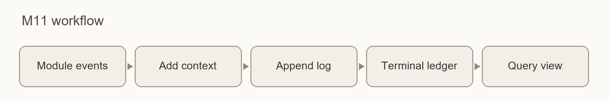

*Figure 12 · Runtime records workflow*

Input → Output: Events from modules, gateways, and runners → contextualized runtime logs, final state records, and query views.

Runtime records is a passive recording layer; it does not execute watchdogs, rework, or state judgments. It displays progress and errors to users and preserves module, object, stage, dependency, cause, evidence location, and disposition for troubleshooting. Decision records/Quality evaluation/Research reports read according to their respective purposes; operational logs are not fed into literature knowledge retrieval.

| Ledger | Stored Content |
| --- | --- |
| Attempt Ledger | Immutable terminal record of each actual attempt, including route, result, and evidence |
| Paper Outcome Ledger | Terminal state and final artifacts for each paper in every run; redoing creates a new run |
| Publication Ledger | Publication requests, selection lists, results, and independent receipts |

Attempt success, paper processing pass, and publication success are tracked separately. Subsequent successes append records without overwriting prior failures; corrections use an Amendment or explicit successor relationship. Run heartbeats enter the event stream or run snapshot and do not write back to sealed attempts.

External calls are logged in phases: before sending, freeze request identity, route/region, behavior hash, permissions, and budget; after sending, record actual return identity, usage, cost basis, latency, and result. Fields for which old data cannot be recovered are marked as unknown; do not guess values or automatically rerun paid requests to supplement evidence. Recovery and concurrent writes are declared according to the ledger contract and actual test scope.

### M12 · Design Decision Log

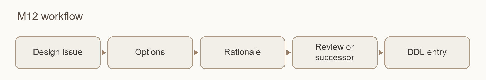

*Figure 13 · Decision records workflow*

Input → Output: A significant choice and its context → A searchable, citable, and version-controlled DDL.

Record context, primary alternatives, final choice, reasons for rejection, affected modules, basis/feedback, status, and review date. Runtime records describes what happened; Decision records explains why this choice was made. Do not turn every operational log entry into a decision log.

Applicable items include model acceptance, isolation, canary release, rollback, re-embedding, OCR preparation, lineage exceptions, feedback basis, canonical pointer movement, and publication/withdrawal. Actual events are recorded by Runtime records/Version and provenance; Decision records references events and explains the trade-offs. Decision changes establish a successor, preserving the original decision and its rationale at the time.

### M13 · Data Lifecycle

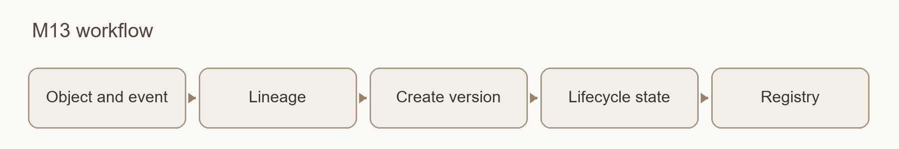

*Figure 14 · Version and provenance workflow*

Input → Output: Data objects and authorized changes → New versions, lineage relationships, and lifecycle records, with old evidence preserved.

Dependencies: Producers of each artifact submit versions; Knowledge admission owns and enforces acceptance, Runtime records stores events, and Version and provenance associates immutable artifacts, parent chains, status events, and compatibility relationships. Git and backups serve as the foundation for storage recovery but do not replace lifecycle semantics.

The Artifact Envelope supports at least immutable IDs, content hashes, type/schema, run, route snapshot, source scope, creation time, and multiple parent_artifacts. The Registry manages these identities and relationships; query projections can be reconstructed, but the production Registry/JSONL remains authoritative.

| Lifecycle | Management Implications |
| --- | --- |
| Usage: Active / Cold / Archive | Usage heat and retrieval priority; does not imply deletion |
| Version: Current / Superseded / History | Version supersession and historical preservation |
| derived.version_status | Draft / current / superseded / historical status of derived objects |

These axes do not replace the pending/active/quarantined states in Knowledge admission. Business revisions do not directly overwrite the original, text, Card, feedback, or decisions; deletion follows the authorized disposal process in Chapter 7.

Compatibility and Publication. Determine compatible/stale status based on exact parent version, schema, and source scope; retain lineage_unknown for missing parent chains and do not guess matches. A new Card does not automatically grant new combination eligibility to an old Analysis. Freeze the manifest before publication, separately checking structural compatibility, coverage, paper outcome, user choices, and cost decisions; execute publication only after confirming the exact object set and obtaining authorization, leaving a trail via an independent receipt and Publication Ledger. Canonical moves, withdrawals, and replacements are recorded as separate events.

The Registry, compatibility engine, Analysis request construction, and publication dry-run for Quality belong to different construction scopes; the dry-run did not execute a formal publication. Capabilities has established historical migration and combination query capabilities, but has not authorized real historical batch migration, production index switching, or pointer moves.

M19 coordinates changes to application packages and installation locations. M13 retains responsibility for research-data versions, provenance and compatibility rules. M19 invokes the applicable migration mechanism and records maintenance outcomes; a software update does not move knowledge-admission pointers or rewrite historical reviews.

### M14 · Quality Assurance

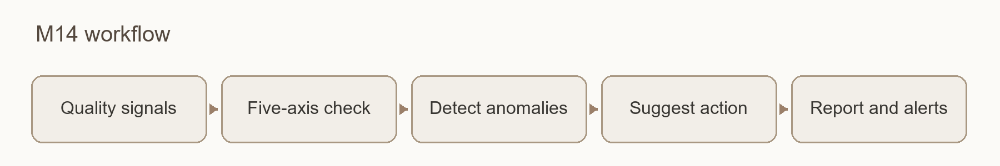

*Figure 15 · Quality evaluation workflow*

Input → Output: Active library, audit receipts, run and lineage records → Quality reports, degradation alerts, and disposal recommendations.

Dependencies: Evidence review performs single-pass content verification, Document processing provides the basis for conversion quality, Model services invokes the corresponding roles, Runtime records supplies runtime facts, and Decision records records gold standards and the rationale for configuration changes; receives quality signals from Research opportunities/Knowledge feedback, etc.

Quality evaluation employs random sampling, risk-based sampling, and sentinel regression. Content with high weight, high citation frequency, intended for papers, or with prior review discrepancies is prioritized. After changing models, Prompts, or related rules, re-verify using the corresponding test packages; full re-review of all content is not required every time.

| Quality Axis | Check Content |
| --- | --- |
| literal_fidelity | Whether text, numbers, units, and citations are faithful to the source |
| evidence_scope_coverage | Whether evidence covers the conditions, scope, and comparison targets of the claims |
| cross_artifact_consistency | Whether Card, Pack, Analysis, review, and published artifacts are consistent |
| scientific_plausibility | Whether statistical criteria, units, samples, timeframes, and orders of magnitude are reasonable |
| lineage_freshness | Whether the parent artifact combination is compatible and not stale |

The five axes record evidence and outcomes separately, preventing a single overall PASS from masking unassessed items. Routine issues receive limitations and review prompts; core unsupported cases, critical provenance failures, or misleading values trigger machine-readable blocks or human recommendations. Quality evaluation does not edit originals, does not alter Knowledge admission status, and does not establish a second production pipeline.

Numerical values and page roles. Before direct comparison, align metric, unit, conditions, statistical type, time, sample, and comparator; if alignment is impossible, mark as not_directly_comparable. Reasonableness checks provide prompts only and do not automatically correct raw data. OCR distinguishes body text, cover, table of contents, headers/footers, references, and unknown roles, ensuring that numbers from arbitrary pages are not treated as body text facts.

Sentinels and gold standards. Maintain extraction/distillation, reviewer miss and mutation, retrieval/embedding, and OCR tests by role. Each revision freezes the complete Form, Gold, scorer, and manifest, and reuses them across models; Gold is excluded from test model requests. Corrections must preserve original values, sources, dates, and new revisions, with audit trails maintained by Decision records. Public commitments or locators cannot substitute for a complete exam pack.

Reference packs are tracked by ownership: only precisely declassified REFERENCE_EXAM_PACK may enter Git; PRIVATE_HOLDOUT_PACK does not enter Git; FORMAL_LOCAL_REFERENCE_PACK may be used locally in full but remains isolated as a whole, and blind test eligibility is not claimed based on it.

Knowledge base health metrics retain indicators for unreviewed, failed, expired, broken links, and derivative displacement. The alternative task completion gate for original QUALITY-ASSURANCE did not convert original B ERROR or 12 five-axis not_assessed items into quality passes.

M18 performs an individual bounded data and logic check. M14 aggregates its receipts to assess false positives, missed findings, coverage and degradation. The numeric quality axes do not create a duplicate production engine or turn successful execution into scientific qualification.

### M15 · Research Change Log

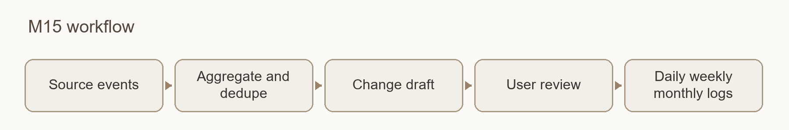

*Figure 16 · Research reports workflow*

Input → Output: Research events over a period → daily, weekly, and monthly change reports.

Normalize and deduplicate from sources such as Runtime records/Knowledge admission/Version and provenance to generate immutable ResearchEvents, then organize via approved methods such as change_digest_primary. Reports preserve event sources and aggregation provenance, separately expressing trial outcomes, paper final states, releases, and configuration changes.

Daily reports focus on new, modified, pending review, and failed items; weekly reports focus on significant progress, literature, incomplete reviews, and potential tensions; monthly reports focus on structural changes and long-term pending items. Research reports reports only changes, risks, and pending items, does not form final research conclusions, and does not alter knowledge acceptance status.

### M16 · Literature Discovery and Research Radar

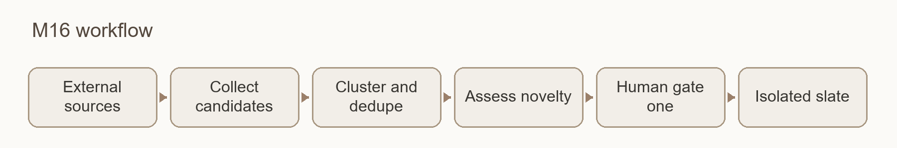

*Figure 17 · Literature discovery workflow*

Input → Output: Topics, keywords, authors, journals, or citation chains → external candidates with sources and recommendation reasons.

The actual sources in this version are arXiv and Crossref; other sources still require independent development. External connections and receipts are managed by the connection framework; Model services is invoked only when model judgment is required, not treating all bibliographic HTTP requests as model calls.

Identity clustering automatically deduplicates only for conflict-free exact DOI/arXiv ID/PMID; weak evidence such as titles/authors or identifier conflicts enter OPEN for human review. Preprints, conference versions, AAM, VOR, and arXiv versions of the same work are retained as different manifestations.

Novelty is recorded as TRUE/FALSE/UNKNOWN across four axes: publication, first-seen, library, and direction. Abstract-level direction estimates retain their estimate labels; UNKNOWN is not rewritten as TRUE. Source canaries, Shadow, and controlled activation are verified and approved separately.

Two human gates: The first approval only permits the isolated Document processing→Evidence extraction→Evidence review pipeline to generate a pending Candidate Card, without generating an Analysis; the second approval is required to formally promote the exact set. Promotion uses an idempotent, WAL-based, dual-lock, compensation, and receipt-last protocol; failures must not leave a success receipt. Offline synthesis tests do not indicate that a real promotion has occurred.

### M17 · Proactive Knowledge Acquisition

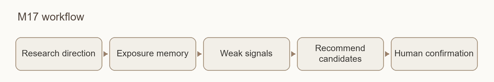

*Figure 18 · Research recommendations workflow*

Input → Output: Research directions, finite candidates, and authorized behavioral signals → Evidence-based recommendations and pending policy suggestions for confirmation.

Research recommendations builds on Literature discovery, organizing a finite Slate using five channels: CORE, ADJACENT, BRIDGE, HORIZON, and COVERAGE_REPAIR. It preserves channel components, whitespace, and coverage/polarization information, and does not create a unified score that masks differences.

Exposure, suppression, and re-emergence are written to an append-only Exposure Ledger. Suppression is bound to work_cluster_id, direction_id, and direction_revision, and does not propagate to similar text, vector neighbors, or other directions; re-emergence requires new evidence. Weak signals reaching a threshold only generate a policy proposal pending human confirmation and not yet applied.

Research recommendations can discover and recommend, but does not automatically import, assign high weights, change strategies, or release; it does not handle writing, file output, or publication execution. v1.02 provides metadata discovery and related recommendations for user-configured directions. This does not admit primary evidence automatically or establish long-term recommendation quality.

### M18 · Data and Logic Checking

Input → Output: Loaded document text, tables, source locations and checking configuration → Data or logic reports with original locations, rule or model grounds, applicable conditions and coverage.

Dependencies: M1 supplies traceable parsed content and conversion-quality information. Model-based judgments use the selected channel through M9. M11 records execution and usage, M13 links reports to input versions, and M14 receives quality signals. M6 continues to assess whether cited evidence supports extracted or generated claims. Checks do not require a successful Card, alter current node scheduling or create an additional mandatory gate for every research analysis.

Deterministic checks preserve the original expression and establish the meaning of percentages, ratios, units and statistical quantities before checking explicit equations, ranges and numeric relationships. Conversions retain their grounds. Missing conditions do not justify guessing a denominator, group or weight; truncated compound equations are not complete formulas, and valid zero values of nonnegative statistics are not automatically errors. Missing conditions, parsing ambiguity and incomparable values remain pending, input issues or limited coverage.

Model-based logic checking proposes concerns grounded in the source and records the inspected context, coverage and unresolved relationships. Rule findings, model concerns and human dispositions remain separate. A model suspicion is not a confirmed error. Task completion, reported concerns and scientific validity are distinct; unrun or uncovered work cannot count as passed.

Reports bind input, rule, prompt and language versions. Explanations use the content language fixed for that generation, while original quotations, values, units and historical versions remain unchanged. A rerun creates a successor report and retains previous failures and explanations. A local check is not a whole-document check, and generation is not repeated without bounds to obtain a preferred conclusion.

M18 does not modify sources, judge author intent, prove research correct by finding no anomaly or perform knowledge admission on behalf of M8. Supported rules, material limits and model eligibility follow the current implementation and checking contract. A module identifier does not expand coverage or authorize additional calls.

### M19 · Application Updates and Maintenance

Input → Output: Current installation identity, target-version manifest, full or incremental package and user actions → Update-check results, verified installation state and traceable maintenance records.

Dependencies: The application layer supplies the version entry and user actions. A shared installation engine and independent assistant maintain the program. M13 supplies research-data compatibility and migration rules, M11 records facts, and M14 provides validation evidence for the corresponding version. M19 belongs to desktop maintenance, not the research pipeline, and does not call models or upload research material.

Checking, downloading and applying an update are separate operations. Automatic checking obtains stable-release information only; a failed check must not report that the application is up to date. Download follows the user's review of the version, notes and size. A delta is tied to the exact old package, and its assembled output must match the target full package. A legitimate base mismatch may use a full package after confirmation; signature, source or identity verification failures stop the operation.

After download verification, choose “Update after exit” to open the native assistant, then exit the current instance normally. The assistant waits for that instance to finish tasks, save and exit. It neither force-terminates the application nor promises an automatic restart. Reopen the application afterward and check its version, data location and existing settings. The original v1.01 uses the assistant distributed with the target release for its first upgrade; uninstalling first is not required.

Program files, configuration and research data are handled separately. Preserve recovery conditions before activation and handle failure according to transaction state. Once the new version accepts writes, do not automatically replace new data with an old backup or pass a new database to an arbitrary older application. Append interruption, recovery and outcome records. Updating the program does not rewrite historical research judgments.

Installation, updating, prerequisite guidance and errors use shared Chinese, English and Japanese resources. A new profile may inherit the installation language; existing settings remain. The assistant inherits the exact instance's language, and a temporary display change does not overwrite content language. New installation, first upgrade, incremental updating and recovery require separate validation. Successful installation or package verification does not establish full functional acceptance. Source, documents, full packages, deltas and signatures must identify the same delivery; public publication requires its own release decision.

## V. Shared Rules

### 5.1 Status must include object and scope

| Status Object | Status or Evidence | Owner/Interpretation |
| --- | --- | --- |
| Capability Design | proposed / approved / superseded | Design approval status |
| Capability Implementation | not_started / partial / implemented | Whether code or contracts exist |
| Capability Verification | untested / tested / qualified | Valid only within the scope of corresponding evidence |
| Capability Deployment | disabled / pilot / active / retired | Permitted scope of actual usage |
| Task Execution | frozen / running / completed / aborted / invalidated | Runner manages execution lifecycle |
| Task Acceptance | PASS / FAIL / NOT_ASSESSED | Separated from runtime and machine verification_result |
| Card acceptance | pending / active / quarantined | Knowledge admission executes based on scope and provenance |
| Card completeness | pending_review / complete / passed_with_omissions | Review disposition closure, not extraction coverage |
| Card quality | Schema, extraction coverage, field reliability, and validation evidence are recorded separately | validation_evidence is derived from Evidence review/Knowledge admission provenance; do not create a separate persistent validation_status |
| Publication | not_requested / not_published / published / publication_failed | Runtime records/Version and provenance store independent publication facts |

See Model services for the availability/governance axis of model profiles, and Version and provenance for the data usage/versioning axis. Similar names do not imply the same fact; no display or statistic may replace these states with a single unnamed active or completed status.

### 5.2 Data Disposition Authority Across the Full Chain

Data ownership and sensitivity are distinct attributes. Current Cards use self / entrusted; self-owned content is used according to approved configurations, while entrusted data, data without disposition rights, or data with unknown ownership defaults to local processing. If local capabilities are insufficient, the corresponding invocation is halted. Additional authorization usage generates auditable policy/decision records and does not independently add schema enumerations.

Whenever data is handed to a model—including OCR, embedding, distillation, analysis, review, caching, and controlled CLI—ownership is checked first. OCR checks ownership before encoding and upload; Context Pack aggregation and downstream transmission must not lose constraints. Launching channels locally, using local ports, or switching to another vendor does not substitute for proof of no external transmission.

Session collection, model refinement/external transmission, and formal pool entry are authorized separately. Diagnostics use only approved probe materials and must not test external capabilities with entrusted data. Credentials are managed by controlled credential storage; configurations store only references, and logs and exports contain no plaintext keys/tokens, cookies, or browser-storage values.

### 5.3 Partial Output and Failure

Ordinary and separable issues allow degradation, omission, needs_review, or tombstone, retaining usable parts and listing gaps; blocking occurs only when core evidence fails, core disposition is unclosed, critical provenance is incompatible, or output would be misleading. Quality judgments are formed by the corresponding owner, and status changes are executed by the implemented Knowledge admission scope. Responsibilities and budgets for technical retries, semantic rework, and new runs cannot substitute for one another.

### 5.4 Execution Classification and Cost Evidence

Each invocation separately records process_transport, inference_location, access_mode, and billing_mode. An API issued via CLI remains an API; a local process does not imply local inference. Per-invocation fee applicability meeting subscription_session and subscription_entitlement can be N/A, while local computation separately records resource consumption.

Fee applicability, whether the amount is known, and the amount source are distinct fields. If the current currency amount for a subscription CLI is unavailable, it can be UNKNOWN, which does not conflict with applicability N/A; neither can be filled as 0 or free. APIs use the price for the corresponding valid date, with actual_cost, estimates, and missing prices separated; failures and retries are still accounted for.

The current desktop cost view deduplicates by run/stage/physical attempt, covers only connected receipts for the current profile, and distinguishes ACTUAL, ESTIMATED, UNKNOWN, and CONFLICT by currency; it is not a complete account bill. New backend fields do not automatically imply frontend display.

Usage retains cached hit/miss input, total output, reasoning, visible output, and full latency. Reasoning is a subset of output and cannot be added again; when splittable, visible output = output − reasoning, and missing values remain unknown. Cumulative session usage must be diffed field-by-field against the same precise session and previous basis; cumulative regression or inconsistency is not treated as verified current usage.

### 5.5 Input Caching and Session Continuation

Caching does not reuse review conclusions. Stable rules and approved sources for the same article are placed first, while dynamic tasks and precise repair targets are placed last, allowing vendors to reuse input computation; each task still sends a new request, generates new output, and executes original schema, provenance, and review checks. This desktop path does not reuse Core's old answer cache.

Caching capabilities are identified by API, model, and actual channel. Unknown capabilities remain UNKNOWN, and unconfirmed vendor parameters are not sent. Repairs only organize originally approved candidate sources; they must not stuff full text into short repairs to force a hit, nor expand the scope of references allowed by the target.

The verified Codex route uses exec to create sessions and resume with an exact UUID, disabling --last. Role, model/profile, source, service, workspace, transport schema, and implementation revision participate in identity binding; each run still independently verifies business schema, UUID, usage, and receipts. Application idle reuse duration is not equivalent to server-side TTL. On expiry, prior failure, incompleteness, or unknown identity, the system performs a cold request per contract, creates an isolated scope, or blocks; concurrent lock conflicts and corrupted records must not reuse old sessions.

This round of testing is limited to the DeepSeek API and Codex CLI. Shared code and evidence for C59–C65 have been formalized and pushed, but no repackaging, deployment, or Desktop completion has occurred based on this. Cost comparisons must retain original costs, wall-clock time, workload, and output volume; pricing counterfactuals do not equal causal code benefits, and full hit rates or universal speedups are not guaranteed.

## 6. Desktop Application and Interaction

### 6.1 Application Layer

The Windows stack uses pywebview + PyInstaller + Edge WebView2 over the Python ApplicationFacade. The design baseline records pywebview 6.2.1 and PyInstaller 6.22.2; each exact build follows its frozen dependency manifest. Electron is only a conditional alternative triggered by later evidence and a design decision record.

Call chain: HTML/CSS/JS → IPC command/event → Application Service → ApplicationFacade → business modules. Control Store persists state for jobs, views, and recovery, rebuilding projections after disconnection or restart. The UI does not directly write module state; the library reads canonical sources, artifacts, and provenance, without duplicating a second knowledge authority.

Pages use the adopted HTML as the visual baseline, retaining porting mappings, and verify screenshots, styles, layout, and interaction under identical WebView2, viewport, DPI, theme, font, and fixture conditions. FakeFacade is used only for visual flow verification; real state persistence and backend calls are verified separately; normal startup does not use sample data to impersonate user data.

### 6.2 Main Interfaces

| Interface | Core Behavior and Boundaries |
| --- | --- |
| Settings | Three interface languages, model tiers, Thinking, credential references, and capability status; verify first then apply atomically, restoring old values on failure |
| Inbox/Current Task | Manage intake, deduplication, conflicts, dispatch, and nodes; pause, cancel, resume, retry, or override configuration per contract |
| Messages/Work Log | Distinguish read from acknowledged; use stable locators to navigate tasks, nodes, and artifacts; reports retain event provenance |
| Library/Session Store | Read sources and output projections; separate permissions for historical collection and knowledge ingestion, with explicit source types |
| Model Exams/Costs | Display specific role, Form, version, and time-based eligibility; show costs by evidence type, without presenting them as complete invoices |
| discovery/Research Reports | Inherit Literature discovery/Research recommendations dual gates and Research reports change-only reporting boundaries; do not assume full functionality is enabled merely because the page exists |

The interface separately displays runtime, paper results, releases, structure, audit basis, field reliability, coverage, and provenance. passed_with_omissions shows available artifacts and specific reasons for deletions; unreviewed items, unknown provenance, and stale combinations are clearly indicated. Technical retries and business rework are counted separately.

CapabilityState availability is ready/disabled/not_configured/not_applicable/blocked, qualification is qualified/not_qualified/not_assessed, and effective_enabled is an independent boolean. If required capabilities are unavailable, block execution; if optional capabilities are unavailable, list degradations.

Normal, Advanced, and Developer modes do not alter data or production permissions. Safe Mode reverts to read-only official_core, does not load custom code, does not merge overlays, keeps user data read-only, and disables production writers. doctor/support provides diagnostics and public safe exports, without implying repairs or enabling authorization.

### 6.3 Desktop Nine-Node Execution Graph

| Node | Responsibility | Key Dependencies |
| --- | --- | --- |
| 01 DOCUMENT_INGEST | Document Processing | Document processing transformation, cleaning, chunking, and provenance |
| 02 CHUNK_EMBEDDING | Source Text Vectorization | Fixes the vector space for this run |
| 03 CARD_DISTILL | Generate Cards | Evidence extraction and local hard gates |
| 04 CARD_CROSS_CHECK | Verify Cards | Triggered by the frozen review contract |
| 05 CARD_ADMISSION | Card Acceptance | Knowledge admission Basis and Scope |
| 06 CONTEXT_PACK | Organize Analysis Materials | Evidence retrieval space from 02, capacity budget from 07 |
| 07 ANALYSIS | Generate Analysis | Research analysis and current Pack |
| 08 JUDGMENT_CROSS_CHECK | Verify Analysis | Independent review or explicit skip rationale |
| 09 HUMAN_FINAL | Human Judgment | Present evidence, objections, and omissions |

06 is not a newly added tenth reranker node. Separating embedding and reranker in the configuration layer does not imply that the runtime has enabled the latter; currently, the desktop bridge.rerank is disabled and falls back to distance ordering, and the OCR adapter is not automatically enabled based on the eligibility of other modules. Long-running tasks have budgets set according to capabilities, using spool/resume, heartbeats, and streaming IPC, while retaining limits on cancellation, costs, and retries.

### 6.4 Limited Process for Desktop Review Maintenance

Card: Distillation → Initial Review → One Round of Issue Remediation → Delta Re-review of Changed Items Only → Removal of Tracing Logic if Necessary → Acceptance based on Existing Evidence. passed_with_omissions is a usable result with omissions and should not be misjudged as a total Card failure.

Analysis: Generation → Representative Independent Review → One Round of Exact-Target Revision → Independent Delta → Pass or Restricted Logic Removal → HumanReview. Unchanged claim hashes are preserved; only independent judgments that remain disputed after a true Delta have eligibility for removal, while missing, expired, or deferred reviews do not count. At least one piece of literature support must be retained, and the last support for an existing facet must not be deleted, otherwise blocking occurs. Original text, revisions, sources, objections, lineage, and tombstones are all preserved.

### 6.5 Session Collection, Refinement, and Built-in Documentation

The session library uses PREFLIGHT to verify identity and authorization, FULL to save history, and INCREMENTAL to update from the successful cursor; it retains immutable snapshots, conversation graphs, last-complete status, lineage, and heartbeats. Long-running tasks with continuous progress cannot be deemed inactive solely because they were created earlier.

Users explicitly select Edge, Chrome, or Brave, and the browser, extension version/directory, and session identity are recorded. Read-only collection is limited to authorized official exports/APIs, UI visible in the existing login state, or exact local CLI roots; it does not read cookie/storage values, does not independently log in or handle 2FA, and does not call hidden interfaces. If the browser is not installed, it is reported as an environment deficiency.

After collection, same-file deduplication and full or incremental refinement are performed, forming 11 types of refinement candidates and 5 types of controlled destination selections. Users can ACCEPT, EDIT, REJECT, or DEFER; collection authorization does not automatically authorize external transmission or pool entry. Conversation content is not a source of literature facts, and entering the knowledge pool still requires the corresponding destination contract and review.

Bundled documentation provides offline Chinese, English and Japanese guides, design notes and notices. The application opens the resource for its selected language. Reading or replacing local help does not approve data admission or publication.

### 6.6 Native Interaction, Leaderboards, and Installation Entry

Native windows, menus, 2D desktop assistant, status animations, and single EXE are verified item by item; local window fixes cannot be extended to claim that all cross-screen, Snap, DPI, or exit behaviors have passed.

The Console prioritizes event processing, applies throttling and bounded backoff to heavy snapshots, and reduces re-projection during active business operations. Shutdown sequentially waits for UI requests, IPC/Console acknowledgments, cleanup, and process exit; connection labels or single HTTP timeouts do not substitute for actual exit evidence.

External model leaderboards are for reference only and do not replace Memorive role examinations. Data sources and versions must be locatable, and strict TLS must be maintained. A fresh isolated data directory with no cache and refresh disabled displays NO_DATA_IN_ISOLATED_TEST; request failures are FETCH_FAILED, and old projections are STALE_PROJECTION. Normal online source chains, data freshness, and Console connections are verified separately.

Installer browser callbacks must verify source/navigation before scheduling the native folder dialog; direct manipulation in unsafe callbacks or incorrect threads is prohibited. Author machine interactions do not replace testing on user laptops or clean Windows environments.

## 7. Storage, Privacy and Maintenance

### Keep originals, configuration and indexes distinct

The application folder contains the program. The selected data folder contains materials, conversations, state and generated outputs. Originals, readable text, Cards, analyses and source versions are durable assets; retrieval indexes are derived data that make those assets searchable. Editing or rebuilding an index must not silently replace original materials. Backups should preserve both content and version relationships and be checked for readability before recovery is needed.

### Model requests and credentials

Users configure API, CLI and local services. External requests may send a question and selected evidence excerpts, so the selected service and material scope matter. Configuration stores credential references; secret values remain in local credential storage. Ordinary logs, documentation and exports must not contain keys, login tokens or browser cookies. Importing earlier settings preserves valid local references without automatically copying or exporting secrets.

### Updates and removal

System Check in the installer explains missing components, while application and data locations are managed separately. Uninstalling the application retains user data by default. Updates should preserve a recovery path. Completed tasks retain their original source versions and model configuration; an update cannot rewrite a previous review conclusion.

## 8. Available Capabilities and Extension Designs

Document processing, direct attachment Q&A, citation inspection, session refinement, model connections, model rankings and usage reporting are the principal desktop entry points. Metadata discovery and related recommendations in v1.02 follow directions and receipt settings enabled by the user. Primary-evidence admission and broader proactive strategies retain separate conditions.

The actual OCR, reranking and review routes depend on adapters and model capabilities. A setting does not establish support for every document or execution route. Browser capture also has a source and a specific captured range. Complete, partial and failed capture must be distinguished; one successful capture does not establish access to all conversation history.

Quality sampling, migration of real historical data and long-term recommendation effectiveness each have their own verification scope. Runtime records, bounded checks and full installation acceptance are recorded separately. v1.01 has a separate release record. This is a pre-release revision for v1.02; the final source, packages and update index must identify the same delivery.

## 9. Research workflows and update maintenance in v1.02

### Claims, sources and answer versions · M3, M4, M6, M10, M13

Locating a citation and establishing support for a claim are recorded separately. Support checks distinguish full or partial support, missing evidence and conflict; coverage explains what was actually checked. Neither approves knowledge automatically. Questions, research background and knowledge confirmation refer to an identified answer version, sources and conditions. Later suggestions add records instead of overwriting earlier judgments.

Style is a snapshot of generation settings. A normal retry keeps the original style and creates a branch; later replies on the old branch remain stored but stay out of the new context. Copying, version selection and draft restoration make no model request. Archiving after more than 30 unopened days or over 100 saved messages changes lifecycle state only, with pinned, busy and multi-window protections. Access watermarks and restoration grace are persistent data, not disposable caches. Lists page through metadata before loading bodies on demand.

### Discovery, parsing and real progress · M1, M11, M16, M17, M18

Home exposes separate latest and related actions using the same research directions, identity checks, batch records and notifications. Metadata and links enter Library under the user's receipt settings; the user supplies full text. This is separate from document processing and the approval boundaries for evidence admission. Recommendation reasons do not establish scientific quality.

Parsing retains paragraphs, tables, superscripts, page or line anchors and version identity. Deterministic value checks and model-based logic analysis retain separate inputs, conditions and reports; main and branch tasks retain separate states. Progress comes from node events and measurable work, not elapsed-time percentages. OCR, semantic judgment and cross-paper attribution can still fail. Traceability is not a guarantee of correctness.

### Execution channels and language · M9 and the application layer

A custom CLI supplies executable, arguments, input/output rules and model mappings to the shared consumers while retaining process exit, cancellation and unknown-cost states. It does not make all interactive CLIs compatible. AI Updates and personal research reports have different source scopes and generation entry points. Each task fixes its language for generation and caching; original documents and historical versions remain unchanged.

### Updating without replacing research data · M19, M13 and the application layer

The v1.02 scope includes update checks and incremental upgrades. M19 coordinates discovery, download and “Update after exit”. One independent assistant waits for the current instance to exit normally, then reuses the installation engine to assemble a new version slot. A delta is tied to an exact base, and its complete output must match the full package. A legitimate base mismatch may use the full package; signature or identity failures stop the update. Updating the program is not a new library import.

Installation, update, maintenance and uninstall share Chinese, English and Japanese resources, including the native prerequisite wizard. A new profile can inherit the installer language; existing settings stay intact. The helper uses the selected instance's language. Maintenance waits for tasks and writes, then backs up, migrates and validates. A failure before activation can restore the old state, but an older backup must not overwrite new data after the updated application accepts writes. Source, resources, full and delta packages and signatures must belong to one release; documentation does not establish release acceptance.

## 10. Model leaderboard and public sources

The leaderboard supports external model selection. It should show model, provider, benchmark, input and output prices, currency, source date, and refresh status. Filters, sorting, and favorites retain their visible scope. A source failure must appear as a failure, not as evidence that no models exist. Public scores cover particular tasks and dates; they do not validate a model for a user's research workflow. [R1][R2]

LiveBench supplies public benchmark context. Its core repository publishes evaluation tasks and results; new-livebench presents release dated tables, subtasks, and cost versus quality views. Memorive uses these as data and information design references. Catalog prices belong to their stated provider and are not a user's charged amount. This attribution does not imply copied code, algorithms, or scores. [R1][R2]

| Element | Memorive presentation | Boundary |
| --- | --- | --- |
| Capability | Benchmark, score, and date | Do not merge unlike benchmarks |
| Price | Input/output per million tokens, currency | Reference price, not a bill |
| Status | Refresh time, source error, missing value | Keep unknown values unknown |

## 11. Session management and web sources

Session management brings together source filtering, search, list limits, detail reading, and refinement. Codex, Claude Code, imported files, and browser sources retain source identity, sync time, first and last messages, and read-only scope. Current-page capture, initial full collection, and later incremental collection need separate status and coverage. Refinement creates a new task and a reviewable artifact version; it does not overwrite the source session.

The interaction and information architecture reference CC Switch Session Manager: one place to browse and search sessions across tools and inspect their details. Memorive adds a research-material workflow with refinement tasks, library artifacts, and human review. The existing detailed design explicitly named this reference. The citation does not imply shared session storage or copied code. [R3][R4]

## 12. Usage and Cost bottom panel

The collapsible Usage and Cost bottom panel is an aggregate view. Its toolbar selects all records or an attributable current job, a 7-day, 30-day, or current-month range, model, and refresh. Its chart follows the selected cost (including estimates), request count, or token metric. When job attribution is incomplete, the current-job scope stays disabled; global spending cannot be assigned to one paper. Cost splits actual and estimated amounts, requests include failures and retries, and tokens split input and output. Missing evidence remains unknown.

The field grouping references CC Switch Usage Statistics, which separates API and CLI log sources and presents tokens, cache, estimated cost, filters, and request logs. Memorive's bottom panel has its own filters and chart; its detailed billing list is a separate view. A per-answer receipt below research chat is another distinct view. The citation does not claim copied proxy interception or every CC Switch statistic. [R5]

| Field | Display rule | Cannot infer |
| --- | --- | --- |
| Scope | Keep all records and current job separate | Global cost is not one job's cost |
| Cost and usage | Split actual/estimated, failed/retried requests, input/output | Unknown is not zero; estimate is not settled |
| Route | Mark API, CLI, or local | A connection pass is not quality approval |

## 13. Referenced projects and scope

These GitHub references identify specific data sources or design comparisons. They do not establish code reuse, licensing status, or historical implementation provenance on their own.

| ID | Project and URL | Scope |
| --- | --- | --- |
| R1 | [LiveBench/LiveBench](https://github.com/LiveBench/LiveBench) | Public benchmark tasks and results |
| R2 | [LiveBench/new-livebench](https://github.com/LiveBench/new-livebench) | Release dated, subtask and cost views |
| R3 | [farion1231/cc-switch](https://github.com/farion1231/cc-switch) | Cross-tool session architecture |
| R4 | [CC Switch Session Manager](https://github.com/farion1231/cc-switch/blob/main/session-manager.md) | Session list and detail interactions |
| R5 | [CC Switch Usage Statistics](https://github.com/farion1231/cc-switch/blob/main/docs/user-manual/en/4-proxy/4.4-usage.md) | Usage, cache, and estimated cost presentation |
