# Memorive User Guide

Follow this guide from your first source to a research judgment you can trace back to the original. Read it in order for setup, or go straight to the task at hand. Screens show empty states or synthetic examples; their answers and filenames illustrate controls, not research findings. Lists, prices, and connection states will reflect your own sources and settings.

v1.02 pre-release documentation · 2026-09-29. This edition covers the agreed scope; installation and update instructions must be checked against the final delivery before release. A documentation version is not a release announcement. Existing illustrations explain common controls; use the actual page for new features.

## 01 Understand the workspace and where research material goes

The left navigation shows where a source goes: Inbox receives it, Current Tasks tracks processing, and Library holds the source and its results. Research Chat lets you ask questions across sources. Settings controls models and retrieval; Messages and Work Log help you retrace what happened. Header buttons open and close the sidebars and bottom panel.

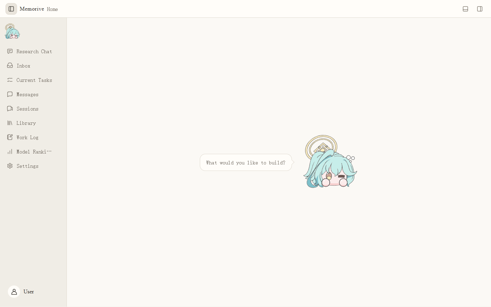

### On the first launch

1. Open **Settings → Documents and External Viewing**. Check the default workspace and output directory, then record their actual locations. The program folder, research files, and application state serve different purposes.
2. Configure only the API, CLI, or local route you intend to use. In **Current Workflow Model Mapping**, assign a model to each required step.
3. Try one familiar paper. Import it in Inbox, inspect its task nodes, open its Card and Analysis in Library, and compare both with the original.
4. Before Research Chat, check the project, conversation, attachments, retrieval scope, and model. The ability to send a message does not establish the answer's evidence.

### How to recognize progress

An open page shows that the interface loaded. A connection test shows whether that route can be called. A node capability check asks whether it fits a particular role. A completed task still needs human review. If a list is empty, first check whether that workspace actually contains the expected material or task.

### Continue your research from Home

Home brings recent research and useful entry points together. Click the bubble or the area around the expression to change the prompt. Clicking the expression also plays an action. Their positions remain stable, with a short interval between accepted clicks. The button below a prompt opens the corresponding feature.

Latest developments focuses on recent publications in a research direction; related material focuses on relevance. These are separate searches. The related entry uses the most recent research direction without another selector on Home. If no direction exists, add one in external-literature settings. AI Updates is a separate news view, not your research evidence library.

## 02 Model Services and API: three common configuration modes

Connect external models in **Settings → Model Services and API**. Whether you use a provider's official API, a compatible endpoint, or a relay, its protocol, address, model ID, and credential must describe the same working route. The display name is for you; the model ID is what the service receives.

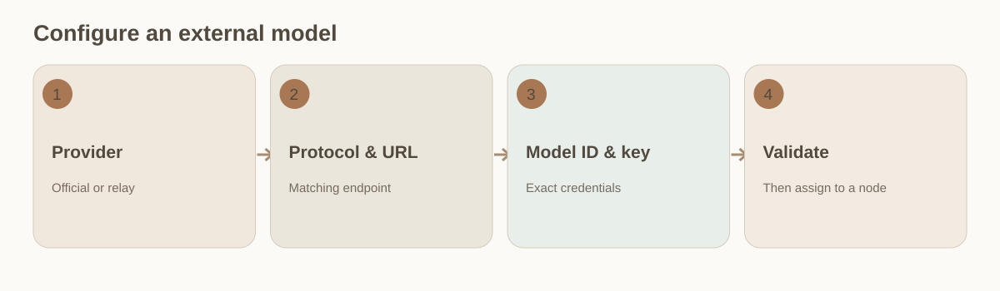

### Configure the route

1. **Official provider:** choose the actual provider, enter its published model ID, put the API key in the dedicated credential field, and use **Secure Save**. Do not invent a compatible endpoint.
2. **OpenAI-compatible endpoint:** select the compatible protocol and enter the service's HTTPS URL, model ID, and key. They must belong to the same service and account.
3. **Relay:** use the protocol, address, and key supplied by the relay. Clarify whether its displayed price is a relay price or an upstream list price; its label does not establish upstream identity.
4. Start with ordinary quality tiers for day-to-day work. Use advanced settings when you need a precise model ID, protocol, or reasoning mode. A tier name is not a capability guarantee.
5. Save, test that specific model connection, assign it in workflow mapping, and use a small task to inspect the actual model and route recorded by the node.

### Saved but unavailable

Check credential submission, endpoint/protocol pairing, model ID, account entitlement, then network or proxy. Saved configuration, presence in a list, and a passing connection test are separate states. Change one cause at a time.

### A field-by-field example

For one OpenAI-compatible service, the display name is your own label; protocol is the compatibility it claims; endpoint is the HTTPS base URL it supplies; model ID is the exact value in its model list; and the key goes in the credential field. Save, validate that model, then assign it to a node. A 401/403 error points first to key or entitlement; 404 to URL path or model ID; timeout to network or proxy; malformed responses to protocol. These are diagnostic clues, and the service's actual receipt decides the cause.

### Credentials and charging

Do not put keys in documentation, screenshots, web exports, or ordinary logs. Give official, compatible, and relay routes separate identities even when model names match. Charges depend on the route actually called. A validation run may make a real request; check its route and model first.

## 03 CLI access: use an installed local tool

If a CLI tool is installed and signed in on your computer, Memo can use it as an execution route. The tool still manages its own installation, sign-in, updates, and subscription access. Memo discovers the route and assigns usable models to task nodes. A subscription may have no meaningful per-call price.

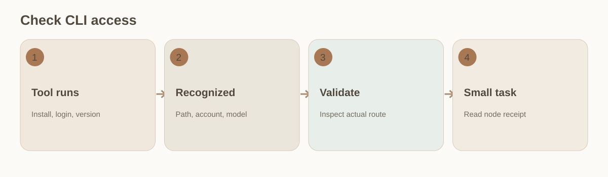

### Connect it

1. In the tool's own terminal, verify that its executable starts, the account is signed in, and the intended model is available. Note the tool version and command path.
2. Open **Settings → CLI Access**. Choose the tool and inspect its executable path, account connection, model configuration, and any error shown.
3. Save and test this CLI route. A successful API test does not prove CLI access; test each CLI independently.
4. Assign a supported CLI model to the relevant workflow nodes. For generation and review, check the role and model identity separately.
5. Run a small task and inspect the node's actual route, start time, errors, and retries. If a task fails after a connection pass, read that node's receipt before reinstalling anything.

### Cost and state

When a subscription CLI has no per-call price, usage cost stays unknown rather than zero. Recheck after an account, model, or tool-version change; old tasks retain their recorded identities and pricing basis.

### Add your own CLI

Alongside existing adapters, a custom CLI service lets you specify a local executable, arguments, input method and output-reading rules, then configure its models. Validate the service first and select it in the chat or workflow node that will actually use it. A familiar display name does not prove which tool ran; inspect the recorded service and model.

Custom integration requires a command that can receive requests and return results through the configured interface. It does not make every interactive tool compatible. Keep timeout, cancellation and output errors visible; starting a process is not a successful answer. CodeBuddy Code keeps its name. WorkBuddy is a different product and is not supported merely by renaming an entry.

## 04 Local models: service, protocol, and ability

Start the model service in its own application, then let Memo detect it. The current local endpoint uses `127.0.0.1` or `::1`. Appearing in the model list shows only that Memo found it; chat, image reading, embedding, and review each need their own check.

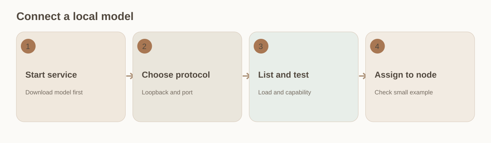

### Connect it

1. In Ollama or another local server, make sure the service is running, the model is downloaded, and the server can call it.
2. Open **Settings → Local Models** and try auto-detection. If needed, enter a display name, service type, and loopback address manually.
3. Select Ollama native or an OpenAI-compatible protocol according to the actual server. For llama.cpp, use the corresponding compatible preset.
4. Read the model list and run validation. If the list is empty, check the process and port; if it appears but fails, check protocol, model load, and capability.
5. Assign a validated model in Research Chat or Workflow Model Mapping. Embedding and chat models have different jobs. Changing an embedding model may require rebuilding the old index.

### What counts as usable

Use a small, nonprivate sample to check the relevant role. No provider API charge does not mean no GPU, power, or time cost. A connection pass does not qualify every workflow node.

## 05 Workflow Model Mapping and validation

Workflow Model Mapping chooses the route that each node in a new task will use. Embedding, Card extraction, Analysis, and review call for different abilities; daily, weekly, and monthly reports also have separate model choices. Template changes affect later tasks, while started nodes retain the configuration and records from their run.

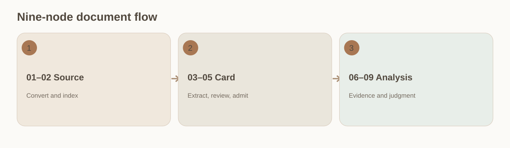

### Configure and check

1. In **Settings → Current Workflow Model Mapping**, choose document processing or the intended report period. Open each node in turn.
2. Use an embedding model for retrieval, a faithful extractor for the Card, a model with enough evidence capacity for Analysis, and a separate model suited to evidence review.
3. Check enabled state, retry policy, and availability. Disabling optional review nodes such as 04 or 08 reduces coverage; skipped does not mean passed.
4. Save and reopen the mapping. Start a small new document task and inspect each node's actual model, route, input/output, and errors.
5. A connection check asks “can it be called?” A node exam asks “does it fit this role?” A public leaderboard only helps shortlist candidates. Keep these three kinds of evidence separate.

### One-task exceptions

A permitted replacement in a current task affects that run only. Change the template for future papers. A changed embedding space can require an index rebuild; changing only a model label is insufficient.

### Assign generation and review roles

A reviewable mapping makes 02 create retrieval representations, 03 extract only source-locatable Card fields, 04 look for omissions or misreadings against the original, 07 build Analysis from controlled evidence, and 08 test whether citations support the claims. Even when 04 and 08 use the same model family, inspect their independent roles and actual input. A second similar answer from a generator is not an independent review. Do not enable a capability merely because its model ranks highly.

After an edit, compare three things: the saved template, Inbox's executable-state message, and the model ID/route recorded by a new task. If they differ, diagnose where the change failed to apply. Do not rewrite an old task.

## 06 Inbox: import, preview, queue, and automatic execution

Inbox is the first stop for a new source. Check the file and preview before deciding when to process it. A place in the queue does not mean its text has been converted or its Card created. For a first run, choose a clear paper you know well enough to check.

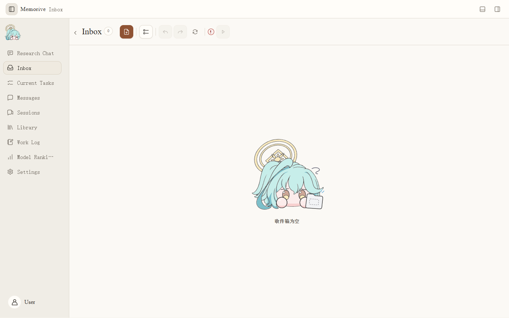

### Process one source

1. Add a file or drag it into the page. Check its name, type, page count, and preview. Acceptance of PDF, Office, or images does not prove full extraction or analysis.
2. Check for a duplicate or wrong file. Reorder the queue if needed; verify the selection before batch removal.
3. Inspect Auto Run and any disabled-state explanation. When it is off, files can remain queued. Before enabling it, save a workable model mapping.
4. Once enabled, open **Current Tasks** and confirm that a task was dispatched. A disappearing Inbox card alone is not proof of success.
5. Open an abnormal card to read its error before undoing, retrying, or changing the source. Keep the original and the failure record.

### If nothing starts

Check Auto Run, mapping, and the UI message. If a task exists but stalls, diagnose its node rather than importing the entire batch again.

### Receive recent and closely related papers

In external-literature settings, choose research directions, the search interval and the expected batch size. Automatic receipt runs only when enabled; a Home action can explicitly request one search. Read the batch counts for new, duplicate, skipped and failed items. No new entries does not by itself mean a source failed.

Discovered entries contain bibliographic metadata and source links: title, authors, year, DOI and, where available, an abstract and a reason for the recommendation. That reason explains relevance, not what a full reading would establish. Messages announce new entries. Missing abstracts remain missing. Add the full text yourself; receipt does not bypass login or copyright restrictions and does not mean a PDF has been downloaded or processed.

Discovery, Inbox and Library use the same identity checks. Prefer stable identifiers such as DOI. When identifiers are absent or conflict, review title, authors and source before deciding. A preprint and a published version may belong to the same work while remaining distinct versions. Similar titles alone are not enough to merge them. Retrying a batch should not create duplicate entries or notifications.

## 07 Current Tasks: nine nodes, states, and targeted retries

The task list shows how far processing has gone; open a node to see the input and model used in this run. The nine steps are 01 document conversion, 02 embedding, 03 Card generation, 04 Card review, 05 Card admission, 06 Analysis material assembly, 07 Analysis, 08 Analysis review, and 09 human decision.

### Inspect the path

1. Select the document in **Current Tasks**. Check its source, time, and overall status, then find the earliest abnormal node.
2. Open a node to inspect its input, output, model, route, retries, and errors. Green means that step finished; it does not approve the content. Interpret yellow and red with their text.
3. If conversion in 01 misses text or tables, inspect the source. If 02 fails, check the embedding model and index. If 03 or 07 lacks content, trace their inputs and original passages.
4. Nodes 04 and 08 may be skipped by configuration. A skipped node has no review finding. Node 09 still requires the researcher's decision.
5. Before changing a permitted current-task model or retry parameter, confirm its scope. Restart only from the necessary step and retain the old/new run difference.
6. To trace earlier results, switch to task history and compare run time and artifact version. Do not treat an old run as current.

### What completion means

Machine completion still requires opening the Card, Analysis, and original source before a result is cited or reused.

### Example of a targeted diagnosis

If 07 Analysis fails, first check whether 01–06 finished with usable input, then open 07's error and model receipt. For context-capacity errors, compare the assembled evidence size with the model limit. For missing citation identities, inspect 06 material assembly. For a timeout, check this run's route and network. Retry only from the earliest necessary permitted node once the cause is understood. Repeating an entire batch adds cost and complicates comparison.

After retry, compare both runs' input versions, models, times, and results. The earlier failure remains evidence even after a later success.

### Read the ring as actual node progress

Progress follows node activity, processing, saving and terminal states. When a percentage cannot be measured, the task keeps a meaningful stage instead of simulating progress with a timer. Inspect a completed main path and an active logic-analysis branch separately. Paused, retried and concurrent tasks retain their own state. A download or a single node at 100% does not mean the whole research task is complete.

## 08 Library: review the Card and Analysis against the original

After processing, read the original, Card, and Analysis together in Library. The Card gathers information extracted from the source; Analysis offers candidate judgments based on that evidence. Return to the original whenever a number, condition, or conclusion needs checking.

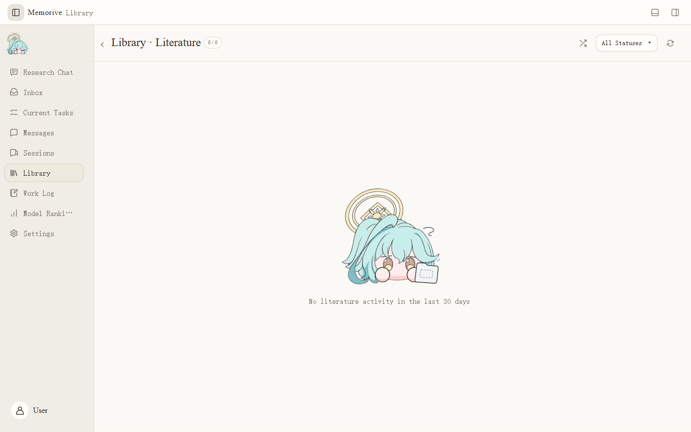

### Review one paper

1. Find the paper by title or status and confirm the artifact belongs to this task and current version.
2. Read the original or converted text, paying particular attention to figures, units, samples, methods, and stated limitations.
3. Open the Card. Check population, method, numbers, findings, and anchors. Distinguish “absent in source” from an extraction gap.
4. Open Analysis. Check each claim's Card or source evidence, whether the inference exceeds it, and whether conditions were omitted.
5. Record the right type of objection: a transcription error calls for a Card correction; weak evidence calls for a narrower or abandoned claim; interpretation disputes retain both views and grounds.
6. After confirming the current artifact version, use **Confirm Review** and check its recorded state and time. If unavailable, verify that both required artifacts were opened.

### After review

Reviewing a paper's artifact does not automatically put it into the knowledge base. Derived conclusions in Research Chat have a separate confirmation step.

### Card and Analysis checklist

Card: Is the population correct? Are sample sizes, units, intervals, method, comparator, author wording, and limits complete? Can each important field return to a paragraph, page, or figure? Keep “not assessed,” “extraction gap,” and “absent in source” distinct.

Analysis: Which Card fields and source passages support each judgment? Did it turn correlation into causation, generalize beyond the sample, or turn an untested hypothesis into fact? Are compared papers genuinely comparable? Record disagreements with reasons and source locations. Confirming review records that this specific version was read; it does not automatically endorse every claim.

### Tables, values and source locations

Document processing retains structured paragraphs, table cells and page or line locations so checks and citations can return to the same source. Compare superscripts, units, headers and tables across pages against the original PDF. Empty-text pages can receive bounded OCR recovery when configured; unreadable content stays failed or missing rather than becoming a plausible invented value.

A stored location supports inspection, not a guarantee of perfect OCR or parsing. Reprocessing creates a new version. Earlier answers remain linked to the version they used rather than silently adopting new paragraph locations.

## 09 Research Chat: choose the project, sources, and model

Begin Research Chat by choosing a project and opening a conversation. By default, it searches attachments in that conversation. Choose a wider scope if you want it to find other project material. You can attach a file before it has produced a Card.

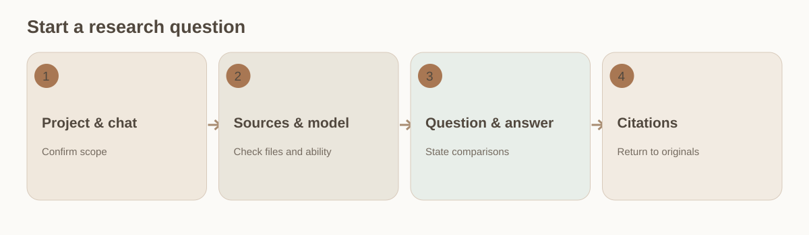

### Ask a first question

1. Open Research Chat and choose or create a conversation under the intended project. Check the project before adding context.
2. Drag a PDF, image, Word, Markdown, or text file into the composer, use **+**, or choose papers from this project's Library.
3. Compare the attachment chips with the Materials sidebar. Unchecking a paper removes its current-conversation association, not its original or historical citations.
4. Click the model name below the composer and choose a validated model. Scanned PDF and images need vision ability; switch models and retry if they cannot be read.
5. State the question and comparison dimensions, such as methods, samples, results, and limits. Cross-paper comparison requires at least two distinct papers.
6. Before sending, review the model, source count, and retrieval scope. Search-only mode may return excerpts; generated analysis needs a usable model.

### When broadening scope

Automatic project-material search can bring in papers you did not manually tick. Inspect the sources actually cited, not just the conversation title.

### Attachments, project retrieval, and memory

Composer chips are the sources explicitly selected for this turn; the Materials sidebar shows conversation associations. Automatic project search can add other candidates. If confirmed memory is enabled, a model may also use saved research context. State your allowed scope before asking, then open every citation to inspect the sources actually used. To test one paper, keep only that attachment and disable any expansion you do not need for a comparison question.

When a paper is reprocessed, an old conversation should still be traceable to the saved source version it cited. A Library display window is not proof that historical citations disappeared.

### Answer style, retry and branches

Global preferences provide four styles: professional and reliable, candid, efficient and practical, and exploratory. Inherit global settings uses those preferences; saved answers retain the style used to generate them. The copy icon copies the answer. The single retry icon generates another version using the original answer's style. Change preferences in Settings; there is no separate style menu beside each reply.

Retrying an earlier step creates a new answer version. The old answer and its later replies remain on their original branch and are excluded from the new branch's context. Switch back to inspect the earlier path. A failed retry should not erase a saved answer. Copying or switching versions makes no model request.

### Automatic archiving and reopening

A chat may be archived after more than 30 days without a successful deliberate open, or when saved user and assistant messages exceed 100. Exactly 30 days or 100 messages does not trigger it. Retained hidden answer versions count as messages, so this is not a count of conversation turns. Pinned chats, busy tasks, attachment processing and chats open in any window are protected while that condition applies.

Archiving keeps text, knowledge, citations and answer versions. Viewing an archived chat does not restore it automatically. Manual restoration gives another 30-day grace period and records the current message count to prevent an immediate repeat. Lists load summaries and necessary metadata first; a chat's body is read when opened. Search still reaches saved content.

## 10 Citation verification and knowledge confirmation

Treat each research answer as an analysis to verify. For a number, comparison, or causal claim, find its citation and read the corresponding saved source with its surrounding context. Smooth prose, many citations, or a “saveable conclusion” cannot replace that check.

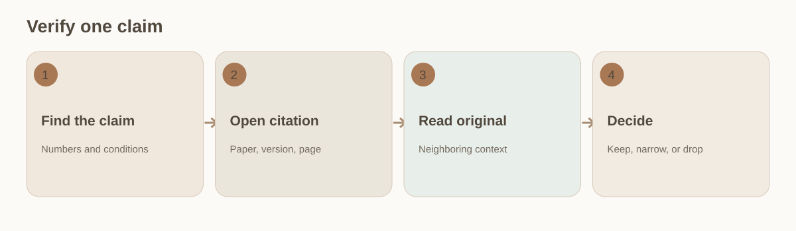

### Check claim by claim

1. Mark important numbers, comparisons, causal claims, scope, and recommendations. Match each to a citation. Leave uncited key claims unverified.
2. Open each citation and confirm its paper, saved version, page or line. Use the Citations sidebar to check the source list.
3. Read the cited passage and nearby context. Check population, sample size, method, units, timing, comparison baseline, statistical limits, and the author's wording.
4. In a multi-paper comparison, verify each paper separately. When measures or populations differ, state the incompatibility rather than merging them into one result.
5. Classify each claim as supported, partially supported, conflicting, or not locatable. Narrow partial claims; investigate or drop conflicting and unlocatable ones.
6. Expand a **Saveable Conclusion** only after that work. Check claim, scope, limits, and every citation before adding it to Knowledge. Later corrections create a reviewed version; retain the earlier one.

### Two separate approvals

**Confirm Review** in Library applies to one paper's generated artifacts. **Confirm Add to Knowledge** applies to a derived conclusion from chat or an Agent. If a source changes or is withdrawn, revisit knowledge that depends on it.

### Worked check: do not turn a difference into causation

Suppose an answer says “Method A increased the measure by 20%” and cites two papers. Find which paper reports 20%, whether it is relative change or percentage points, its unit and measurement time. Then compare population, control group, and statistics. If one paper reports association only and the other uses a different population, “increased” is too causal. A narrower statement might say that one paper observed about a 20% difference in its specific sample while the other used different conditions and cannot be pooled. Keep separate citations. If the unit or conditions are unknown, leave the numeric claim unverified.

A Knowledge item also needs scope, limitations, and a review date. When a source is corrected or withdrawn, follow its dependency to affected items and review them again.

### Separate a located citation from support for a claim

Opening a citation shows that a source was located. Check whether it supports this particular claim and to what extent. The chat distinguishes supported, partly supported, unsupported and conflicting material, and points out gaps in evidence coverage. These signals help prioritize review; they do not approve a research conclusion for you.

Before saving knowledge from a chat, check the question, selected answer version, conditions and sources. Research background, refinement suggestions and later updates retain their relationships rather than overwriting earlier records. Semantic diagnostics can still miss issues or raise false alarms. Cross-paper attribution and inference need particular care.

## 11 Retrieval and Weights: how ranking changes

Use **Settings → Retrieval and Weights** when you want to change which sources appear first. Decide whether the settings apply to every project or one project, then choose a preset or adjust individual weights. Ranking cannot repair an incorrect source, and changing the embedding model may require a new index.

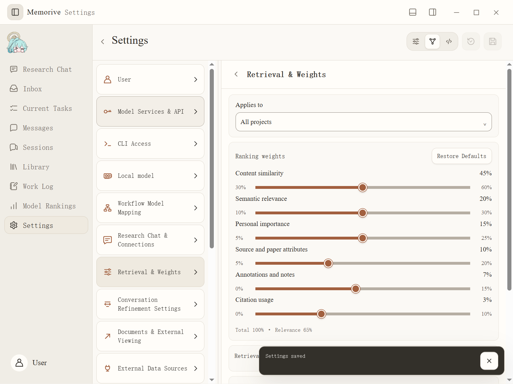

### Choose a mode

1. In ordinary mode, choose Balanced Research, Original Source, Cross-paper Comparison, or Reuse according to the task.
2. In advanced mode, inspect content similarity, semantic relevance, manual importance, source attributes, annotations/notes, and citation use.
3. After moving a slider, check the other values and the 100% total. Follow the UI's allowed relevance range. A higher weight is not evidence of reliability.
4. Choose all projects or turn off inheritance for one project. Before saving, check the effective scope and preview ordering.
5. Select a configured embedding or semantic model if needed. Without one, lexical search remains available. Changing embedding models may require rebuilding the index.
6. In developer mode, validate fields, ranges, and sum in the structured configuration, then return to the ordinary view to confirm how it appears.

### Calibrate with known examples

Preview with papers you know should appear. Watch how originals and derived knowledge rank. If results seem wrong, check source identity and version before moving sliders.

## 12 Session Management: sync, filter, refine, and remove

Session Management brings local Codex and Claude Code records, browser captures, and manual imports into one reading list. If you keep chatting in the source tool, sync again to bring in the new messages. Organization here affects Memo's saved copy.

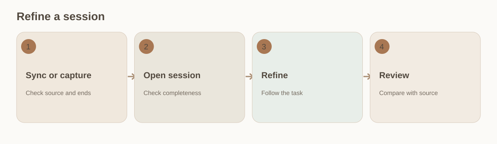

### From source to artifact

1. Open **Sessions** and narrow by source, title, and per-type count. Use **Sync Codex / Claude** for supported local histories.
2. Open a session and check source, time, first/last message, and completeness. For browser sources, check capture scope and status too.
3. In **Settings → Conversation Refinement**, save a suitable model. Return to the session and choose **Refine**.
4. Refinement enters Inbox and the task queue. It waits if Auto Run is off. Follow Current Tasks, then open its artifact in Library.
5. Compare the result with the source for key points, assumptions, decisions, and next actions before review. New messages call for a new snapshot or refinement version.
6. Check batch selection before removing records. Removing a local Memo copy does not delete its source in Codex, Claude Code, or a website.

### If a session is missing

Check supported sources, sync completion, filters, and whether the source tool stored it for the current local account. A changed recent-chat location alone is not proof that the source was deleted.

### Full, incremental, and refinement versions

An initial sync or capture establishes a baseline; sample the first and last messages and total count. An incremental update should continue from the last successful point. A partial failure must not replace a complete baseline. Before refining, record the source snapshot time; afterward, check that the result includes the snapshot's last messages. Continued chat in the source tool requires another sync and a new refinement version. Keep the earlier one to explain decisions made then.

Titles may repeat across sources or sessions; use source, time, and content to identify a record. Batch removal manages the local copy. Export or back up research records you need before confirming the selection.

## 13 Web reading and browser extension: page versus history

To bring web content into Memo, prepare the browser companion in **Settings → Conversation Refinement**, then sign in on the target site yourself. Historical coverage depends on the site. Choose current-page capture, an initial full collection, or a later incremental update according to what you need.

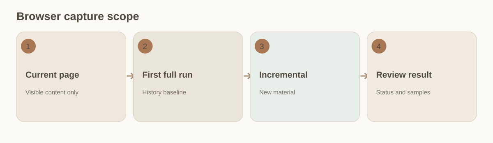

### Procedure

1. Find the companion entry in Settings and follow its instructions to load it in the browser extension manager. Reload the extension after an update.
2. Open the target site, complete sign-in or verification yourself, and wait for the relevant page to load.
3. To save only visible material, click the browser toolbar extension and choose **Capture Current Page**. This creates a general web source, not full account history.
4. For supported sites, use full capture for the first history baseline and incremental capture later. Inspect each source's last successful point, count, errors, and completion status.
5. Refresh Sessions and sample the first, last, and middle records. After an interruption or expired sign-in, fix the cause and continue; do not call a partial run complete.

### Failure boundaries

Site layout changes, network interruption, or lack of full-history support may limit collection. Configuring a URL does not establish that the entire site has been read.

## 14 Model Rankings: use public measures to shortlist

Use Model Rankings to narrow your shortlist: compare public capability and price information, then test promising candidates on your own work. Read the update date, metric definition, provider, currency, and unit together. A ranking score cannot stand in for a connection check or a task sample.

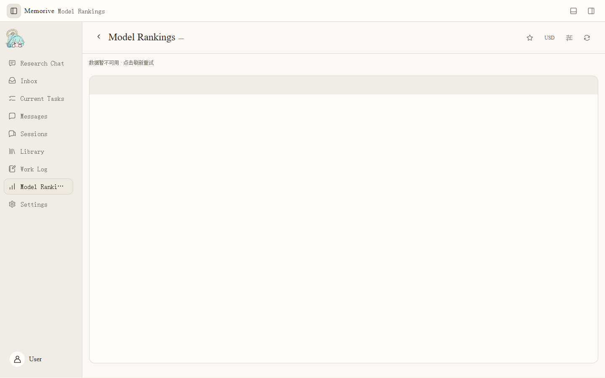

### Compare carefully

1. Check source and data date, then filter by model, provider, or favorites. If the source fails, refresh or retry later.
2. For capability scores, check benchmark and task category. Values from different benchmarks should not be subtracted as if they shared a scale.
3. For input/output prices, check currency, per-million-token units, cache, and mixed-pricing assumptions. Public catalog rates can change.
4. Bring a candidate back to API, CLI, or Local Models settings. Confirm the real route and model ID, then perform connection and role-specific checks.

### Boundary

An empty board does not prove a model does not exist. A high rank does not grant account access or establish suitability for extraction, citation review, or your local hardware.

## 15 Usage and Cost bottom panel: scope, cost, and unknowns

In the bottom **Usage and Cost** panel, choose the accounting scope and period before filtering models or switching metrics. Its totals, public prices in Model Rankings, and a receipt for one chat answer cover different records. Align those scopes before comparing costs.

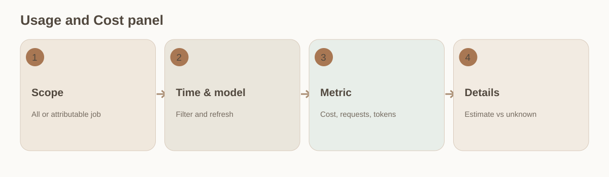

### Read the chart and details

1. Use the top bottom-panel control or **Ctrl+J**. All records are available; if **Current Job** says attribution is incomplete, it remains disabled.
2. Select last 7 days, last 30 days, or this month, then one model or all. Refresh and inspect synchronization status when you need recent records.
3. Switch among cost (including estimates), request count, and tokens. Keep actual/estimated cost distinct; requests include failures and retries; tokens distinguish input and output.
4. For one record, open the billing list under model/accounting settings. Check job attribution, route, time, model, and pricing basis.
5. A subscription CLI with no per-call rate stays unknown. Local inference has no provider API charge but has resource cost. Missing evidence is not zero.

### Reconcile a bill

Estimated cost uses recorded usage and price, not the provider's settled charge. Currency switching only changes the display conversion. Keep original pricing and the provider bill for reconciliation; do not assign all-record totals to one paper.

### Why three cost figures differ

A ranking's per-million-token price is a public reference; the bottom panel aggregates actual or estimated records over a filter; a per-answer receipt covers one answer. Their time, route, cache pricing, currency, and failed-request basis may differ. If a call fails and is retried, request count may be two while only one final answer exists. Partial token reporting can leave cost estimated or unknown. To compare runs, align dates, models, and routes, then inspect input, output, and cache reads before checking the provider bill.

When current-job attribution is unavailable, do not divide global spending by task count. Keep unknown and unassigned records until evidence permits reconciliation.

## 16 Reports, Messages, Work Log, and backup

Daily, weekly, and monthly reports help you look back over a period of research. Messages surface work that needs attention, while Work Log preserves the trail of a run. To explain a judgment, follow those pointers back through the task, Card, Analysis, and original source.

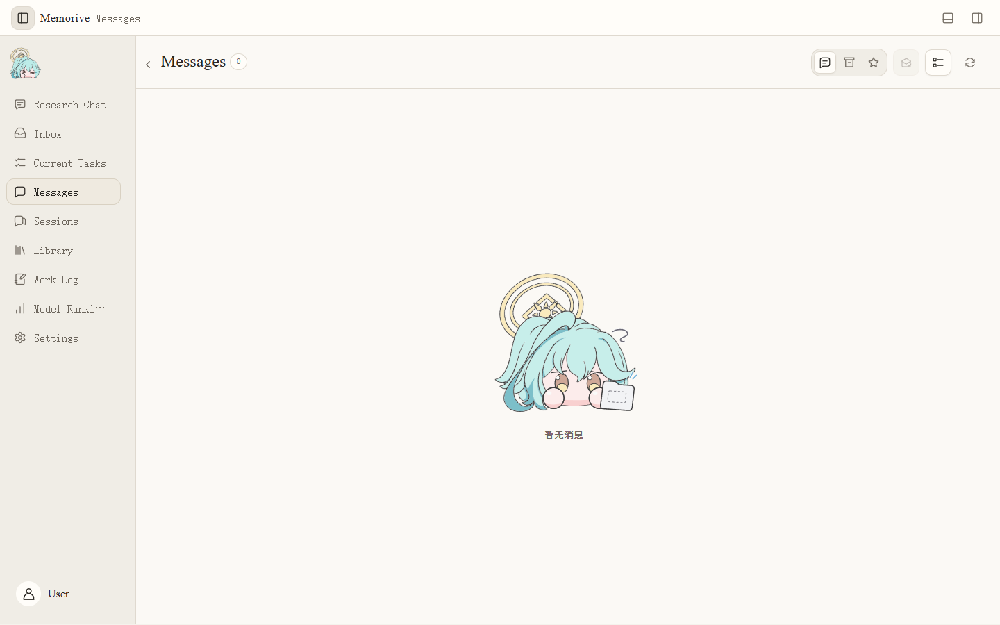

### Reports and issues

1. Map report-generation models separately for daily, weekly, and monthly flows. Mapping one period does not map the others.
2. In **Settings → Notifications and Reminders**, set generation times. No new outcomes or no usable model need not produce an empty report.
3. Find a generated report in Library. Check its period, linked sources, and version. Regenerate from its linked task when needed; retain the earlier version.
4. Open a Message and use **Go To** to reach its object. Marking it read does not approve a review or confirm a paper.
5. Filter Work Log by time and type, then follow one task's errors and retries. Refresh for new entries; the last success message alone is not full-chain evidence.

### Maintenance

Back up originals, generated artifacts, annotations, research conclusions, configuration, and needed records. Locate old files before changing a directory field; a field change does not migrate them. Sample an original, Card, Analysis, and refined session after backup. Public-release and formal acceptance status require their own version-specific records.

### AI Updates and content language

AI Updates organizes changes and source links from public material within the selected period. Choose an available model in Research Chat and Connections, or inherit the chat model as configured, then explicitly start generation. This is separate from daily, weekly and monthly reports about your research records. A message announces an event; it is not the report itself.

After selecting Chinese, English or Japanese, the interface, system messages and newly generated chat answers and memo reports follow the current language settings. Existing answers and reports keep their language and version. Document processing follows the source language; titles, DOI, quotations and source excerpts are not rewritten when the interface changes. Caches distinguish languages so an old-language result is not presented as new generation.

## 17 literature data and logic review

memo provides local numeric analysis and optional cloud logic review per document. Reports give scoped review opinions. A color cannot establish a paper's authenticity or its authors' intentions.

### Start a review

1. Open Current Workflow Models in Settings. Data analysis is enabled by default, uses no model, and runs after RawMD is available. The separate logic node below the main workflow requires a verified cloud API or subscription CLI profile. Local models and automatic fallback are unavailable for this node.
2. In the inbox detail panel, below file location controls, select Logic review beside the brain icon. It is off by default. Turn off automatic dispatch first if you need to change pending document options. Dispatch freezes the source identity, rules and model configuration.
3. Open Numeric check rules to bind a proportion, sum, SD/SE relationship, cross-check, discrete mean, statistic/p value or raw-value summary. Supply exact numeric text, a uniquely locating source quote, explicit conditions and their basis. Unknown weights, independence, denominator, tail or adjustment remain insufficient information.
4. When a check lacks a numeric input and an actual Card omission anchors the same explicit source relationship, the program associates the omission, original quote and current chunk page locator automatically. It uses RawMD first, then bounded PDF assistance when needed. Removed Card values are never reused or restored. Ambiguous associations remain unresolved. Advanced Card locators are optional additions, not a prerequisite.

### Progress and recovery

The local data node is part of the main workflow, works without a successful Card, and can be skipped before it begins. Selected logic work may continue after the main workflow finishes. The whole task completes only after the selected report is saved and registered. The separate node offers state-appropriate pause, resume, cancel, skip and retry. Retrying logic does not rerun successful main processing.

Pause or cancel cannot recall an already sent provider request. Usage and returned results are retained. An uncertain request outcome is never retried automatically; an explicit retry acknowledges possible additional calls and charges. Publication failures retry saved results first. Reports retain versions and show when the source or a successor result has made them historical.

### Read reports and record a disposition

Open the document detail in the library, then its data or logic report. Review checked and excluded scope, source locations, formulas, conditions and results. More numeric records can be loaded. Missing conditions, ambiguous OCR and unresolved source locations are kept as limitations or input issues.

Green means no important concerns in the checked scope; yellow means clarification is needed; red indicates evidenced important concerns that deserve priority review. Limited coverage may have no risk color. Finding counts, repeated digits and small samples do not alone establish high risk. Detailed calculations remain available in an expandable record.

Record Explained, Confirmed report issue, Needs material, Deferred or Reopened against a finding, with a reason and evidence when explaining it. Dispositions are appended separately; the machine report and color remain unchanged. Review reports are excluded from original-paper evidence candidates.

### Exams, cost and limits

The model exam is in the logic node's Current Workflow settings. The independent anomaly-detection and false-positive-control category uses nested LIGHT, HALF and FULL sets of 6, 10 and 20 synthetic cases. Every tier allows two directed repairs with a provisional category-specific nonlinear penalty. Subset results do not overwrite full scores. This reference exam does not establish blind-test validity, formal qualification or cross-category comparability. Field and quote checks do not prove semantic justification.

Data analysis and local PDF assistance make no model calls. Selected logic review and model exams use the configured cloud channel and existing authorization, capacity and accounting controls. API exam plans show a cost cap. Missing cost evidence stops automatic paid repairs. A subscription CLI's unknown per-call price remains unknown. Logic review sends the loaded text as a whole or in capacity-bounded segments to the selected cloud channel; confirm that the material is appropriate to send before selecting it.

The deterministic engine uses loaded RawMD and explicit bindings. PDF assistance is limited to two pages, 64 MB and five seconds. Main numeric processing is bounded to 4 MB of RawMD, 20,000 numeric records and 200 rules; exceeding a limit stops with a reason. Distribution tail probabilities are numeric approximations. Unloaded supplements, image forensics and author-intent judgments are outside coverage.

### Default processing and global relationship coverage

Without manual rules, the engine extracts numbers, written precision, repetition, literal table-column summaries and plus/minus pairs. Supported checks include explicit arithmetic equations, n/N (%) within one cell, named p-value/SD/SE numeric domains and the expressly stated SE = SD / sqrt(n) relation. A column is not assumed to be one research sample; a plus/minus pair is not inferred to mean SD or SE. Generic count/percent columns do not establish a denominator, weighting or group. Formula and precision checks remain conditional, not authenticity judgments.

If capacity permits, logic review checks the whole source in one request. Longer texts have grounded method/result/conclusion/limitation inventories followed by a separate cross-segment pass using original source excerpts. Reports show the global stage and its citations. Local completion alone, oversized global material, incomplete inventories or unresolved relationships cannot produce an overall completed green verdict. These calls remain part of the manually selected cloud task and share scheduling, pause, accounting and uncertain-request recovery.

Automatically recognized rules are limited to 200, including advanced rules. Omitted automatic checks are explicitly marked as limited coverage. Unloaded material, unsupported formats and ungrounded Card-gap associations are not treated as passed checks.

Current Task shows execution status only. Completed logic nodes are green, including reports with findings or limited coverage. Click a node for status and controls, without a logic progress bar in the existing right sidebar; closing and reopening keeps the selected node. There is no saved-result expander or report popup. Data and logic reports open inline in Library document details. Report colors describe findings within the checked scope separately. Library status labels fit their text and wrap onto another row in narrow lists.

A finding applies only to the conditions and coverage stated in its report. Convert percentages and ratios according to the source meaning, without guessing missing conditions. Truncated formulas, ambiguous OCR and valid zero values need separate treatment. Checks do not rewrite the paper, and concerns or human explanations do not replace research judgment.

## 18 Installation, update checks and incremental upgrades

For a new installation, use the globe icon on the welcome page to choose Chinese, English or Japanese, then check prerequisites and the application and data folders. Language selection is also available in the native prerequisite wizard when WebView2 is missing. For a new profile, the choice becomes memo's initial language. An upgrade or reused data folder keeps existing settings.

Automatic checking is enabled by default for stable releases and can be turned off in settings. It starts after a delay once the application is ready, with a 24-hour cooldown for automatic checks. It does not download or install automatically. Investigate a failed manual check rather than treating it as an up-to-date result.

### Start from v1.01

The old v1.01 does not have the complete in-app incremental-update flow. For its first upgrade, use Memorive.Update.exe distributed with the target release and identify the existing application and data folders. Finish tasks and back up important data first. Do not uninstall first or overwrite the data folder. A new empty profile does not mean the old data was lost. Keep a portable distribution complete instead of copying only its main executable.

### Update subsequent versions

1. Check for updates under Settings → About and Version. Automatic checking controls discovery of versions, not automatic installation.
2. Review the version, notes and download size. A matching delta transfers changed files; otherwise the same flow can offer a full package with its reason and size. A failed check does not mean you are up to date.
3. After download verification, choose “Update after exit” to open the update assistant. Let tasks and saves finish, then exit this instance normally. The assistant continues the update without force-terminating the application or automatically restarting it for you.
4. Reopen memo after the assistant finishes and check the version, data folder, model settings and recent chats. The helper inherits the application language; a temporary display change does not overwrite existing content-language settings.

### Keep evidence when something fails

Signature, integrity or compatibility failures stop application of the update and preserve the old program and diagnostics. Application files and research data are handled separately. New answers created after upgrading must not be overwritten automatically by an older backup. Follow the recovery instructions for this upgrade; do not give an upgraded database to an arbitrary older application. Remove private content and paths before sharing diagnostics.
