# Memorive 总体设计

*面向使用者与贡献者的设计说明 · 2026 年 9 月 29 日*

v1.02 发布前文档 · 2026-09-29。本文覆盖本次已确定的功能范围；安装与更新部分须与最终交付核对后发布。文档版本不代表程序已经发布。既有示意图用于辨认通用操作，新增功能以本版实际页面为准。

Memorive 把资料处理、研究问答、引用查证和知识复用连接起来。本说明保留数据流、模块职责和失败处理，帮助你理解系统如何形成可回查的研究记录。研究者负责判断与最终写作。

本文同时描述已实现的主线和受限制的扩展设计。某项能力是否可用，以当前界面、配置和任务回执为准；文档修订不会自动取得发布资格。

## 一、定位与原则

Memorive 是个人研究流程的辅助系统，服务于资料获取、证据整理、检索分析、研究记录和知识复用，不绑定单一学科。系统提供可追溯的材料与建议，研究者负责判断、决策和最终写作。

研究者保留最终决定权。 AI 可以理解、组织、分析、推荐、校核和提醒，但不能自行批准导入、准入、回流或发布，也不能覆盖原始数据、代替研究者形成最终科研结论。系统可执行已授权的任务和规则；自动执行不产生新的授权。

数据独立于工具。 原件、Markdown、卡片、笔记和决策记录长期保留，模型与软件可以替换。检索索引和界面投影服务于这些资产，不成为另一套事实来源。

按阶段建设。 先完成最小研究闭环，再补质量治理、生命周期和研究运营。只细分高复杂模块；新增能力须有明确职责、依赖和退出条件，不因产品定位扩大而同时建设所有功能。

以证据判断质量。 格式合法、内容可信、抽取完整、谱系有效和允许发布是不同问题。关键数值、因果判断和拟用于论文的内容优先校核；普通、可分离的缺口可以降级保留，核心证据失效或继续输出会误导时才阻断。

保持原文与版本。 数据主干保持来源语言；翻译只在用户选择的展示层进行，不回写数据。修改产生新版本，旧内容、审核记录和失败证据保留。

### 本文范围

正文保留模块职责、输入输出、关键依赖、跨模块约束、失败处理及阶段现状。字段全集、Prompt、阈值、供应商价格、逐次测试记录和文件哈希由对应的模块契约与运行证据维护。

## 二、系统架构

### 2.1 主线与旁路

资料处理： 用户授权输入 → 文档处理 预处理 → 证据提取 生成 Card → 证据审核 校核 → 知识准入 执行准入 → 正常检索入口。

研究分析： 问题 → 证据检索 检索并组装 Context Pack → 研究分析 生成分析建议 → 按合同触发 证据审核 独立审核 → 用户判断。

知识复用： 已准入资料 → 研究机会 机会分析；用户选定的可复用结果 → 知识回流 回流候选 → 用户确认目的地与准入 → 知识准入/版本与谱系 执行状态和版本处理。

外部发现：M16 获取题录候选，M17 组织推荐。用户明确开启自动接收或触发检索后，可将题录与来源链接保存到资料库并通知；全文由用户补充。题录收取不等于全文处理或知识准入，后两者仍按各自的审核与批准规则执行。

原件和预处理中间产物可先保存，不以 Card 已 active 为前提；进入正常分析的资料必须满足其准入合同。研究报告 从多源事件生成研究变更报告，不是上述主线的必经环节。

M18 将数值关系和内部逻辑核查作为有界检查接入现有处理流程，不改变数据节点与逻辑旁支的实际调度。M19 独立协调桌面安装与更新，不进入文献分析主线。下图保留原有研究链路；新增职责及依赖见模块分工和第四章。

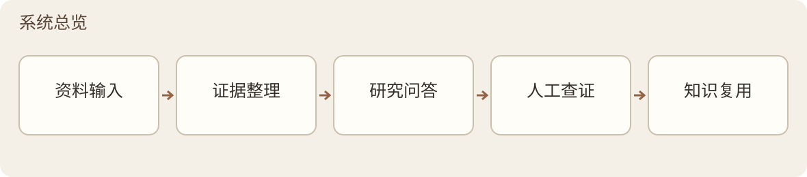

*图 1 · 系统总览*

### 2.2 模块分工

设计保留 M1—M17 的编号与基本职责，并新增 M18 数据与逻辑核查、M19 应用更新与维护。M18 归入核查服务，M19 归入桌面维护层；首页、语言与问答界面仍由应用层协调。这是职责划分，不按模块编号新建界面，也不以文档修订代替实现或验收。

| 层次 | 模块 | 责任 |
| --- | --- | --- |
| 处理与分析 | 文档处理 预处理；证据提取 蒸馏；证据检索 检索；研究分析 分析 | 从原始资料形成可引用证据和分析建议 |
| 分析旁路 | 研究机会 机会分析 | 识别可比条件下的张力与作者自陈缺口 |
| 共享服务 | 证据审核 校核；检索权重 权重；知识准入 状态机；模型服务 模型网关 | 分别负责内容审核、排序、准入执行和模型调用 |
| 记录与反馈 | 知识回流 回流；运行记录 日志 | 形成受控反馈候选，记录运行事实与终态 |
| 长期治理 | 决策记录 决策日志；版本与谱系 生命周期；质量评估 质量保证 | 保存决策理由、不可变谱系与持续质量证据 |
| 研究运营 | 研究报告 变更日志；文献发现 文献发现；研究推荐 主动获取 | 报告变化、发现候选并组织推荐 |
| 核查服务 | M18 数据与逻辑核查 | 检查数值关系和内部逻辑，保留条件、依据及覆盖范围 |
| 桌面维护 | M19 应用更新与维护 | 协调版本检查、下载、安装更新和失败恢复 |
| 应用与执行 | ApplicationFacade、Application Service、Control Store、ExecutionCore、JobRunner | 连接桌面、业务模块、持久运行状态和执行通道；不新增业务模块编号 |

| 编号 | 模块 |
| --- | --- |
| M1 | 预处理流水线 |
| M2 | 蒸馏 |
| M3 | 检索加权 |
| M4 | 分析 |
| M5 | 机会分析 |
| M6 | 校核 |
| M7 | 权重 |
| M8 | 状态机 |
| M9 | 模型网关与执行通道 |
| M10 | 受控知识回流 |
| M11 | 日志与终态账本 |
| M12 | 设计决策日志 |
| M13 | 数据生命周期 |
| M14 | 质量保证 |
| M15 | 研究变更日志 |
| M16 | 文献发现与研究情报雷达 |
| M17 | 主动知识获取 |
| M18 | 数据与逻辑核查 |
| M19 | 应用更新与维护 |

### 2.3 责任边界

文档处理 处理转换与 OCR 质量；证据提取 负责抽取和本地结构校验；研究分析 校验引用身份及上下文成员关系；证据审核 判断证据是否支持内容。知识准入 只根据请求与依据执行状态迁移，不生成质量判断。

模型服务/provider adapter 处理调用边界内的技术重试，JobRunner 管运行、超时、取消和恢复，证据提取/证据审核 管业务返修，运行记录 记录事件。决策记录 保存决策理由，版本与谱系 保存版本与谱系，质量评估 监测质量并给出处置建议。

各功能模块 是本版模块集合。后续扩展须独立批准 ModuleManifest、依赖、兼容性与资格，默认禁用；扩展协议本身不授权新增模块。

## 三、数据与比较约定

### 3.1 双层知识库

来源层保存原件及其可追溯文本：PDF 或其他原始文件、RawMD、CleanMD、Chunks。原件是最终证据依据，转换结果保留来源位置与转换记录。

卡片层保存单篇忠实提炼的 Card，供检索、比较和回查。个人批注、跨篇总结、Analysis 与回流对象另作派生产物，不能混入 Card 的原文忠实字段。

向量、字段向量、查询投影和桌面资料库都是访问层。它们必须指向具体来源和产物版本，可以按合同重建，但不能反向替代原件、Card 或 Registry 的权威。

### 3.2 身份、来源与语言

文献使用稳定 paper_id；持久化产物保存 artifact ID、内容 hash、schema 版本、来源范围、父版本、run 和执行配置。多篇 Context Pack、Analysis 与发布清单可以有多个父产物，不能只挂一个可移动的 latest 路径。

高风险 Card 信息同时保存可读提炼与 source_anchor：{chunk_id, quote}。quote 必须可在对应同篇 chunk 中核验；原文引句真实，不代表提炼在语义上必然成立，仍须审核。历史缺失身份、结构或谱系标为 unknown / not_assessed，不按文件名、时间或相似文本猜补。

RawMD、CleanMD、Card 和文献处理保持来源语言。界面、系统消息及之后生成的问答、研究建议与报告按当前内容语言设置输出；原文、引用、题录和历史版本不改写。生成时固定语言及提示版本，缓存按语言隔离；显示译文不能成为新的原始证据。

### 3.3 通用比较上下文

| 字段 | 要表达的信息 |
| --- | --- |
| Research Object | 研究对象、材料、样本、文本或系统 |
| Intervention / Factor | 被考察因素或干预 |
| Comparator | 对照对象或比较基准 |
| Method | 方法、研究设计或分析框架 |
| Metric | 评价指标及其含义 |
| Boundary Condition | 结论适用的条件与边界 |
| Scale / Context | 尺度、场景与应用背景 |
| Claim Type | 因果、相关、机制、性能、方法验证等结论类型 |

各学科只替换别名映射，不改核心字段。证据提取 抽取比较上下文，研究机会 用它判断可比性。比较结果引用 fact_id，或可追溯的 Card 字段路径及版本；这套业务表达不替代 Card Schema、审核 sidecar、coverage 或谱系合同。

## 四、模块设计

### M1 · 预处理流水线

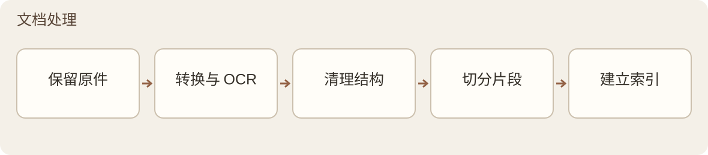

*图 2 · 文档处理 内部流程*

输入 → 输出： 原始文档、图片或笔记 → 原件存档、RawMD、CleanMD、Chunks、向量索引及转换记录。

依赖与交付： 入库流程及获准的外部候选调用 文档处理；文档处理 使用 模型服务 的转换/OCR/嵌入通道、检索权重 入口信号、版本与谱系 版本存证和 运行记录 日志，向 证据提取 交付文本与来源。Card 尚未形成时不调用 知识准入，转换质量不转交 证据审核 通用审核。

| 步骤 | 处理内容 |
| --- | --- |
| DocumentIngest 导入 | 保存原件、来源、身份、时间和数据处置权标记 |
| DocumentConvert 转换 | PDF/其他输入转 RawMD；异常页按需 OCR，输出转换报告 |
| DocumentClean 清洗 | 用本地确定性规则处理页眉页脚、断行、串栏等格式噪音，保留语言和来源标记 |
| DocumentChunk 切块 | 按章节、段落、表格、图注等结构切分，生成稳定 chunk_id |
| DocumentEmbed 嵌入 | 按获准 profile 生成向量，记录模型与时间，透传已有结构和权属元数据 |

页面级 OCR。 正常数字 PDF 优先本地解析，不默认全文 OCR。扫描、近空文本、乱码或关键结构损坏的页面才进入救援：本地诊断 → 权属检查 → 获准 OCR 角色 → 与原解析并列核对 → 页面合并。原始物理页是最终依据，双路结果不用多数投票决定真值。单页失败保留其他页面，明确标出缺页与不完整范围。

笔记核对。 note 在 DocumentConvert 后默认暂停，由用户检查转录和格式，不判断笔记内容价值。跳过核对须显式设置并记日志。恢复使用经校验的 RawMD 元数据，不依赖上次进程内存；关键身份缺失即停止。

向量一致性与恢复。 同模型名称不能证明同向量空间，复用索引须验证维度、归一化、距离度量与检索回归。普通运行和恢复入口不具备清旧向量能力；显式重嵌先确认新文本产物可生成，再保存旧向量落盘快照，清理并核验后重建。中止时从快照恢复旧向量，不重新调用模型伪造旧值；恢复失败保留快照并提示人工处理。同篇重嵌遵守单写者边界。

本版范围。 Capabilities 登记 14 种 canonical 格式：11 种 supported，JPEG/PNG/TIFF 为 degraded，仅作 frame probe，不代表图像 OCR。PDF 保留 [PDF]，其他原件按原字节保留 [Original]；typed anchor 投影到 chunk_schema_version=3。Office legacy bridge 仅覆盖已冻结的 Office16 范围，禁宏及链接更新。OCR、Marker 和本地链的实际资格见第八、九章。

### M2 · 蒸馏

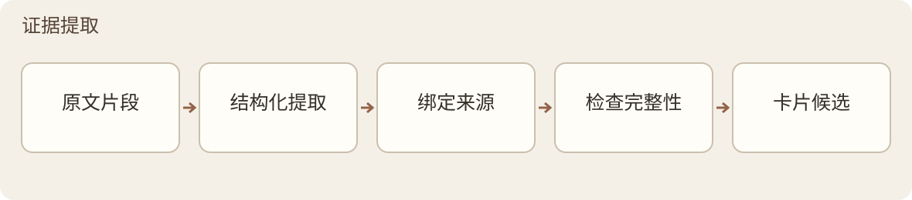

*图 3 · 证据提取 内部流程*

输入 → 输出： 单篇 CleanMD 与冻结 Chunks 清单 → Card、辅助抽取结果及覆盖记录。

依赖与交付： 通过 模型服务 请求 card_distiller_primary；结果先过本地硬门，再交 证据审核 审核、知识准入 准入，版本与谱系/运行记录 保存版本与日志。Card 字段嵌入由后续已准入流程触发，不与 DocumentEmbed 原文嵌入混为一步。

内容范围。 核心字段包括研究问题、对象、方法、关键结果、作者结论、边界条件和来源锚点。辅助抽取包括关键数据、比较上下文、作者自陈局限/展望，以及可选的术语和引用关系。研究局限与结论适用边界分开；个人启发、批判、假设、跨篇综合和写作语料不进入忠实层。

| 规则 | 提炼要求 |
| --- | --- |
| R1–R2 | 保留作者主张强度；完整保留多步过程和多组比较，不能以其中一项替代整体 |
| R3–R4 | 数值连同统计类型、阶段、样本与范围提取；指标写明作用域、分母和对照 |
| R5–R6 | 结论附真实适用条件；区分研究对象与表征/测试样品 |
| R7–R8 | 术语按作者定义；来源锚点覆盖实际取材范围，不统一简写为摘要 |
| R9 | 原文已给的信息应提取；确无则标明，不臆造。明显笔误按上下文处理时保留原值、依据与修订痕迹 |

结构与覆盖。 Card Schema 以 v6 为基线，保留逐锚点引用、field_credibility、completion_status、omissions/tombstone。必需槽位分别标为 present、absent_in_source、not_applicable、extraction_gap、not_assessed；“未找到”不能直接记作“原文没有”。审核完成和没有登记删除，也不能证明抽取已覆盖全部源文。

生成与恢复。 写出可用 Card 前检查 schema、类型、枚举、来源 ID、锚点和确定性跨字段约束。高风险 quote 做对应原文匹配，归一化只处理排版噪音。Full 前可用独立预算进行一次核心锚点恢复：冻结精确目标和候选来源，只允许替换或删除失效锚点；字段失去全部真实锚点时不能放行。

Full 后的修复按 证据审核 合同执行：单次 Card cascade 最多一次业务批量返修，不整卡再生成、不第二次 Full。系统性失败须另建 Card、run 与清单，保留前次失败。技术截断恢复使用另一份有界预算。

长文。 Capabilities segmented_distill 已建立容量探测、分片、分片锚定、逐层合并、封顶修订与完整文件原子可见机制。文件完整可见与 知识准入 准入是两件事；审核未结束仍为 pending。该模块合同及样本资格不能直接当作桌面已接入的保证。

### M3 · 检索加权

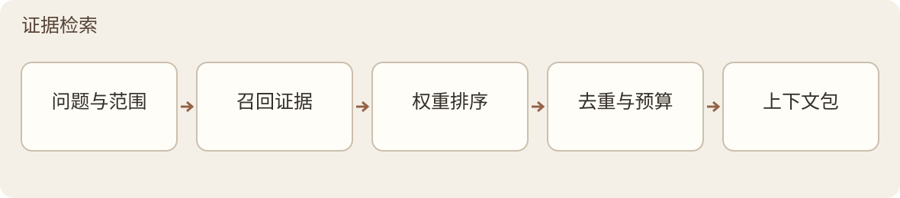

*图 4 · 证据检索 内部流程*

输入 → 输出： 问题、获准来源和权重配置 → 可追溯且受容量约束的 Context Pack。

依赖： 检索权重 提供排序分，模型服务 提供获准嵌入/重排通道，运行记录 记录。结果供 研究分析、研究机会 及日常检索使用。

检索分为问题理解、候选召回和上下文打包。先用 Card 与字段信号定位，必要时下沉原文；Card 锚点是召回线索，实际交付的证据文本来自 Chunks。打包同时控制 token 上限、来源多样性、问题分面和有质量的反例，不把固定块数当作覆盖证明。

logical_span 只在运行态组织有明确结构关系的原始成员，保留 member_chunk_ids。现有范围为同章节表格与标题/脚注、严格相邻的连续段落，不改写 chunk，也不是任意跨章节语义融合。

证据检索 记录已覆盖/缺失的问题分面；研究分析 另产 direct-answer、subquestion coverage、source-dominance 等分析指标。未知结构不猜补，参考文献只有在章节与条目形态均明确时才按普通检索规则排除；书目问题可保留。

Context Pack 汇总实际入选成员的 data_ownership，形成 effective_data_ownership、混合状态、贡献来源、摘要和解析回执等不可变快照，并沿 证据检索→研究分析→证据审核 传递。未知或冲突按权限合同停止外传。重排若启用，只能使用获准模式；结果身份集合非法时退回原距离顺序。复杂问题的检索子对话精炼仍未接入。

### M4 · 分析

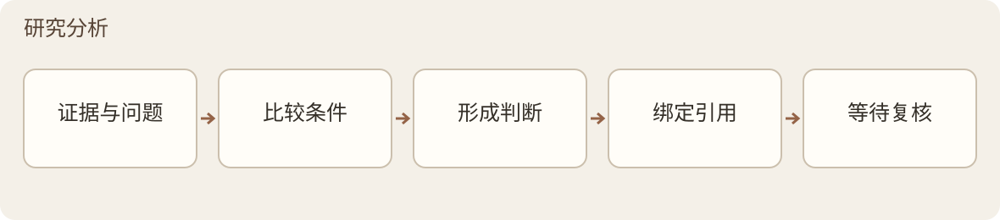

*图 5 · 研究分析 内部流程*

输入 → 输出： 问题与 Context Pack → 带引用、限制和回查位置的分析建议。

依赖： 证据检索 提供证据，模型服务 调用 analysis_primary，证据审核 校核语义支持性，运行记录 留痕。输出绑定具体 Card/Pack 父版本、权属、模型和时间。

分析固定区分四部分：文献支持内容及引用、未经本库验证的 AI 补充通识、风险与不确定性、建议回查原文的位置。覆盖不足时抑制 AI 通识补全，分别说明研究本身的局限、来源内部不一致和检索缺口。

研究分析 只作确定性来源检查：source_id 必须存在且属于本次 Pack 或其展开成员。非法项移出文献支持区并记录原因；其余合法内容保留。核心支持全部失效或继续输出会误导时阻断。证据是否充分、主张是否夸大或越界，由 证据审核 的独立 reviewer 判断。

研究分析 提供观点候选、证据排列与分析结构，不产出可直接提交的最终论文结论。审核意见交由用户处理，不反向改变 Card 的准入状态。

### M5 · 机会分析

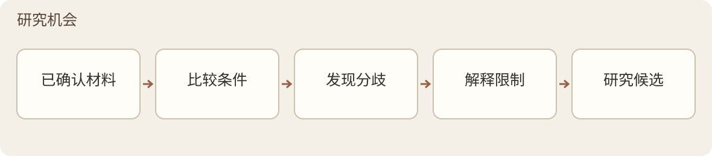

*图 6 · 研究机会 内部流程*

输入 → 输出： 已准入 Card、比较上下文和作者局限/展望 → 张力候选与有来源的研究缺口。

依赖： 证据检索/检索权重 定位主题和字段，模型服务 执行机会识别，证据审核 校核归纳，知识准入 按机会对象的独立合同管理准入，运行记录 留痕，质量评估 接收质量信号。机会归纳的审核须经相应对象适配合同接入，不直接套用 Card scope。

引擎 A 比较对象、条件、方法、指标、统计口径与时间范围，在上下文可比但结论不同处提出张力。引擎 B 只归纳作者明说的局限、空白和未来工作，保留原句与来源；没有检索到不能证明某方向无人研究。缺口可按主题聚类、统计提及次数，并标注后来文献提供的填补证据。

输出分为 A：高可比张力；B：条件或方法差异；C：表述、指标或结论类型差异；D：用户确认忽略。覆盖不足时输出 not_comparable 或 coverage_limited，不制造 A 级张力。这些类别不是 active 准入状态。

研究机会 按主题增量处理，可由定时、用户操作或受影响的反馈触发，不全库两两比较。用户决定可比性及研究价值；忽略率异常时交 质量评估 检查条件抽取和误报。

### M6 · 校核

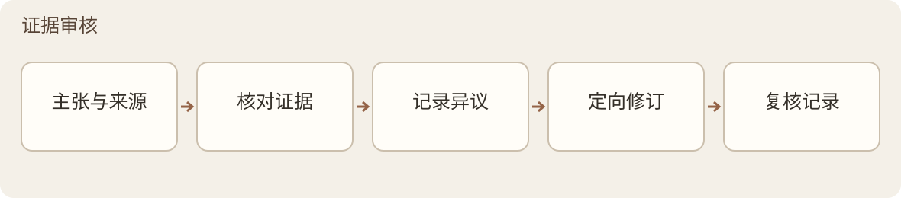

*图 7 · 证据审核 内部流程*

输入 → 输出： 已过确定性前门的 Card 或 Analysis、对应证据与审核合同 → 审核回执、问题与处置记录。

依赖： 模型服务 绑定 reviewer，运行记录 记录，质量评估 汇总质量；准入请求交 知识准入。Card 与 Analysis 分 scope，分别使用 card_reviewer_primary、analysis_reviewer_primary，且与各自生成器分属不同 model_family_id。不同供应商不自动表示模型家族独立。

Card 流程： 一次 atomic Full → 无问题则闭包；可修问题进行一次合并式 Repair → 一次 atomic Delta → 跨字段残留扫描和最终机械门。RepairPatch 只改授权路径，核验旧值 hash，非目标变化为零；Delta 只证明修改项及直接依赖，不等于重新全文通过。

审核按 atomic claim 与单篇保守事实身份展开，同一事实的已确认 occurrences 一并处置。只有精确、唯一且可分离的目标可逻辑删除；模糊相似只能提示候选，歧义转人工。保留值须有证据或降级说明，删除值进入 tombstone。完整收口为 complete，可分离省略为 passed_with_omissions，核心问题未闭合则保持失败或人工待决。

Analysis 流程： 按风险、MUST/EXEMPT 与抽样合同决定审核，跳过须留理由或待核项。reviewer 只接收主张和引用证据作定向证伪，不接收生成器推理过程。结果未知的已发送请求不能靠重启或盲目重发伪造成功。桌面有限修订及异议删除规则见第六章。

M18 提供数值关系与内部逻辑的核查结果，M6 仍负责证据对主张的支持性。原文中的矛盾被忠实抽取时，抽取忠实性与内容一致性可以得到不同结论；两种结果分别保存。

### M7 · 权重

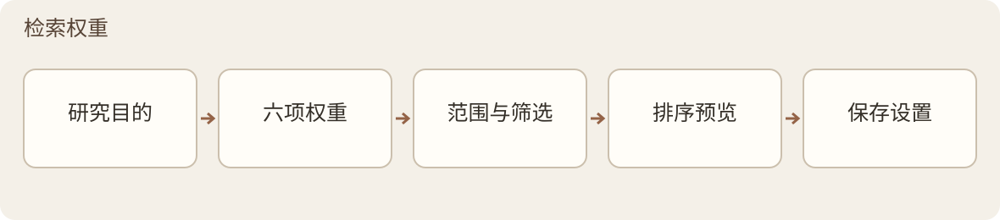

*图 8 · 检索权重 内部流程*

输入 → 输出： 资料元数据与当前问题 → 检索排序分。

依赖： 模型服务 提供字段嵌入等调用，运行记录 记录；证据检索 消费结果。衍生类型来自 知识回流，解除衍生降权须有决策依据和状态事件。

| 分组 | Provider | 含义 |
| --- | --- | --- |
| 相关性 | SimilarityWeight | 与当前问题的向量相似度 |
| 相关性 | SemanticWeight | 按问题维度计算的字段相关性与相对价值 |
| 权威/个人价值 | ManualWeight | 用户带理由设置的重要性 |
| 权威/个人价值 | RuleWeight | 年份、期刊、被引、类型等规则信号；缺失不等于低质量 |
| 权威/个人价值 | NoteWeight | 用户笔记、批注等研究痕迹 |
| 权威/个人价值 | CitationWeight | 用户研究中引用该资料的次数及用途 |

合成关系： FinalScore = 相关性组加权和 + DerivedPenalty × 权威组加权和。

系数属于可调整配置，不是全学科最优常量。SemanticWeight 在检索时按当前问题计算，以软分配保留其他字段，缺字段不造成系统性低分。Card 字段向量与 DocumentEmbed 原文向量分开生成；正常字段索引只接收 证据审核 收口、知识准入 已 active 的 Card，提前计算须使用独立隔离索引。

DerivedPenalty 只降低衍生条目的权威分，不惩罚真实相关性。跨篇综合降权最重，概念关系居中，原创批注最轻；解除须记录依据，不能靠提高 ManualWeight 偷换可信度。质量评估 以衍生条目在 top-k 中挤掉其原始依据的频率监测漂移，比例和复核日期仅作辅助指标。字段可信度和覆盖状态仍独立展示，不自动折成全局权重。

### M8 · 状态机

*图 9 · 知识准入 内部流程*

输入 → 输出： 对象、明确 scope 的变更请求与依据 → 经校验的状态迁移及事件。

Card 的 review_status 为 pending、active、quarantined。未准入对象可供审查，不得进入正常检索、张力分析或自动反馈消费。机会与知识反馈使用各自合同；Analysis 的请求构造器不能替代尚缺的通用生产状态合同。

知识准入 不负责质量判断、技术重试、业务返修或运行恢复。它生成不可变 state_transition_event，由 运行记录 追加持久化，版本与谱系 关联版本与谱系。生命周期热度、版本状态、Card 完成度和发布状态不写入 Card 三态。校验证据须回指 证据审核 回执与本次转换依据，不能仅看 active 标签。

### M9 · 模型网关与执行通道

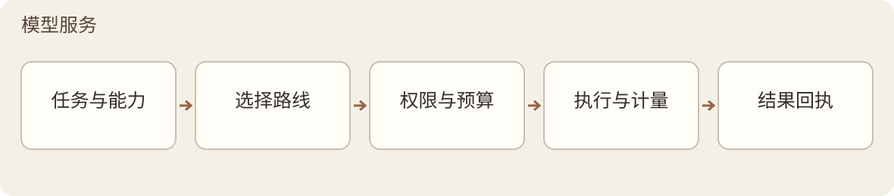

*图 10 · 模型服务 内部流程*

输入 → 输出： 逻辑角色、任务内容与约束 → 获准通道的模型结果，或明确的失败/暂不执行结果。

业务模块只依赖逻辑角色。模型服务 在 run 开始时冻结 profile 与 route snapshot，绑定供应商、模型家族、Prompt/schema、参数、执行位置、权属、区域、质量证据、预算及回滚目标。模型更换优先修改配置，不改业务职责。

主要角色包括 embedding_primary、card_distiller_primary、card_reviewer_primary、analysis_primary、analysis_reviewer_primary、opportunity_analysis_primary、change_digest_primary、ocr_page 与 reranker。Card 和 Analysis 的 reviewer 不共用含义不明的统一名称。

执行链： 角色请求 → ExecutionCore 编译工作包 → Adapter Registry 选通道 → 隔离 JobRunner → API、受控 CLI 或本地 adapter → 结果与逐 attempt 证据。

JobRunner 管进程、deadline、heartbeat、取消、恢复和工作包边界。网关处理调用级技术恢复；业务返修仍归 证据提取/证据审核。开发助手会话与运行会话隔离。Execution 已纳入七类受控 CLI adapter，但命令可运行只说明通道存在，不能代替逐角色质量资格。

配置治理。 运行可用性 UNKNOWN/AVAILABLE/DEGRADED/MISSING，与治理状态 CANDIDATE/APPROVED/ACTIVE/DEPRECATED/QUARANTINED/RETIRED 分开。质量评估 提供角色评估，用户或已批准规则作决定，模型服务 登记执行，决策记录 保存理由。质量—成本路由只从合格范围提出候选；没有可用资格时可 abstain。

身份与回退。 每次保存 requested 与 returned provider/model，正式审核遇身份不符或不可证实时按合同阻断。批次中不无痕换模；fallback 按角色定义，并保留审核家族独立、权属与区域限制。CLI 组件的实际路径和 hash 在预检与启动前核对。Embedding 切换默认新索引，兼容证明成立后才复用。

依赖故障。 短暂网络/限流问题在预算内恢复；凭据、额度、服务下线或配置问题暂停受影响环节，提示模块、依赖、原因和处理方式，不拖停无依赖功能。自动任务不意味着必须使用 API，也不允许超时后自动转付费。

区域策略。 设计要求每个 provider 绑定有效的支持地区政策与同路由出口证据，未知、过期或不匹配时不作生产放行。Integration 已加强 HTTPS 探针、显式代理同路由与发送前复核，但国家判定仍为 CN 阻断/非 CN 通过；provider-specific 支持国白名单仍是缺口。

Prompt 版本、缓存能力、档位、Thinking 与费用规则由受控配置管理。maximum 档须显式选择；可选档位不证明相应模型已经合格。权属、费用和缓存的共用约束见第五章。

### M10 · 受控知识回流

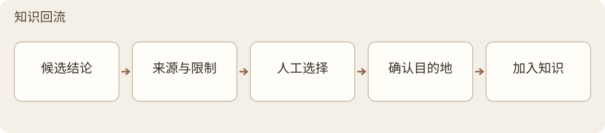

*图 11 · 知识回流 内部流程*

输入 → 输出： 用户选定的可复用内容及依据 → 带 is_derived、来源版本与理由的 pending 候选。

依赖： 知识准入 执行目标 scope 的准入，检索权重 施加衍生权重，版本与谱系 保存版本与父链，决策记录 关联决策理由，模型服务 执行获准整理任务，运行记录 留痕，质量评估 接收健康信号。

可回流的对象包括批注、判断、假设、稳定概念关系和跨文献综合。用户原始记录可自动保存，也可自动整理为候选；保存不等于正式回流。所有类型进入 active、canonical 或正常知识消费前都须用户确认，一次性问答和未经确认的 AI 草稿不能直接入池。

流程为：用户选定对象 → 形成候选、来源与理由 → 检查允许目的地和精确变更 → 用户接受/修改/拒绝/暂缓 → 必要审核与准入 → 版本保存和回执。对象绑定输入 artifact IDs/hashes 与执行配置；上游改变后重算兼容或陈旧状态。

回流准入与衍生降权分别解决“能否使用”和“排序权重多少”。已确认的总结仍是二手产物，不因人工确认而自动获得原始文献的权威。

### M11 · 日志与终态账本

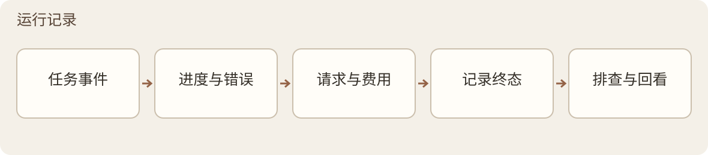

*图 12 · 运行记录 内部流程*

输入 → 输出： 各模块、网关与 runner 的事件 → 带上下文的运行日志、终态记录及查询视图。

运行记录 是被动记录层，不执行 watchdog、返修或状态判断。面向用户展示进度和错误，面向排查保存模块、对象、阶段、依赖、原因、证据位置与处置。决策记录/质量评估/研究报告 按各自目的读取，不把运维日志送入文献知识检索。

| 账本 | 保存内容 |
| --- | --- |
| Attempt Ledger | 每次实际尝试的不可变终结记录、route、结果和证据 |
| Paper Outcome Ledger | 每篇论文在每个 run 的终态及最终产物；重做另建 run |
| Publication Ledger | 发布请求、选择清单、结果及独立 receipt |

尝试成功、论文处理通过和发布成功分开。后续成功追加记录，不覆盖先前失败；订正用 Amendment 或明确后继关系。运行心跳进入事件流或运行快照，不回写已封存 attempt。

外部调用分时记录：发送前冻结请求身份、route/区域、行为 hash、权限和预算；发送后补真实返回身份、usage、费用依据、延迟及结果。旧数据不能恢复的字段记 unknown，不猜配，也不为补证自动重跑付费请求。恢复和并发写入按账本合同及实际测试范围声明。

### M12 · 设计决策日志

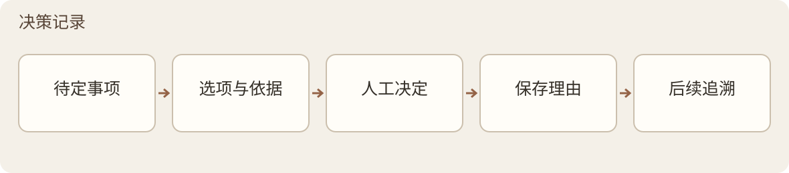

*图 13 · 决策记录 内部流程*

输入 → 输出： 一次重要选择及其背景 → 可检索、引用和版本管理的 DDL。

记录背景、主要备选、最终选择、放弃理由、影响模块、依据/反馈、状态与复查日期。运行记录 说明发生了什么，决策记录 说明为什么这样选；不把每条操作流水都变成决策日志。

适用事项包括模型准入、隔离、灰度、回滚、重嵌、OCR 准备、谱系例外、回流依据、canonical 指针移动及发布/撤回。实际事件由 运行记录/版本与谱系 记录，决策记录 引用事件并解释取舍。决策变化建立 successor，保留原决定和当时理由。

### M13 · 数据生命周期

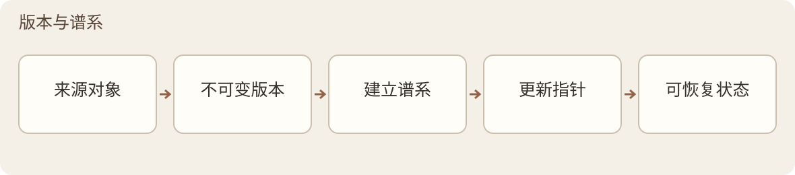

*图 14 · 版本与谱系 内部流程*

输入 → 输出： 数据对象与获准变更 → 新版本、谱系关系和生命周期记录，旧证据保留。

依赖： 各产物生产者提交版本；知识准入 拥有并执行准入，运行记录 保存事件，版本与谱系 关联不可变产物、父链、状态事件与兼容关系。Git 和备份是存储恢复基础，不替代生命周期语义。

Artifact Envelope 至少支持不可变 ID、内容 hash、类型/schema、run、route snapshot、来源范围、创建时间与多个 parent_artifacts。Registry 管这些身份和关系；查询 projection 可以重建，生产 Registry/JSONL 仍是权威。

| 生命周期 | 管理的含义 |
| --- | --- |
| Usage：Active / Cold / Archive | 使用热度与检索优先级，不隐含删除 |
| Version：Current / Superseded / History | 版本替代与历史保存 |
| derived.version_status | 派生对象的 draft / current / superseded / historical |

这些轴不替代 知识准入 的 pending/active/quarantined。业务修订不直接覆盖原件、文本、Card、反馈或决策；删除另走第七章的授权处置流程。

兼容与发布。 按精确父版本、schema 和来源范围判断 compatible/stale；缺失父链保留 lineage_unknown，不能猜配。新 Card 不会自动使旧 Analysis 获得新组合资格。发布前冻结 manifest，分别检查结构兼容、coverage、paper outcome、用户选择和成本决定；确认精确对象集并获授权后执行发布，以独立 receipt 和 Publication Ledger 留痕。canonical 移动、撤回与替代另记事件。

程序包与安装位置的变更由 M19 协调；研究数据的版本、谱系与兼容规则仍归 M13。M19 调用对应迁移机制并保存维护回执，不因软件升级移动知识准入指针或重写历史审核结论。

### M14 · 质量保证

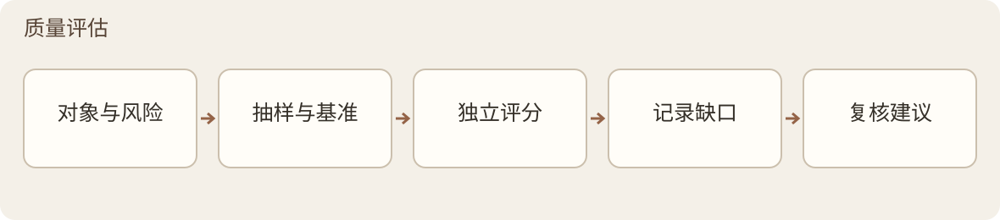

*图 15 · 质量评估 内部流程*

输入 → 输出： 活跃库、审核回执、运行和谱系记录 → 质量报告、退化告警与处置建议。

依赖： 证据审核 执行单次内容校核，文档处理 提供转换质量依据，模型服务 调用对应角色，运行记录 提供运行事实，决策记录 记录金标准和配置变更理由；接收 研究机会/知识回流 等质量信号。

质量评估 采用随机抽检、风险抽检和哨兵回归。高权重、高引用、拟用于论文或曾有审核分歧的内容优先；更换模型、Prompt 或相关规则后按对应测试包复核，不要求所有内容每次全文重审。

| 质量轴 | 检查内容 |
| --- | --- |
| literal_fidelity | 文字、数值、单位、引文是否忠于来源 |
| evidence_scope_coverage | 证据是否覆盖主张的条件、范围及比较对象 |
| cross_artifact_consistency | Card、Pack、Analysis、审核和发布物之间是否一致 |
| scientific_plausibility | 统计口径、单位、样本、时间及数量级是否合理 |
| lineage_freshness | 父产物组合是否兼容、是否陈旧 |

五轴分别记录证据和结果，不以一个总 PASS 隐藏未评估项。普通问题给限制与复核提示，核心不支持、关键谱系失效或误导性数值给机器可读阻断/人工建议；质量评估 不编辑原件、不替 知识准入 改状态，也不建立第二条生产流水线。

数值与页面角色。 直接比较前对齐 metric、unit、条件、统计类型、时间、样本和 comparator；不能对齐则标 not_directly_comparable。合理性检查只给提示，不自动纠正原始数据。OCR 区分正文、封面、目录、页眉页脚、参考文献和未知角色，不能把任意页面数字当正文事实。

哨兵与金标准。 按角色维护抽取/蒸馏、reviewer 漏判与变异、检索/嵌入及 OCR 测试。每个 revision 冻结完整 Form、Gold、scorer 和 manifest，并跨模型复用；Gold 不进入受测模型请求。订正须保留原值、来源、日期及新 revision，经 决策记录 留痕。公开 commitment 或 locator 不能替代完整考试包。

参考包按权属分轨：精确降密的 REFERENCE_EXAM_PACK 才可入 Git；PRIVATE_HOLDOUT_PACK 不入 Git；FORMAL_LOCAL_REFERENCE_PACK 可完整本地使用但整包隔离，不据此宣称盲测资格。

知识库健康度保留未审、失败、过期、断链和衍生挤占指标。原 QUALITY-ASSURANCE 的替代任务完成门没有把原 B ERROR 或 12 份五轴 not_assessed 改成质量通过。

M18 负责一次有界的数据与逻辑核查；M14 汇总其回执，评估误报、漏报、覆盖与退化。M14 的数值质量轴不另建重复生产引擎，也不将执行成功换算为科学质量通过。

### M15 · 研究变更日志

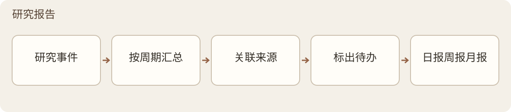

*图 16 · 研究报告 内部流程*

输入 → 输出： 一段时间内的研究事件 → 日、周、月变更报告。

从 运行记录/知识准入/版本与谱系 等来源规范化、去重并生成不可变 ResearchEvent，再由 change_digest_primary 等获准方式整理。报告保留事件来源和聚合谱系，分别表达尝试结果、论文终态、发布与配置变化。

日报关注新增、修改、待审和失败；周报关注重要进展、文献、未完成审核及潜在张力；月报关注结构变化和长期待办。研究报告 只报变化、风险与待办，不形成最终科研结论，也不改知识准入状态。

### M16 · 文献发现与研究情报雷达

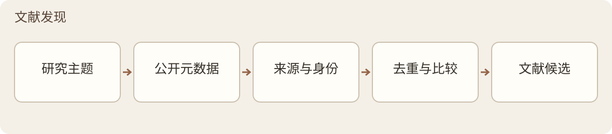

*图 17 · 文献发现 内部流程*

输入 → 输出： 主题、关键词、作者、期刊或引用链 → 有来源、有推荐理由的外部候选。

本版实际来源为 arXiv 与 Crossref；其他来源仍须独立建设。外部连接与回执由连接框架管理，需要模型判断时才调用 模型服务，不把所有书目 HTTP 请求都当作模型调用。

身份聚类仅对无冲突精确 DOI/arXiv ID/PMID 自动去重；题名、作者等弱证据或标识冲突进入 OPEN 人工复核。同一 work 的预印本、会议版、AAM、VOR 和 arXiv 版本保留为不同 manifestation。

新颖性按 publication、first-seen、library、direction 四轴记录 TRUE/FALSE/UNKNOWN。摘要级方向估计保留估计标签，UNKNOWN 不改写为 TRUE。来源 canary、Shadow 与 controlled activation 分开验证和批准。

两道人工门： 第一次批准只允许隔离 文档处理→证据提取→证据审核 生成 pending CandidateCard，不生成 Analysis；第二次批准才允许对精确集合进行正式晋升。晋升使用幂等、WAL、双锁、补偿和 receipt-last 协议；失败不得留下成功回执。离线合成测试不表示真实晋升已经发生。

### M17 · 主动知识获取

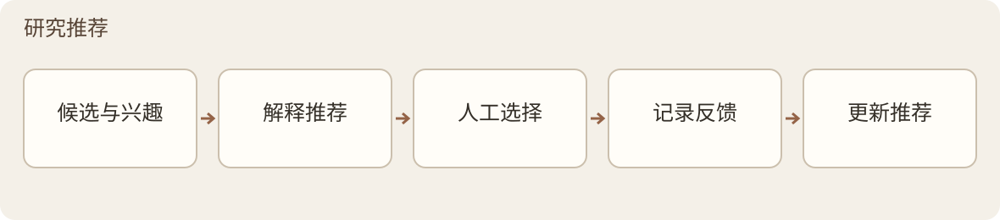

*图 18 · 研究推荐 内部流程*

输入 → 输出： 研究方向、有限候选和获准行为信号 → 有依据的推荐与待确认策略建议。

研究推荐 建立在 文献发现 之上，使用 CORE、ADJACENT、BRIDGE、HORIZON、COVERAGE_REPAIR 五通道组织有限 Slate，保留通道分量、留白和覆盖/极化信息，不制造掩盖差异的统一分数。

曝光、抑制和再出现写入 append-only ExposureLedger。抑制绑定 work_cluster_id、direction_id、direction_revision，不向相似文本、向量近邻或其他方向传播；再出现需有新依据。弱信号达到阈值只产生待人工确认、尚未应用的 policy proposal。

研究推荐 可以发现与推荐，不自动导入、赋高权重、改变策略或放行；不承担写作、文件输出或发布执行。v1.02 提供用户设定研究方向后的题录发现与相关推荐；这不等于自动晋升原始证据，也不宣称长期推荐效果已获验证。

### M18 · 数据与逻辑核查

输入 → 输出： 已装入的文献文本、表格、来源位置与核查配置 → 带原文位置、规则或模型依据、适用条件和覆盖范围的数据或逻辑核查报告。

依赖： M1 提供可回查的解析内容及质量信息；需要模型判断时经 M9 调用已选通道；M11 记录执行与用量，M13 关联报告和输入版本，M14 接收质量信号。M6 继续判断引用证据是否支持抽取或生成的主张。核查不以 Card 成功为前提，不改变当前节点调度，也不成为所有研究分析的新增必经门。

确定性检查保留原始表达，先辨明百分数、比例、单位与统计含义，再检查明确等式、范围和数值关系。换算须保留依据；不根据空条件猜分母、组别或权重，不将截断的复合等式当完整公式，也不把可取零的非负统计量一律判错。条件不足、解析歧义或不可比较时标记待核、输入问题或覆盖受限。

模型逻辑核查用于提出有原文依据的疑点，单独记录检查范围、使用的上下文与未解决关系。确定性规则结果、模型疑点和人工意见分别保存；模型怀疑不直接成为已确认错误。任务已完成、报告有疑点和科学判断成立是不同状态，未运行或未覆盖不能记为通过。

报告绑定输入、规则、Prompt 及语言版本。核查说明随本次生成的内容语言输出，文献原句、数值、单位与历史版本保持原样。重做形成后继报告；旧失败及人工解释保留。局部检查不能冒充全文核查，也不为得到满意结论无限重复生成。

M18 不自动修改原文，不判断作者意图，不以未发现异常证明研究正确，不代替 M8 执行知识准入。具体规则、材料容量和模型资格以现行实现及核查合同为准；模块登记不增加覆盖范围或调用授权。

### M19 · 应用更新与维护

输入 → 输出： 当前安装身份、目标版本清单、完整包或增量包及用户操作 → 更新检查结果、经校验的安装状态与可追溯维护记录。

依赖： 应用层提供版本入口和用户操作，同一安装引擎与独立助手负责程序维护；M13 提供研究数据兼容与迁移规则，M11 保存事实记录，M14 提供对应版本的验证证据。M19 属于桌面维护层，不加入文献处理主线，也不执行模型调用或上传研究资料。

版本检查、下载与应用更新分开。自动检查只获取正式版本信息；检查失败不能显示为已是最新版。用户确认版本、说明和大小后下载。差分绑定准确旧包，组装结果必须与目标完整包一致；合法基线不匹配时可经确认改用完整包，签名、来源或身份校验失败则停止。

下载校验后选择“退出后更新”，启动原生助手，再正常退出当前实例。助手等待该实例完成任务、保存并退出后继续；它不强杀应用，也不承诺自动重启。完成后重新打开，核对程序版本、资料位置与既有设置。原 v1.01 的首次接入使用目标版本同批的更新助手，不以先卸载为前提。

程序、配置与研究资料分别处理。切换前保留恢复条件，失败按事务状态处理；新版开放写入后，不自动拿旧备份覆盖新数据，也不将新数据库任意交给旧程序。更新事务的中断、恢复与结果追加留痕，程序更新不重写历史研究判断。

安装、更新、依赖提示与错误说明使用统一中英日资源。新配置可继承安装语言，已有配置保持；更新助手继承准确实例的语言，临时显示切换不覆盖内容语言。首次安装、旧版升级、增量更新及恢复分别验证；安装成功或包校验成功不等于全部功能合格。源码、文档、完整包、差分和签名须绑定同一交付身份，公开发布另按发布决定执行。

## 五、共用规则

### 5.1 状态必须带对象和作用域

| 状态对象 | 状态或证据 | 所有者/解释 |
| --- | --- | --- |
| 能力设计 | proposed / approved / superseded | 设计批准状态 |
| 能力实现 | not_started / partial / implemented | 代码或契约是否存在 |
| 能力验证 | untested / tested / qualified | 仅对对应证据范围成立 |
| 能力部署 | disabled / pilot / active / retired | 允许的实际使用范围 |
| 任务运行 | frozen / running / completed / aborted / invalidated | runner 管理运行生命周期 |
| 任务验收 | PASS / FAIL / NOT_ASSESSED | 与运行、机器 verification_result 分开 |
| Card 准入 | pending / active / quarantined | 知识准入 按 scope 和依据执行 |
| Card 完成度 | pending_review / complete / passed_with_omissions | 审核处置闭包，不是抽取覆盖 |
| Card 质量 | schema、抽取覆盖、字段可信、校验证据分别记录 | validation_evidence 从 证据审核/知识准入 依据派生，不另造持久化 validation_status |
| 发布 | not_requested / not_published / published / publication_failed | 运行记录/版本与谱系 保存独立发布事实 |

模型 profile 的可用性/治理轴见 模型服务，数据使用/版本轴见 版本与谱系。名称相近不代表同一事实；任何展示或统计都不能只用一个未命名的 active 或 completed 代替这些状态。

### 5.2 数据处置权贯穿全链

数据归属与敏感度是不同属性。当前 Card 使用 self / entrusted；自有内容按获准配置使用，受托、无权处置或权属未知的数据默认本地处理，缺本地能力时停止相应调用。额外授权使用可审计的 policy/decision 记录，不自行增加 schema 枚举。

凡把数据交给模型，包括 OCR、嵌入、蒸馏、分析、审核、缓存和受控 CLI，都先检查权属。OCR 在编码、上传前检查；Context Pack 聚合与下游传递不得丢失约束。通道在本机启动、使用本地端口或改走另一供应商，都不能代替无外传证明。

会话采集、模型精炼/外传、正式入池分别授权。诊断只使用获准探测材料，不能拿受托数据测试外部能力。凭据由受控凭据存储管理，配置只保存引用，日志和导出不含明文 key/token、cookie 或 browser-storage 值。

### 5.3 部分输出与失败

普通且可分离的问题允许降级、省略、needs_review 或 tombstone，保留可用部分并列出缺口；核心证据失败、核心处置未闭合、关键谱系不兼容或输出将误导时才阻断。质量判断由对应所有者形成，状态变更由已实现的 知识准入 scope 执行。技术重试、语义返修和新 run 的责任及预算不能互相替代。

### 5.4 执行分类与成本证据

一次调用分别记录 process_transport、inference_location、access_mode、billing_mode。API 经 CLI 发出仍是 API；本机进程不代表本地推理。满足 subscription_session 与 subscription_entitlement 的逐调用费用适用性可为 N/A，本地计算另记资源消耗。

费用适用性、金额是否已知和金额来源是不同字段。订阅 CLI 的本轮货币金额不可得时可以是 UNKNOWN，不与适用性 N/A 冲突；两者都不能填成 0 或免费。API 使用对应有效日期价格，actual_cost、估算与缺价分开，失败和重试仍记账。

桌面当前费用视图按 run/stage/physical attempt 去重，仅覆盖当前 profile 的已接入回执，按币种区分 ACTUAL、ESTIMATED、UNKNOWN、CONFLICT，不是完整账户账单。后端新增字段不自动表示前端已展示。

usage 保留缓存命中/未命中输入、总输出、reasoning、可见输出与完整延迟。reasoning 是 output 子集，不能再相加；可拆分时 visible output = output − reasoning，缺失保持未知。会话累计 usage 须按同一精确 session 与上次依据逐字段差分，累计倒退或不一致不作为已核验本次用量。

### 5.5 输入缓存与会话续接

缓存不复用审核结论。 稳定规则及同篇获准来源前置，动态任务和精确修复目标后置，使供应商有机会复用输入计算；每项任务仍发新请求，生成新输出并执行原 schema、来源和审核检查。桌面这一路不是复用 Core 的旧答案缓存。

缓存能力按 API、模型和真实通道识别。未知能力保持 UNKNOWN，不发送未确认支持的厂商参数。修复只整理本来获准的候选来源，不能为凑命中而把全文塞入短修复，也不能扩大目标允许引用的范围。

已验证 Codex 路线使用 exec 创建会话、resume 指定 exact UUID，禁用 --last。角色、模型/profile、来源、service、workspace、传输 schema 和实现 revision 参与身份绑定；每次仍独立核验业务 schema、UUID、usage 与回执。应用空闲复用期限不等于服务端 TTL。到期、先前失败、未完成或身份不明时按合同冷请求、新建隔离 scope 或阻断；并发锁冲突和损坏记录不能混用旧会话。

本轮实测限于 DeepSeek API 与 Codex CLI。C59–C65 的共享代码和证据已正式化并推送，但未据此重打包、部署或完成 Desktop。成本比较须保留原费用、墙钟、工作量和输出量；定价反事实不等于代码因果收益，不能保证全部命中或普遍提速。

## 六、桌面应用与交互

### 6.1 应用层

Windows 主栈采用 pywebview + PyInstaller + Edge WebView2，承接 Python ApplicationFacade。设计基线记录 pywebview 6.2.1、PyInstaller 6.22.2；具体构建以其冻结依赖清单为准。Electron 仅是需后续证据与设计决策记录触发的条件备选。

调用关系： HTML/CSS/JS → IPC command/event → Application Service → ApplicationFacade → 业务模块。Control Store 保存作业、视图和恢复所需状态，断连或重启后重建投影。UI 不直接写模块状态；资料库读取 canonical 来源、产物和谱系，不复制成第二套知识权威。

页面以已采用的 HTML 为视觉基线，保留移植映射，在相同 WebView2、viewport、DPI、theme、font 与 fixture 下核对截图、样式、布局和交互。FakeFacade 只作视觉流程验证，真实保存状态和后端调用另验；普通启动不以示例数据冒充用户资料。

### 6.2 主要界面

| 界面 | 核心行为与边界 |
| --- | --- |
| 设置 | 三种界面语言、模型档位、Thinking、凭据引用和能力状态；先验证再原子应用，失败恢复旧值 |
| 收件箱/当前任务 | 管理 intake、去重、冲突、dispatch 和节点；按合同暂停、取消、恢复、重试或覆盖配置 |
| 消息/工作日志 | 区分 read 与 acknowledged；用稳定 locator 跳转任务、节点和产物；报告保留事件谱系 |
| 资料库/会话库 | 读取来源和输出投影；历史采集与知识入池分权，来源类型明确 |
| 模型考试/费用 | 展示具体 role、Form、版本和时间的资格；费用按证据类型展示，不冒充完整账单 |
| 文献发现/研究报告 | 继承 文献发现/研究推荐 双门与 研究报告 只报变化边界，不因页面存在而推定功能全开 |

界面分别展示运行、论文结果、发布、结构、审核依据、字段可信、覆盖与谱系。passed_with_omissions 展示可用产物和具体删除原因；未审核、未知谱系和陈旧组合明确提示。技术重试与业务返修分别计数。

CapabilityState 的 availability 为 ready/disabled/not_configured/not_applicable/blocked，qualification 为 qualified/not_qualified/not_assessed，effective_enabled 为独立布尔值。required 不可用时阻断，optional 不可用时列出降级。

普通、高级、开发者模式不改变数据和生产权限。Safe Mode 回到只读 official_core，不加载自定义代码、不合并覆盖层，用户数据只读、生产 writer 关闭。doctor/support 提供诊断与公开安全导出，不隐含修复或启用授权。

### 6.3 桌面九节点执行图

| 节点 | 职责 | 关键依赖 |
| --- | --- | --- |
| 01 DOCUMENT_INGEST | 文档处理 | 文档处理 转换、清洗、切块及来源 |
| 02 CHUNK_EMBEDDING | 原文向量化 | 固定本次向量空间 |
| 03 CARD_DISTILL | 生成卡片 | 证据提取 与本地硬门 |
| 04 CARD_CROSS_CHECK | 核对卡片 | 按冻结审核合同触发 |
| 05 CARD_ADMISSION | 卡片准入 | 知识准入 依据与 scope |
| 06 CONTEXT_PACK | 整理分析材料 | 检索空间来自 02，容量预算来自 07 |
| 07 ANALYSIS | 生成分析 | 研究分析 与本次 Pack |
| 08 JUDGMENT_CROSS_CHECK | 核对分析 | 独立审核或明确的跳过依据 |
| 09 HUMAN_FINAL | 人工判断 | 呈现证据、异议及遗漏 |

06 不是新增的第十个 reranker 节点。设置层将 embedding/reranker 分开，不表示 runtime 已启用后者；当前桌面 bridge.rerank 禁用并退回距离序，OCR adapter 也没有因其他模块的资格而自动接通。长任务按能力设置预算，使用 spool/resume、心跳和流式 IPC，仍保留取消、费用与重试上限。

### 6.4 桌面审核维护的限定流程

Card：蒸馏 → 初审 → 一次问题项修复 → 仅变更项 Delta 复审 → 必要时留痕逻辑移除 → 按既有依据准入。passed_with_omissions 是带遗漏的可用结果，不应误判为整卡失败。

Analysis：生成 → 代表性独立审核 → 一次 exact-target 修订 → 独立 Delta → 通过或受限逻辑剔除 → HumanReview。未改 claim hash 保持；只有真实 Delta 后仍有异议的独立判断才有剔除资格，审核缺失、过期或 deferred 不算。至少保留一项文献支持，且不删除某个已有 facet 的最后支持，否则阻断。原文、修订、来源、异议、谱系和 tombstone 一并保留。

### 6.5 会话采集、精炼与内置文档

会话库使用 PREFLIGHT 核验身份与授权，FULL 保存历史，INCREMENTAL 从成功游标更新；保留 immutable snapshot、conversation graph、last-complete、lineage 与 heartbeat。持续有进度的长任务不能仅因创建时间较早就被判定失活。

用户显式选择 Edge、Chrome 或 Brave，并记录浏览器、扩展版本/目录和 session identity。只读采集限于获准的官方导出/API、现有登录态可见 UI 或 exact local CLI root；不读取 cookie/storage 值，不独立登录或处理 2FA，不调用隐藏接口。浏览器未安装按环境缺失报告。

采集后执行同文件去重、全量或增量精炼，形成 11 类 refinement 候选及 5 类受控目的地选择。用户可 ACCEPT、EDIT、REJECT、DEFER；采集授权不自动授权外传或入池。对话内容不是文献事实来源，进入知识池仍须相应目的地合同与审核。

内置文档提供中英日离线使用指南、设计说明与声明，应用按所选语言打开对应资源。阅读或替换本地帮助不代表数据准入或发布批准。

### 6.6 原生交互、榜单与安装入口

原生窗口、菜单、2D 桌面助手、状态动画和单 EXE 分项验证；局部窗口修复不能扩展为全部跨屏、Snap、DPI 或退出行为已通过。

Console 优先处理事件，对重型 snapshot 节流并有界退避，活动业务期间减少重投影。关闭依次等待 UI 请求、IPC/Console 回执、清理和进程退出；连接标签或单次 HTTP timeout 不替代真实退出证据。

外部模型排行榜仅供参考，不代替 Memorive 角色考试。数据源与版本须可定位，并保持 strict TLS。fresh isolated data directory 无缓存且关闭刷新时显示 NO_DATA_IN_ISOLATED_TEST；请求失败才是 FETCH_FAILED，旧投影才是 STALE_PROJECTION。正常在线来源链、数据新鲜度和 Console 连接分别验证。

安装器的浏览器回调须验证 source/navigation 后调度原生文件夹对话框，不能在不安全回调或错误线程中直接操作。作者机交互通过不替代用户笔记本或清洁 Windows 环境的测试。

## 七、存储、隐私与维护

### 原件、配置和索引分别保存

程序目录保存应用；用户选择的数据目录保存资料、会话、状态和生成产物。原件、可读文本、卡片、分析及其来源版本是需要保留的资产；检索索引是为它们提供查询的派生数据。修改和重建索引不应静默覆盖原始资料。备份时同时保留内容与版本关系，并在需要恢复前确认备份可读。

### 模型请求与凭据

API、CLI 和本地服务由用户配置。外部请求可能发送问题及选入的证据片段，应在使用前确认所选服务和资料范围。配置保存凭据引用，凭据值交由本机凭据存储管理；普通日志、文档和导出不应包含 Key、登录令牌或浏览器 Cookie。导入以前的设置时保留有效的本机引用，不自动复制或导出秘密。

### 更新与卸载

安装器在系统检查中提示缺少的组件，并分别管理程序位置和数据位置。卸载应用默认保留用户数据。版本更新应保留可恢复状态；已执行的任务保留当时的来源和模型配置，不能因为更新而改写旧的审核结论。

## 八、可用范围与扩展设计

文献处理、直接附件问答、引用回查、会话精炼、模型连接、模型排行榜及计费用量构成桌面工作台的主要入口。v1.02 的题录发现与相关推荐按用户启用的方向和接收设置工作；原始证据准入与更广的主动策略仍有独立条件。

OCR、重排和审核的实际路径取决于适配器与模型能力。设置中出现某项配置，不等于每种文件或执行路线都已验证。浏览器采集也只能说明当前来源和实际采集范围；必须分别显示完整、部分和失败，不能把一次成功外推到全部历史会话。

质量抽检、真实历史迁移和长期推荐效果有各自的验证范围。运行记录、局部检查和完整安装验收分别留档。v1.01 已有独立发布记录；本文为 v1.02 发布前修订，最终源码、包与更新索引仍须绑定同一交付身份。

## 九、v1.02 的研究流程与更新维护

### 主张、来源与回答版本 · M3、M4、M6、M10、M13

引用可定位与主张受到支持分开记录。支持性检查说明支持、部分支持、缺项或冲突，证据覆盖说明实际检查到哪里；二者不自动批准知识。问答、课题背景和知识确认关联到明确的回答版本、来源及条件，后续建议追加记录，不覆写旧判断。

风格属于生成配置的快照。普通重试沿用原回答风格，形成新的回答分支；被替换回答之后的旧分支保留但不混入新上下文。复制、版本选择和草稿恢复不产生模型调用。30 天未打开或超过 100 条保存消息的归档只改变生命周期状态，置顶、忙碌及多窗口保护保持；访问水位和手动恢复宽限属于持久数据，不能当作缓存删除。列表分页先读取元数据，正文按需加载。

### 文献发现、解析与真实进度 · M1、M11、M16、M17、M18

首页向用户提供最新与相关两类明确入口，复用同一方向、去重、批次记录和消息机制。按用户接收设置进入资料库的是题录及链接，全文由用户补充；这与正文处理、证据准入的人工边界分开。推荐理由不替代科学质量审阅。

解析输出保留段落、表格、上下标、页行锚点与版本身份。确定性数值检查和模型逻辑分析保留各自输入、适用条件及报告，主线与旁支分别记录状态。真实进度来源于节点事件及可计量工作，不根据等待时长虚构百分比。OCR、语义判断与跨文献归属仍可能失败，来源可追溯并不保证内容正确。

### 执行通道与语言 · M9 与应用层

自定义 CLI 把可执行入口、参数、输入输出规则和模型映射交给统一消费者，保留进程退出、取消和费用未知状态。它不将所有交互 CLI 自动变成兼容工具。AI 近况与个人研究报告采用不同的资料范围和生成入口；语言在任务开始时绑定到生成及缓存，文献原文和历史版本保持不变。

### 版本更新与资料保护 · M19、M13 与应用层

v1.02 的版本边界包含检查更新与增量升级。M19 协调应用发现、下载与“退出后更新”；同一独立助手等待当前实例正常退出，再复用安装引擎组装新版本槽位。差分绑定准确旧包，目标与完整包逐文件一致；合法基线不匹配时可使用完整包，签名或身份失败则停止。程序更新不等于重新导入研究库。

安装、更新、维护及卸载采用统一的中英日资源，原生依赖向导也可选语言。新配置可继承安装语言，已有配置保持；更新助手使用准确实例的语言。维护阶段等待任务与写入完成，再备份、迁移和验证。激活前失败可以恢复；新版开放写入后，不能自动用旧备份覆盖新内容。正式发行须将源码、资源、完整包、差分包与签名绑定，文档不能代替发行验收。

## 十、模型排行榜与公开来源

排行榜用于外部选型参考，展示模型、供应商、能力指标、输入与输出价格、币种、来源日期和刷新状态。排序、筛选和收藏应保留当前筛选条件，并在来源不可用时显示失败状态，不把空结果解释为模型不存在。公开榜单只描述其覆盖的任务与时间范围，不能证明某个模型适合当前研究任务。[R1][R2]

LiveBench 是能力数据的公开基准来源；其主项目公开评测任务与结果，new-livebench 展示分发布日期的数据表、细分任务和成本与质量的比较。Memorive 借鉴了分维度比较、版本日期和来源可追溯的呈现方式；价格目录另从实际服务目录取得，不能把公开目录价写成个人实扣。此处是数据来源与信息架构参考，不宣称复制 LiveBench 的代码、算法或分数。[R1][R2]

| 设计项 | Memorive 呈现 | 核对边界 |
| --- | --- | --- |
| 能力 | 标明基准、分数与日期 | 不同基准不可直接混排 |
| 价格 | 输入/输出每百万 token 与币种 | 公开参考，不是本次账单 |
| 状态 | 刷新时间、来源失败与缺项 | 保留未知，不填零 |

## 十一、会话管理与网页来源

会话管理采用来源筛选、搜索、分页或显示条数、详情阅读与精炼入口。Codex、Claude Code、本机文件导入和浏览器来源需保留来源身份、同步时间、首尾消息与只读边界。浏览器当前页录入、首次全量采集和后续增量采集要区分范围与完成状态；会话精炼输出作为新任务与成品版本保存，不覆盖源会话。

该入口的信息架构与交互参考 CC Switch 的 Session Manager：统一浏览跨工具会话、搜索、详情和恢复路径。Memorive 的差异是把会话接入研究资料流，提供精炼任务、资料库成品与人工复核。现有详细设计曾明确标注该参考关系；本文件继续在公开设计层面标注，不表示会话数据互通或代码复制。[R3][R4]

## 十二、计费与用量底部面板

底部「计费与用量」面板是可开合的统计区域。工具栏选择全部记录或可归属的本任务、近 7 天／近 30 天／本月、模型与刷新；主体在费用（含估算）、请求次数和 Tokens 之间切换，图表跟随筛选变化。若本任务归属未完整，该选项保持不可用，不能把全局费用冒充单一文献费用。费用分列实际与估算，请求次数包括失败与重试，Tokens 分列输入和输出。缺失证据保留未知。

信息组织参考 CC Switch 的 Usage Statistics 文档：按来源区别 API 请求与 CLI 日志，分列 token、缓存命中和估算费用，并提供筛选与请求记录。Memorive 的底部面板是自己的筛选和图表视图；需要单次明细时进入模型与计费的计费列表。研究问答回答下方的单次用量回执则是另一个视图。此引用不表示复制 CC Switch 的代理拦截或全部统计能力。[R5]

| 字段 | 显示规则 | 不能推断 |
| --- | --- | --- |
| 统计范围 | 全部记录与本任务分开；不完整时禁用 | 全局数不能当作单任务数 |
| 费用与用量 | 实际/估算分列；请求含失败重试；输入/输出分列 | 未知不是零，估算不是实扣 |
| 来源通道 | API、CLI、本地分别标识 | 通道成功不代表任务质量 |

## 十三、参考项目与使用边界

以下是经过核对的公开 GitHub 参考。引用说明借鉴或数据来源的具体范围；Memorive 的现有实现、历史来源和软件许可仍需各自证据，不因列出项目而自动成立。

| 标记 | 项目与位置 | 本文件引用范围 |
| --- | --- | --- |
| R1 | [LiveBench/LiveBench](https://github.com/LiveBench/LiveBench) | 公开基准与任务结果来源 |
| R2 | [LiveBench/new-livebench](https://github.com/LiveBench/new-livebench) | 发布日期、细项和成本比较的展示参考 |
| R3 | [farion1231/cc-switch](https://github.com/farion1231/cc-switch) | 跨工具会话管理的信息架构参考 |
| R4 | [CC Switch Session Manager](https://github.com/farion1231/cc-switch/blob/main/session-manager.md) | 会话入口、列表与详情的设计参考 |
| R5 | [CC Switch Usage Statistics](https://github.com/farion1231/cc-switch/blob/main/docs/user-manual/en/4-proxy/4.4-usage.md) | 用量字段、缓存与费用估算的呈现参考 |
