# Memorive 使用指南

这份指南陪你从第一篇资料走到可回查的研究判断。你可以按顺序完成初次设置，也可以直接跳到正在处理的功能。截图来自空白界面或合成测试；其中的回答和文件名只用于演示操作。实际列表、价格与连接状态，以你当前的资料和配置为准。

## 01 先认识界面与研究资料的去向

先看左侧导航，就能找到一篇资料的去向：它从收件箱进入任务队列，处理结果出现在资料库；之后，你可以带着这些资料进入研究问答。设置负责模型与检索，消息和工作日志帮助你回看过程。顶部按钮可收起侧栏、右侧资料栏和底部面板。

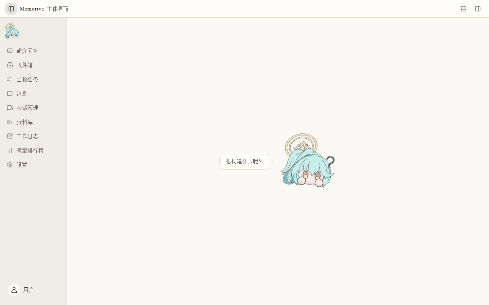

### 第一次打开时

1. 先到「设置 → 文档与外部查看」核对默认工作区和生成产物目录，并记下实际位置。安装目录、资料目录和应用状态目录承担不同职责。
2. 按实际可用的通道设置 API、CLI 或本地模型，再在「当前流程模型映射」选择节点模型。只需配置准备使用的通道。
3. 用一篇内容熟悉的文献试跑：收件箱导入、当前任务看节点、资料库打开 Card 与 Analysis、回原文核对。
4. 开始研究问答前，先确认项目、对话、附件、检索范围和模型。不要把能发送消息当成已完成证据核对。

### 完成标志与常见误解

能打开页面只表示界面运行；模型验证成功说明该通道可调用；节点能力检查回答它是否适合相应工作；一次任务完成还需要人工核对。空列表先确认是否确有资料或任务，不要把空状态直接当成数据丢失。

## 02 模型服务与 API：三种常见配置方式

外部模型从「设置 → 模型服务与 API」接入。无论使用服务商官方接口、兼容接口还是中转服务，都应把协议、地址、模型 ID 和凭据配成同一条可用路线。显示名只是便于自己辨认；真正发给服务的是模型 ID。

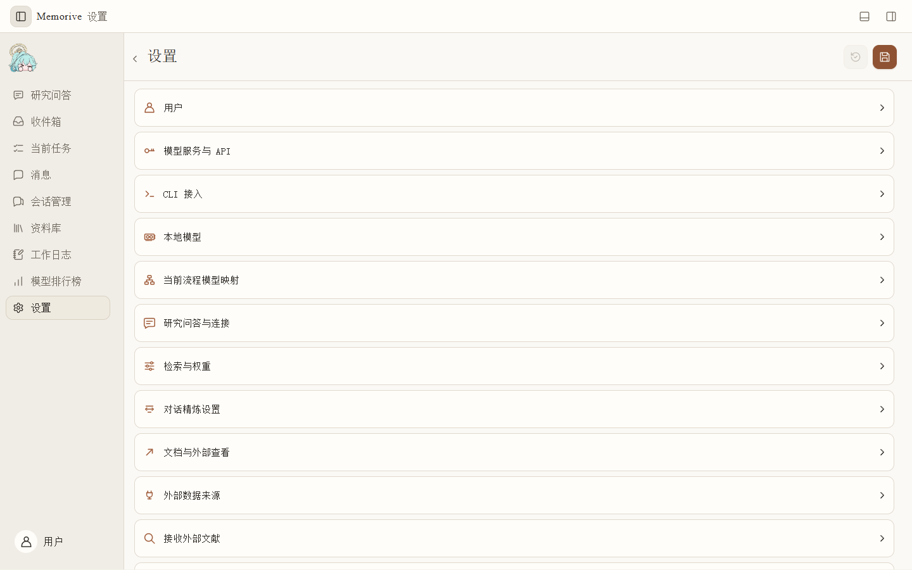

### 按通道配置

1. **官方接口**：选实际服务商，填写它公布的模型 ID；在专用凭据字段填 API Key，按页面提示「安全保存」。不需要自行补一个兼容地址。
2. **OpenAI 兼容接口**：选兼容格式，填写服务给出的 HTTPS 地址、模型 ID 和 Key。服务地址、路径、模型列表与权限必须属于同一个提供方。
3. **中转服务**：按中转方给出的兼容协议填写地址与凭据；明确它展示的是中转价格、还是上游官方价格。不要把中转显示名当成原厂身份。
4. 日常选择先用普通模式的经济、标准、高质量等档位；需要精确指定模型、接口或思考方式时进入高级配置。档位不是能力保证。
5. 保存配置后运行当前模型的连接验证，再到流程映射把它放到相应节点。最后用小任务核对节点实际记录的模型和通道。

### 如果保存了仍不可用

依次查凭据是否提交、地址与接口格式是否匹配、模型 ID 是否存在、账号是否有该模型权限，以及网络或代理。保存成功、列表出现、连接验证通过是三个不同状态；不要反复改动无关的其他通道。

### 字段核对示例

以一个 OpenAI 兼容服务为例：显示名可写成自己认识的服务名称；接口格式选择该服务宣称兼容的协议；地址用它明确给出的 HTTPS 根地址；模型 ID 使用它的模型列表原值；Key 存入凭据栏。保存后先对该模型发起连接验证，再在需要的节点选它。若验证报 401/403，优先查 Key 和权限；404 优先查路径与模型 ID；连接超时查网络与代理；回答格式异常查接口协议。错误码只是定位线索，仍要以该服务的具体回执为准。

### 凭据与计费的检查点

不要把 Key 写进文档、截图、网页导出或普通日志。对同名模型的官方、兼容和中转路线分别标识；费用要看实际发起调用的路线。验证可能产生真实请求，执行前确认所选通道和模型。

## 03 CLI 接入：使用本机已安装的工具

如果你已在本机安装并登录某个 CLI 工具，可以让 Memo 使用这条执行路线。工具仍由它自己负责安装、登录、升级和订阅资格；Memo 负责识别通道，并把可用模型分配给任务节点。订阅费用通常不能直接换算成单次调用价格。

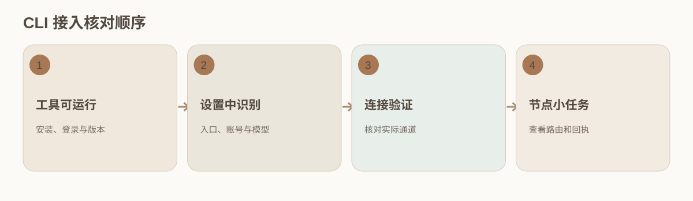

### 连接步骤

1. 在工具自己的终端确认可执行命令能启动、账号已登录且所需模型可用。先记录工具版本和实际命令入口。
2. 到「设置 → CLI 接入」选择该工具，检查可执行入口、账号连接状态、模型配置和页面给出的异常。
3. 保存后运行该 CLI 通道的连接验证。API 通道成功不证明 CLI 已连通；不同 CLI 也应分别验证。
4. 在「当前流程模型映射」给允许使用 CLI 的节点选模型。对于生成与审核，分别确认角色、模型身份和能力。
5. 用一项小任务查看节点详情中的实际路由、开始时间、错误及重试。若验证通过而任务失败，优先看该节点的回执，不直接重装工具。

### 费用与边界

CLI 没有逐次单价时，计费显示应为未知而非零。切换账号、模型或工具版本后重新验证；旧任务的模型记录和费用口径保留其当时状态。

## 04 本地模型连接：服务、协议与能力

连接本地模型前，先在运行它的软件中启动服务，再让 Memo 检测。当前本地入口使用 `127.0.0.1` 或 `::1`。出现在模型列表中只说明它已被发现；聊天、图像识别、向量化和审核还要分别验证。

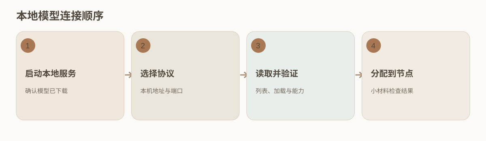

### 连接步骤

1. 在 Ollama 或其他本地服务软件中确认服务正在运行，所需模型已经下载并能从该软件调用。
2. 到「设置 → 本地模型」先选择自动检测；没有发现时手动填显示名、服务类型和本机地址。
3. 按实际服务选择 Ollama 原生协议或 OpenAI 兼容协议；llama.cpp 按界面提供的兼容预设填写。
4. 读取模型列表并验证。若列表空白，先检查服务进程和端口；若列表有模型而测试失败，检查协议、能力和模型加载状态。
5. 在研究问答设置或流程模型映射中分配经过验证的模型。向量模型与聊天模型的用途不同，更换向量模型可能需要重建旧索引。

### 判断是否真正可用

用一段不含私密资料的小材料做对应能力检查；观察结果是否符合节点任务。无供应商 API 费不等于无显存、电力和时间成本。不要将本地通道连通证据外推为所有节点已通过。

## 05 当前流程模型映射与模型验证

流程映射决定新任务的每个节点由哪条模型通道执行。向量化、Card 抽取、Analysis 和审核各有不同要求；日报、周报、月报也有各自的模型设置。修改模板会影响之后启动的任务，已运行节点仍保留当时的配置与记录。

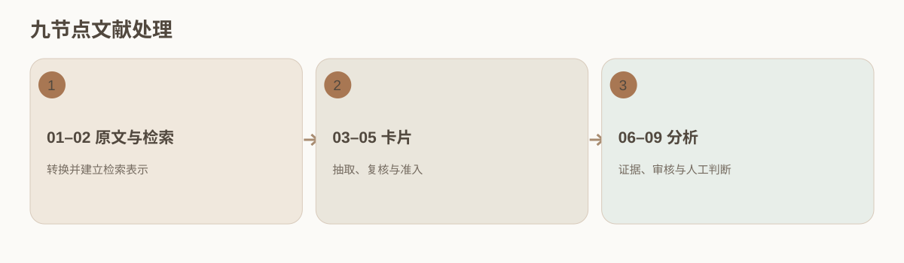

### 配置与检查

1. 打开「设置 → 当前流程模型映射」，先选文献处理或需要的报告周期，再逐个点开节点。
2. 向量化选合适的检索模型；Card 生成选忠实抽取能力；Analysis 选能够接收所需证据长度的模型；审核选能对照证据独立检查的模型。
3. 查看节点是否启用、重试规则和可用提示。关闭 04 或 08 等可选审核会减少检查覆盖，跳过不等于审核通过。
4. 保存后重新打开映射核对。为新文献建立小任务，在节点详情看实际模型、通道、输入输出和失败原因。
5. 连接验证回答“能否调用”；节点考试回答“是否适合做这一类工作”；公开排行榜只提供外部选型线索。三者不能互相替代。

### 本次任务需要例外时

允许在当前任务检查器中替换或重试的设置只作用于该次任务。想让以后所有文献使用新模型，应改流程模板并检查新任务。向量空间变化可能要求重建索引，不能仅替换模型名。

### 为生成与审核分配角色

一套可检查的配置是：02 负责把资料建成检索表示，03 只抽取能在原文定位的 Card 字段，04 对照原文找遗漏或误读，07 根据受控证据生成 Analysis，08 检查引文是否真的支撑判断。04 与 08 即使使用同一模型系列，也要看独立角色和实际输入；不能把生成模型第二次写出的相似答案当成审核。节点不需要的能力不应因为模型排名高就默认打开。

映射修改后做三次核对：设置页显示的模板、收件箱的可执行提示、新任务节点记录的模型 ID 与通道。三者不一致时，以新任务真实执行记录定位哪个环节没有生效，勿倒改旧任务。

## 06 收件箱：导入、预览、排队和自动执行

收件箱是资料进入 Memo 的第一站。你可以先检查文件和预览，再决定何时处理。文件出现在队列里，还不表示正文已转换或 Card 已生成。第一次尝试，建议选一篇结构清楚、自己熟悉的文献。

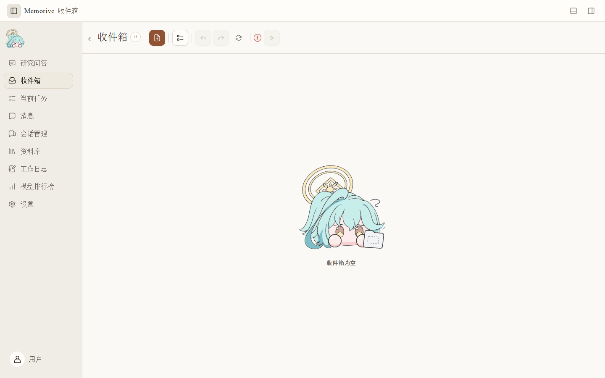

### 从一篇资料开始

1. 点击添加文件或拖入页面；确认文件名、类型、页数与预览。PDF、Office、图片能否完整分析，仍需看相应转换结果。
2. 检查是否重复或导错文件。需要调整顺序时在队列中整理；批量移除前先核对选择范围。
3. 看自动执行开关和不可用提示。关闭时文件可留在队列；开启前确认流程模型映射已保存且关键节点可用。
4. 开启自动执行后到「当前任务」看是否已派发。不要只凭收件箱卡片消失判断任务成功。
5. 若卡片异常，先打开详情读错误，再决定撤销、重试或换源文件。保留原文件和错误记录，便于追溯。

### 进入下一步的判断

收件箱有文件但没有任务时，检查自动执行、模型映射与提示；已有任务但长期不前进时，从当前任务的具体节点定位，不盲目重导整批。

## 07 当前任务：九节点、状态和定向重试

任务列表告诉你处理进行到哪里；点开节点，才能看到这次运行实际用了什么输入和模型。九个节点依次是：01 文档处理、02 向量化、03 生成卡片、04 核对卡片、05 卡片准入、06 整理分析材料、07 分析、08 核对分析、09 人工判断。

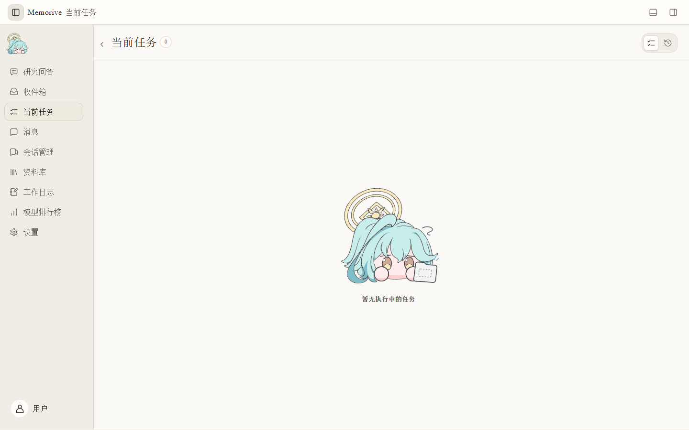

### 逐节点核对

1. 在「当前任务」选文献，先核对任务名称、来源文件、时间及当前整体状态，再找最早异常的节点。
2. 点开节点查看输入、输出、模型、通道、重试与错误。绿色表示步骤完成，仍需看成品；黄色和红色要结合文字解释。
3. 若 01 转换缺正文或表格，先处理输入；若 02 检索表示异常，检查向量模型与索引；若 03/07 内容缺失，回到对应输入和原文。
4. 04/08 可能按配置跳过。已跳过的节点没有审核结论，不能记成通过；09 仍需研究者决定如何使用结果。
5. 修改当前任务允许的模型或重试参数时，先确认影响范围。只从必要的步骤重新处理，保留旧运行和新运行的差异。
6. 追溯旧结果时切换历史任务，并核对运行时间与成品版本，避免把旧任务当成当前结果。

### 完成标志

节点结束只说明机器处理结束。可引用的结果仍需打开 Card、Analysis 和原文，记录证据支持与局限。

### 一个定向排错示例

如果任务在 07 分析失败，先确认 01–06 是否真正完成并有可用输入，再打开 07 的错误和模型回执。若错误是上下文容量不足，优先检查送入的分析材料规模与该模型的容量；若是引用标识缺失，回看 06 证据组装；若是连接超时，查本次模型通道与网络。只在找到原因后从允许的最早必要节点重试。重新跑整批会增加费用，也可能使新旧成品难以对照。

重试后把两次任务的输入版本、模型、时间和结果并排看。历史运行仍是历史证据，不能因新任务成功就删除旧失败。

## 08 资料库：对照原文复核 Card 与 Analysis

处理完成后，到资料库把原文、Card 和 Analysis 放在一起读。Card 汇集从原文抽出的信息；Analysis 给出基于这些信息的候选判断。每当数字、条件或结论有疑问，都应回到原文。

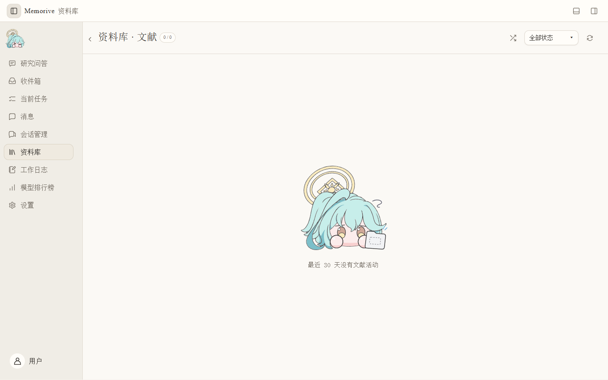

### 一篇文献的复核顺序

1. 按标题或状态找到目标；确认打开的是本次任务关联的文献及当前版本。
2. 读原文或转换文本，尤其检查图表、单位、样本、方法和作者写明的限制。
3. 打开 Card，逐项核对研究对象、方法、关键数值、结果、来源锚点。若写着“未找到”，区分原文确实没有与抽取遗漏。
4. 打开 Analysis，逐句检查它引用了哪条 Card 或原文证据、推论是否超出证据、条件是否被省略。
5. 记录异议：原文搬运错误应修订 Card；证据不足应收窄或放弃判断；解释分歧应保留意见与依据。
6. 确认阅读的是当前成品版本后使用「确认复核」，再核对复核状态和时间。按钮不可用时先检查 Card 与 Analysis 是否按要求打开。

### 复核后会发生什么

单篇成品复核不会自动把内容加入知识库。研究问答中的衍生结论另有独立的人工确认；两类审核不要混成一次。

### Card 与 Analysis 的逐项检查表

Card：研究对象是否准确？样本量、单位、置信区间等数值是否完整？方法、比较对象、作者原话与局限是否对应原文？每个关键字段能否回到段落、页码或图表？如果字段标记为未评估、抽取缺口或原文没有，保持状态差异。

Analysis：每个判断对应哪些 Card 字段与原文证据？是否把相关性写成因果、把一个样本外推到整个人群、把尚未验证的假设写成事实？跨篇材料是否有可比性？如有不同意见，记录自己的理由和原文位置。复核动作确认的是这份具体版本已被阅读，不自动赞成所有结论。

## 09 研究问答：确定项目、资料与模型

研究问答从选项目、开对话开始。默认检索范围是当前对话的附件；如果希望它再到项目里找资料，需要主动扩大范围。文件也可以直接加入对话，无须等它先生成 Card。

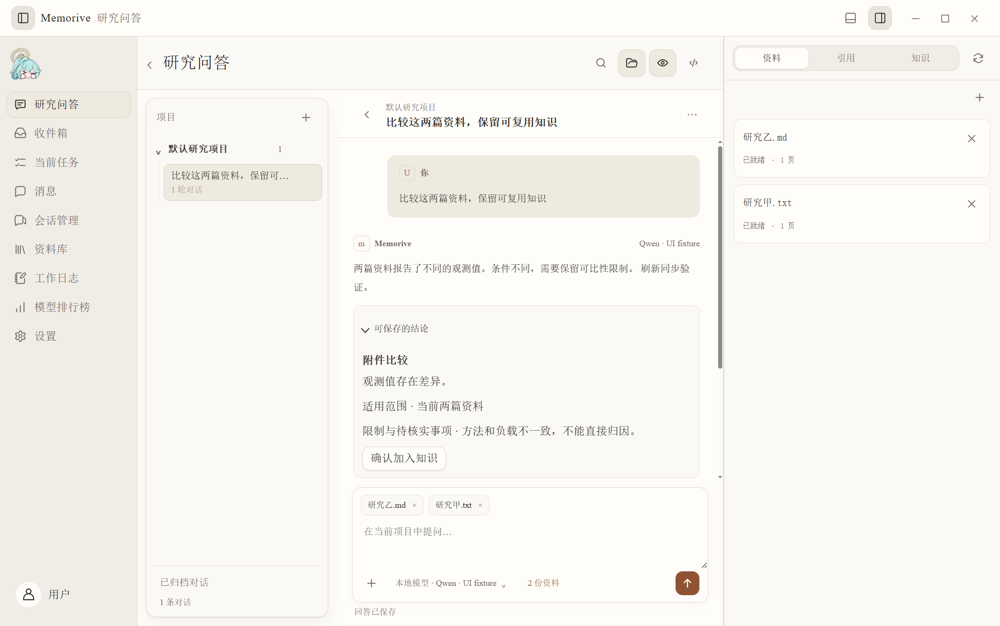

### 发出第一问

1. 进入研究问答，选项目并新建或打开对话。先核对是否处于预期项目，避免把另一项目的背景混入当前问题。
2. 把 PDF、图片、Word、Markdown 或 TXT 拖入输入框，或点「＋」选择文件；也可用「从本项目资料中选择」勾选资料库中的文献。
3. 检查输入框附件标签与右侧资料栏是否一致。取消勾选只移除当前对话的关联，原文和旧引用仍保留。
4. 点击输入框底部模型名，选择已验证的模型。扫描 PDF 和图片依赖当前模型的视觉能力；无法读取时换模型并重试。
5. 明确提问范围和比较维度。例如比较方法、样本条件、结果、限制；跨篇比较至少选择两篇不同文献。
6. 发送前再看一遍模型、资料数量和检索范围。只检索资料时可能返回摘录；生成分析需要可用模型。

### 范围扩展的代价

启用“自动检索本项目资料”后，结果可能来自当前未手动勾选的项目资料。回答前后都要查看实际引用来源；不能仅凭对话标题推断使用了哪些文件。

### 附件、项目检索和记忆的优先核对

输入框的附件标签是本轮明确选入的资料；右侧资料栏显示当前对话关联。开启项目自动检索后，回答还可能使用项目内其他候选；若启用已确认记忆，模型也可能参考先前保存的研究背景。提问前写下本次允许的范围，回答后逐条打开引用，确认实际使用的资料集合。要测试一篇资料的说法时，可只保留该资料并关闭不需要的扩展范围，再进行一次对照提问。

同一文献被重新处理后，旧对话仍应能回看当时引用的保存版本；不要用资料库当前列表的展示期限推断旧引用已经失效。

## 10 引用查证与知识确认：研究问答的核心复核

研究问答给出的是待验证的分析。遇到数字、比较或因果判断，先找它引用了什么，再打开对应版本的原文，连同前后文一起读。回答写得流畅、引用很多，或出现“可保存的结论”，都不能替代这一步。

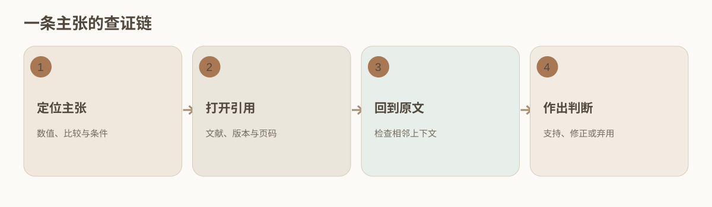

### 逐句查证

1. 先圈出数值、比较、因果、适用范围和建议等关键主张；为每条主张建立对应引用。没有引用的关键句先标记待证。
2. 点击回答中的引用，确认它对应哪篇文献、哪个保存版本及页码或行号；右侧「引用」栏可核对来源列表。
3. 打开原文片段与前后上下文。核对对象、样本量、方法、单位、时间、比较基线、统计限定和作者原本的语气。
4. 多篇比较时分别查两篇：若指标、条件或研究对象不同，写清不可直接比较之处，不合并成单一结论。
5. 给每条主张标记“支持／部分支持／冲突／无法定位”。部分支持就收窄措辞；冲突或无法定位就回查或弃用。
6. 若出现「可保存的结论」，展开检查主张、范围、限制和每条引用。确认后才加入知识；需要更正时走修订或复核，并保留旧版本。

### 两个容易混淆的审核

资料库的「确认复核」针对单篇文献生成成品；研究问答的「确认加入知识」针对从回答或 Agent 产生的衍生结论。来源撤回或变化时，应重新检查依赖它的知识。

### 查证示例：避免把差异误写成因果

假设回答写道“方法 A 使指标提高 20%”，并给了两篇文献。先确认 20% 来自哪篇、是相对变化还是百分点、原文单位及测量时点；再查两篇的对象、对照组和统计方法。若第一篇只报告了相关性，第二篇研究对象不同，就不能保留“使”这一因果表述。可以改成“在文献甲的特定样本中观察到约 20% 的差异；文献乙使用不同条件，不能直接合并”，并分别保留引用。无法确认单位或条件时，数值主张保持待证。

知识条目还需记录适用范围、限制和复核时间。以后原文被更正或撤回时，沿来源关系找到依赖它的条目，重新确认，而非只改回答文字。

## 11 检索与权重：怎样改变结果排序

想调整哪些资料更容易排在前面，可以到「设置 → 检索与权重」。先决定配置用于所有项目还是某一个项目，再选择预设或逐项调权重。排序调得再好，也无法修复原文本身的错误；更换向量模型时还要留意旧索引。

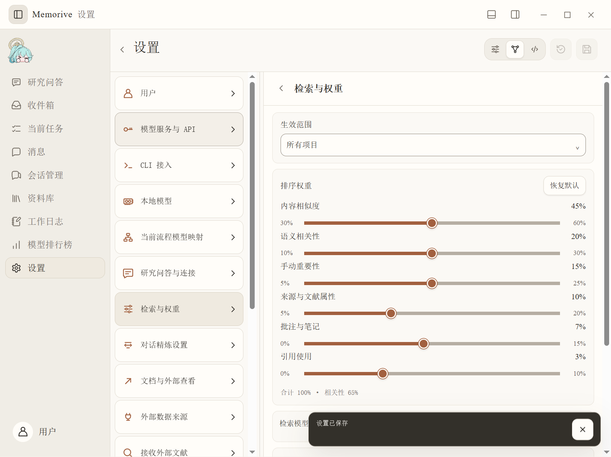

### 选择模式

1. 普通模式从均衡研究、原文定位、跨篇比较、积累复用中选最接近当前问题的预设。
2. 若要逐项控制，用高级模式查看内容相似度、语义相关性、手动重要性、来源与文献属性、批注与笔记、引用使用六项。
3. 拖动一项时检查其他项联动及合计 100%；相关性两项的允许范围以界面校验为准。不要把高权重当成可靠性证明。
4. 选择“所有项目”，或关闭继承后仅为一个项目配置；保存前确认生效范围和预览结果。
5. 在检索模型项选已配置的向量或语义模型；没有配置时仍可使用词项检索。更换向量模型可能需要重建索引。
6. 开发者模式编辑结构化配置时，检查字段、上下限与总和；保存后返回普通页面复核投影。

### 校准建议

用已知应当出现的文献进行预览，观察原文与衍生知识的比例。衍生知识的权威性折扣和单条保留比例有历史记录；若排序异常，先看来源与版本，再微调权重。

## 12 会话管理：同步、筛选、精炼与删除边界

会话管理把本机 Codex、Claude Code、浏览器采集和手动导入的记录放在一处，方便阅读与整理。如果你在原工具里继续聊天，记得再同步新增内容。这里的整理操作针对 Memo 保存的副本。

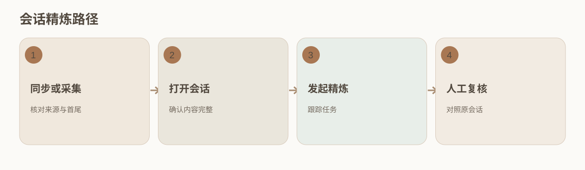

### 从来源到成品

1. 进入「会话管理」，按来源、标题和显示条数缩小列表；同步本机内容时用「同步 Codex / Claude」。
2. 打开目标会话，核对来源、时间、首尾消息与正文是否完整；网页来源还要核对采集范围和完成状态。
3. 准备精炼时先到「设置 → 对话精炼设置」选可用模型并保存，再回会话详情点击「精炼」。
4. 精炼进入收件箱及任务队列；自动执行关闭时会排队。到当前任务跟踪，完成后在资料库打开成品。
5. 对照原会话核对重点、假设、决定与待办，再进行成品复核。新增消息应对应新快照或新精炼，不覆盖旧版本。
6. 批量移除前确认选择范围。移除 Memo 的本地记录不删除 Codex、Claude Code 或源网站里的会话。

### 找不到目标时

检查该来源是否受支持、同步是否完成、筛选条件是否隐藏了结果，以及源工具是否把会话存在本机当前账号。不要把“最近聊天”中的显示位置当成源记录已被删除的证据。

### 全量、增量与精炼版本

首次同步或采集先建立基线，核对开始与末尾消息及总量；后续更新只读新增内容时，确认增量从上次成功位置继续。部分失败不覆盖上次完整基线。精炼前记录会话快照时间；精炼后比较是否包含该快照末尾，避免只总结前半段。若之后继续在原工具对话，应再次同步并形成新的精炼版本。旧版仍可用于追溯当时做出的决定。

同一标题可能来自不同来源或不同会话，判断身份要结合来源、时间和内容。批量移除是本地副本管理；先导出或备份需要保留的研究记录，再确认范围。

## 13 网页读取和浏览器插件：当前页与历史库

要把网页内容带进 Memo，先在「设置 → 对话精炼设置」准备浏览器组件，再由你在目标网站完成登录。组件能取得哪些历史内容取决于网站支持情况；“录入当前界面”“首次全量”和“后续增量”应按目的分别使用。

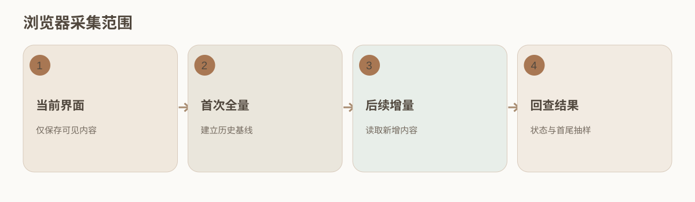

### 操作顺序

1. 到设置页面找到浏览器组件入口，按提示在浏览器扩展管理页加载；组件更新后按提示重新加载扩展。
2. 在浏览器打开目标网站，由你完成登录或网站验证，确认页面已经加载所需内容。
3. 只需保存当前可见内容时，点浏览器工具栏组件并选「录入当前界面」。该结果进入通用网页来源，不等于全账号历史。
4. 首次建立受支持的网站历史库时用全量采集；以后更新用增量。查看每个来源的最后成功位置、数量、错误和完成状态。
5. 回到会话管理刷新列表，抽查首条、末条和中间内容。采集中断或登录过期时，先修复原因，再继续，不把本次部分结果冒充完整历史。

### 失败判断

页面结构变化、网络中断或网站不支持全量都可能限制采集。配置了 URL 仅表示有来源配置；不能据此宣称整站历史已经读取。

## 14 模型排行榜：公开指标怎样用于选型

模型排行榜适合用来缩小选型范围：先看公开能力和价格，再决定哪些模型值得亲自试。阅读榜单时要连同更新日期、指标定义、供应商、币种和价格单位一起看。榜单分数不能替代连接验证和你的任务样本。

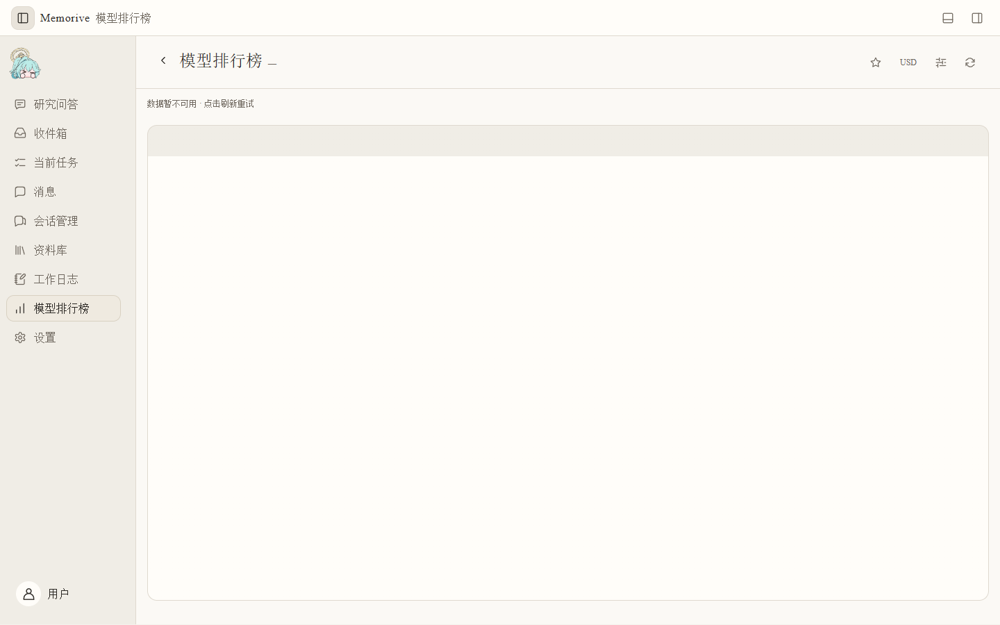

### 比较步骤

1. 查看榜单的数据日期和来源，再设置模型、供应商或收藏筛选。若源不可用，先刷新或稍后重试。
2. 比较能力指数时确认基准和任务类别；跨基准数值不能直接相减得出性能差。
3. 看输入与输出价格时确认币种、每百万 token 单位、缓存和混合计价口径。公开目录价可能随提供方变化。
4. 把候选模型带回「模型服务与 API／CLI／本地模型」确认真实通道和模型 ID，再做连接验证及对应节点能力检查。

### 需要保留的边界

排行榜空白不表示模型不存在；高排名不表示你有调用权限，也不表示它适合文献抽取、引用核对或本地设备。

## 15 计费与用量底部面板：范围、费用与未知值

打开底部「计费与用量」面板时，先选统计范围和时间，再筛模型、切换指标。这里的汇总、排行榜上的公开价格，以及研究问答的一次回答回执，各自覆盖的记录不同；比较费用前要先统一口径。

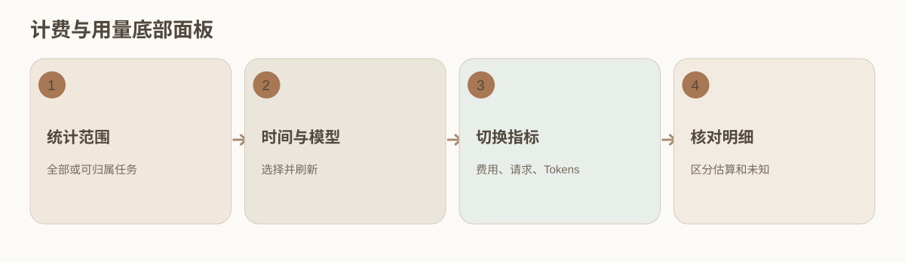

### 读图表与明细

1. 点击顶部的底部面板按钮或按 Ctrl+J，打开「计费与用量」。统计范围可选全部记录；当“本任务”显示归属未完整时，该项不可用。
2. 选近 7 天、近 30 天或本月，再筛一个模型或全部模型；点击刷新后查看同步状态。
3. 在费用（含估算）、请求次数与 Tokens 间切换。费用要分实际和估算；请求包括失败与重试；Tokens 分输入与输出。
4. 要查单条记录，到模型与计费的计费列表，核对任务归属、通道、时间、模型和费用依据。
5. 订阅 CLI 若无逐次单价，保持未知；本地模型没有供应商 API 费，但有硬件与运行成本；缺失证据不写成零。

### 核对账单

估算费用按记录的用量和价格计算，不等于供应商实扣。切换币种只是显示换算，仍应以原始计价和供应商账单核对；不能把“全部记录”直接算作一篇文献的费用。

### 同一数字为何会有不同结果

排行榜的“每百万 token 价格”是公开参考，底部面板的费用是按筛选范围汇总的实际或估算记录，单次回答回执只覆盖那一问。三者的时间、模型路由、缓存计价、币种和请求失败口径可能不同。例如某次请求先失败后重试，请求次数可能是 2，而最终只有一次有效回答；若供应商只返回部分 token，费用可能显示估算或未知。比较两次运行时，先统一日期、模型与通道，再看输入、输出和缓存读取，最后对照供应商账单。

本任务归属不可用时，不用全局费用除以任务数量。保留未知值以及无法归属的记录，等有足够证据再核对。

## 16 报告、消息、工作日志与备份

日报、周报和月报帮助你回看一个周期内的研究进展；消息提示待办，工作日志留下运行线索。需要解释某个判断从何而来时，仍要沿着报告或消息回到任务、Card、Analysis 和原文。

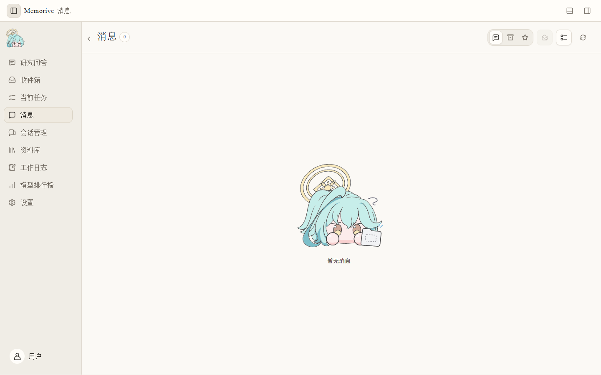

### 报告与异常处理

1. 在「当前流程模型映射」分别设置日报、周报和月报的生成模型；只配置周报不会自动配置另外两类。
2. 到「设置 → 通知与提醒」设置生成时间。没有新成果或模型不可用时，不必为填满日历生成空报告。
3. 在资料库的生成文档中按周期找报告，检查覆盖日期、关联资料和版本。需要重新生成时，从关联任务按界面提示操作并保留旧版。
4. 消息页打开提醒并使用「前往」回到对象；标为已读不等于批准审核或确认文献复核。
5. 工作日志按时间和类型筛选，沿一次任务查看节点错误与重试。需要新记录时刷新，勿把最后一条完成提示当成全链路证据。

### 维护与备份

至少备份原始材料、生成成品、批注、研究结晶、配置和必要记录。变更资料目录前先定位旧文件；改路径字段不迁移旧资料。备份后抽查原文、Card、Analysis 和会话精炼结果能否打开。公开发布或正式验收资格以对应版本的独立记录为准。
